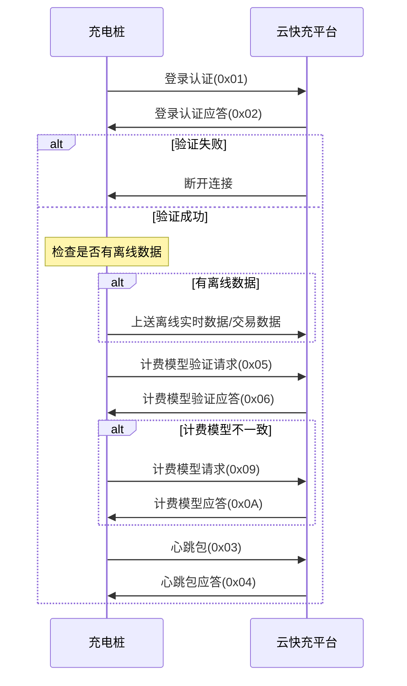

# 上电流程

## 流程说明

充电桩在上电或者离线恢复后连接到云快充平台,首先上送充电桩登陆认证,平台对桩的信息进行校验,并回复登陆认证应答,如果不符合则会断开当前建立的连接,如果验证通过,则桩先检查是否有离线状态下本地储存的实时监测数据或者交易数据,如果有则先上送到平台进行处理,随后充电桩发起充电计费模型的请求,平台检测计费模型与当前运营费率是否一致,并回复计费模型请求应答,如果不一致,桩需要向平台请求新的计费模型。

## 流程图

## 关键步骤

1. **登录认证**: 充电桩上送登录认证(0x01),平台校验并应答(0x02)
2. **离线数据处理**: 如有离线数据,先上送到平台
3. **计费模型验证**: 验证计费模型是否一致(0x05/0x06)
4. **计费模型更新**: 如不一致,请求新的计费模型(0x09/0x0A)
5. **心跳保活**: 开始发送心跳包维持连接(0x03/0x04)
