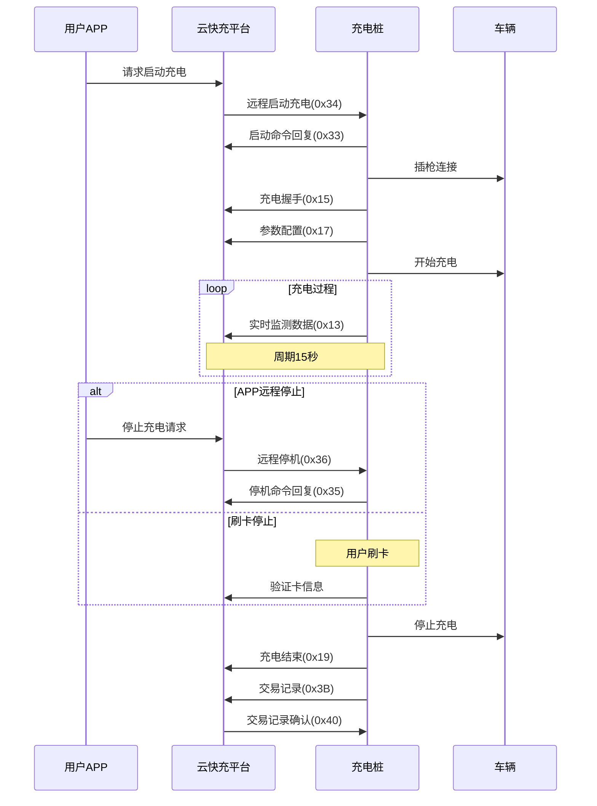

# APP充电流程

## 流程说明

app充电流程与刷卡充电流程互通,即app充电可以用卡结束,app鉴权时会将用户绑定的卡信息下发到充电桩,用于卡结束验证,卡充电可以用app结束充电。

## 流程图

## 关键步骤

1. **远程启动**: 用户APP发起充电请求,平台下发远程启动命令(0x34)
2. **启动确认**: 充电桩回复启动命令(0x33)
3. **充电握手**: 充电桩与车辆BMS进行握手(0x15)
4. **参数配置**: 上送参数配置信息(0x17)
5. **充电过程**: 周期上送实时监测数据(0x13),周期15秒
6. **充电停止**:
   - APP远程停止: 平台下发停机命令(0x36),充电桩应答(0x35)
   - 刷卡停止: 验证卡号信息
7. **充电结束**: 上送充电结束报文(0x19)
8. **交易记录**: 上送交易记录(0x3B),平台确认(0x40)

## 互通性说明

- APP充电可以刷卡结束
- 刷卡充电可以用APP结束
- APP鉴权时会下发用户绑定的卡信息到充电桩
