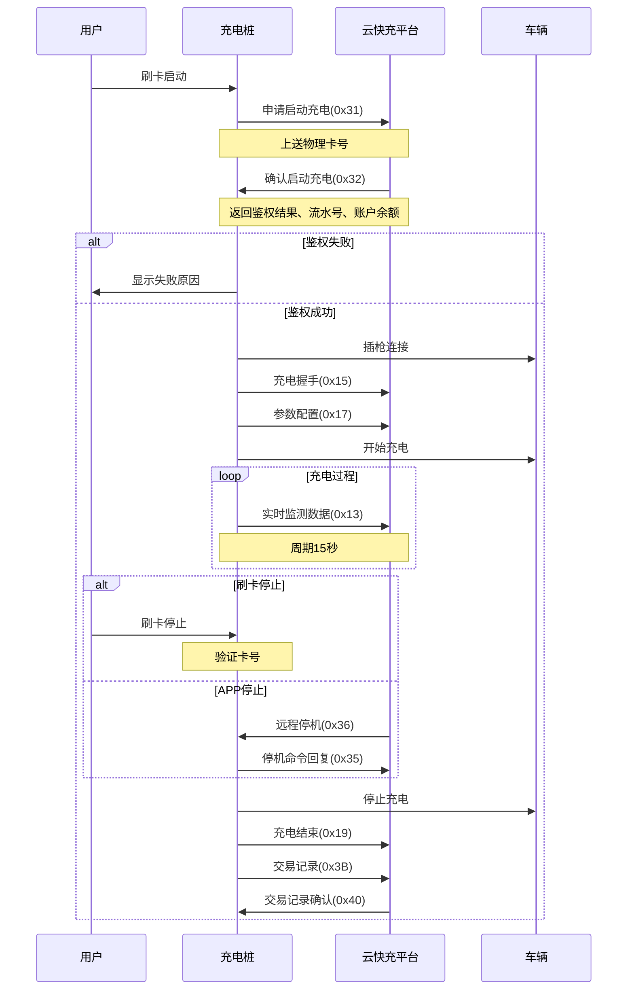

# 刷卡充电流程

## 流程图

## 关键步骤

1. **刷卡启动**: 用户在充电桩上刷卡
2. **申请启动**: 充电桩上送物理卡号,申请启动充电(0x31)
3. **鉴权确认**: 平台确认启动充电(0x32),返回:
   - 鉴权结果
   - 交易流水号
   - 账户余额
   - 逻辑卡号
4. **鉴权失败**: 充电桩显示失败原因给用户
5. **鉴权成功后的流程**:
   - 插枪连接车辆
   - 充电握手(0x15)
   - 参数配置(0x17)
   - 开始充电
   - 周期上送实时数据(0x13)
6. **充电停止**:
   - 刷卡停止: 验证卡号
   - APP停止: 接收远程停机命令(0x36),回复(0x35)
7. **结束流程**:
   - 停止充电
   - 上送充电结束(0x19)
   - 上送交易记录(0x3B)
   - 接收交易记录确认(0x40)
