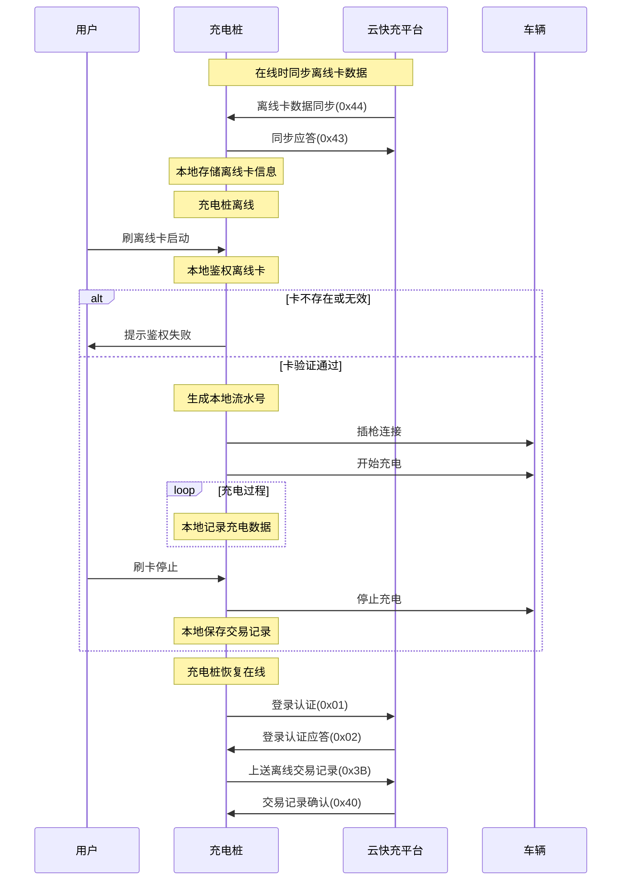

# 离线充电模式

## 流程说明

离线充电模式允许充电桩在与平台断开连接的情况下,使用本地存储的离线卡信息进行充电服务。

## 流程图

## 关键步骤

### 准备阶段(在线时)

1. **离线卡同步**: 平台下发离线卡数据(0x44)
2. **同步应答**: 充电桩确认同步(0x43)
3. **本地存储**: 充电桩保存离线卡信息到本地

### 离线充电阶段

1. **刷卡启动**: 用户刷离线卡
2. **本地鉴权**: 充电桩在本地验证卡信息
3. **鉴权失败**: 提示用户
4. **鉴权成功**:
   - 生成本地流水号(按平台规则)
   - 插枪连接
   - 开始充电
   - 本地记录充电数据
5. **刷卡停止**: 用户刷卡结束充电
6. **本地保存**: 保存交易记录到本地

### 恢复在线阶段

1. **登录认证**: 充电桩重新登录平台(0x01/0x02)
2. **上传记录**: 上送离线期间的交易记录(0x3B)
3. **记录确认**: 平台确认接收(0x40)

## 相关报文

- 离线卡数据同步: 0x44/0x43
- 离线卡数据清除: 0x46/0x45
- 离线卡数据查询: 0x48/0x47
- 交易记录上送: 0x3B/0x40
