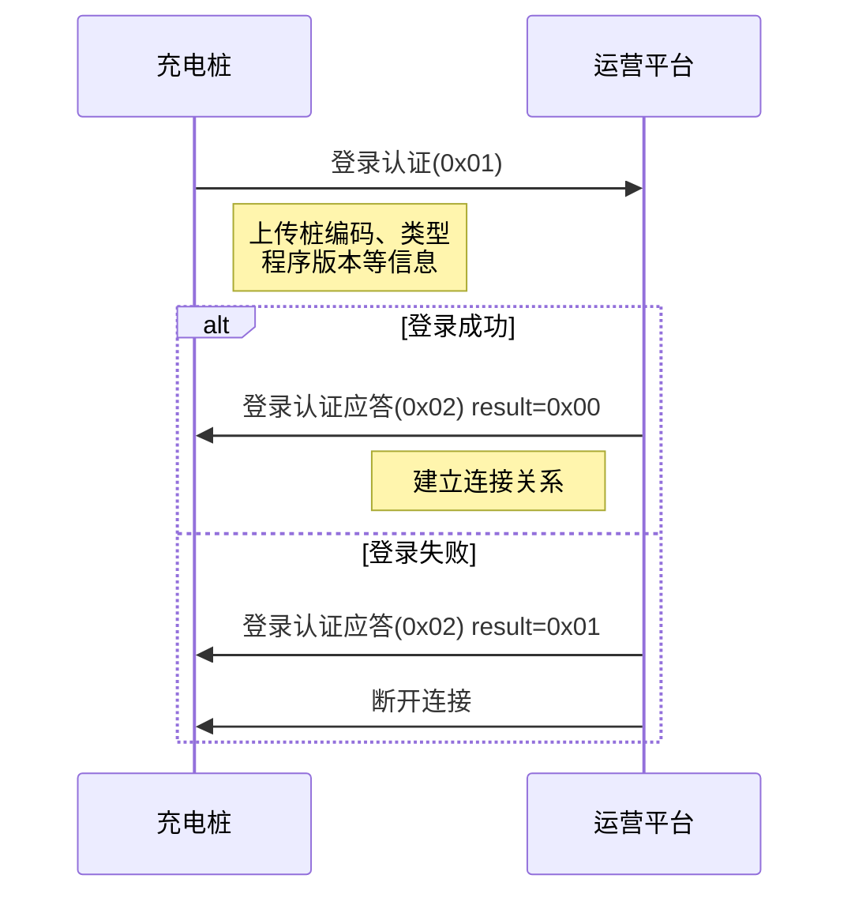

# 登录认证

## 6.1 充电桩登录认证 (0x01)

### 基本信息

| 项目 | 内容 |
|------|------|
| 帧类型码 | 0x01 |
| 传送间隔 | 通信中断后上电复位 |
| 方向 | 充电桩→运营平台 |

### 功能说明

充电桩将桩设置的运营编码上传给运营平台,以实现运营平台将运营编码与充电桩建立连接关系。充电桩每次复位或通信离线,都需重新登录,并成功后才能进行后续交互。

### 样例报文

```
68 22 0000 00 01 55031412782305 00 02 0F 56342E312E353000 01 01010101010101010101 04 675A
```

**报文解析**:
- 起始标志: 68
- 数据长度: 22
- 序列号域: 0000
- 加密标志: 00
- 帧类型: 01
- 桩编码: 55031412782305
- 桩类型: 00 (直流桩)
- 充电枪数量: 02
- 通信协议版本: 0F (V1.5)
- 程序版本: 56342E312E353000 (v4.1.50)
- 网络链接类型: 01 (LAN)
- SIM卡: 01010101010101010101
- 运营商: 04 (其他)
- 帧校验域: 675A

### 数据定义

| 序号 | 参数名称 | 数据类型 | 长度(Byte) | 备注 |
|------|---------|---------|-----------|------|
| 1 | 桩编码 | BCD码 | 7 | 不足7位补0 |
| 2 | 桩类型 | BIN码 | 1 | 0表示直流桩,1表示交流桩 |
| 3 | 充电枪数量 | BIN码 | 1 | |
| 4 | 通信协议版本 | BIN码 | 1 | 版本号乘10,v1.0表示0x0A |
| 5 | 程序版本 | ASCII码 | 8 | 不足8位补零 |
| 6 | 网络链接类型 | BIN码 | 1 | 0x00 SIM卡<br>0x01 LAN<br>0x02 WAN<br>0x03 其他 |
| 7 | SIM卡 | BCD码 | 10 | 不足10位补零,取不到置零 |
| 8 | 运营商 | BIN码 | 1 | 0x00 移动<br>0x02 电信<br>0x03 联通<br>0x04 其他 |

---

## 6.2 登录认证应答 (0x02)

### 基本信息

| 项目 | 内容 |
|------|------|
| 帧类型码 | 0x02 |
| 传送间隔 | 应答发送 |
| 方向 | 运营平台→充电桩 |

### 功能说明

回复充电桩登录结果。

### 样例报文

```
68 0C 0000 00 02 55031412782305 00 DA4C
```

**报文解析**:
- 起始标志: 68
- 数据长度: 0C
- 序列号域: 0000
- 加密标志: 00
- 帧类型: 02
- 桩编码: 55031412782305
- 登录结果: 00 (成功)
- 帧校验域: DA4C

### 数据定义

| 序号 | 参数名称 | 数据类型 | 长度(Byte) | 备注 |
|------|---------|---------|-----------|------|
| 1 | 桩编码 | BCD码 | 7 | 不足7位补0 |
| 2 | 登录结果 | BIN码 | 1 | 0x00: 登录成功<br>0x01: 登录失败 |

---

## 使用场景

### 上电登录
充电桩每次上电启动后,必须先进行登录认证,建立与运营平台的连接关系。

### 重连登录
当充电桩通信离线后重新连接,需要再次进行登录认证。

### 登录失败处理
若登录失败,充电桩将无法进行后续的业务交互,需要排查:
- 桩编码是否正确
- 网络连接是否正常
- 平台是否已配置该桩

### 交互流程



## 注意事项

1. **必须首先登录**: 登录认证是所有业务交互的前提,登录失败则无法进行后续操作
2. **登录超时**: 充电桩应设置登录超时时间,超时未收到应答则重新登录
3. **版本信息**: 通信协议版本和程序版本需准确上报,便于平台管理和问题排查
4. **网络类型**: 准确上报网络连接类型,便于平台监控网络状态
