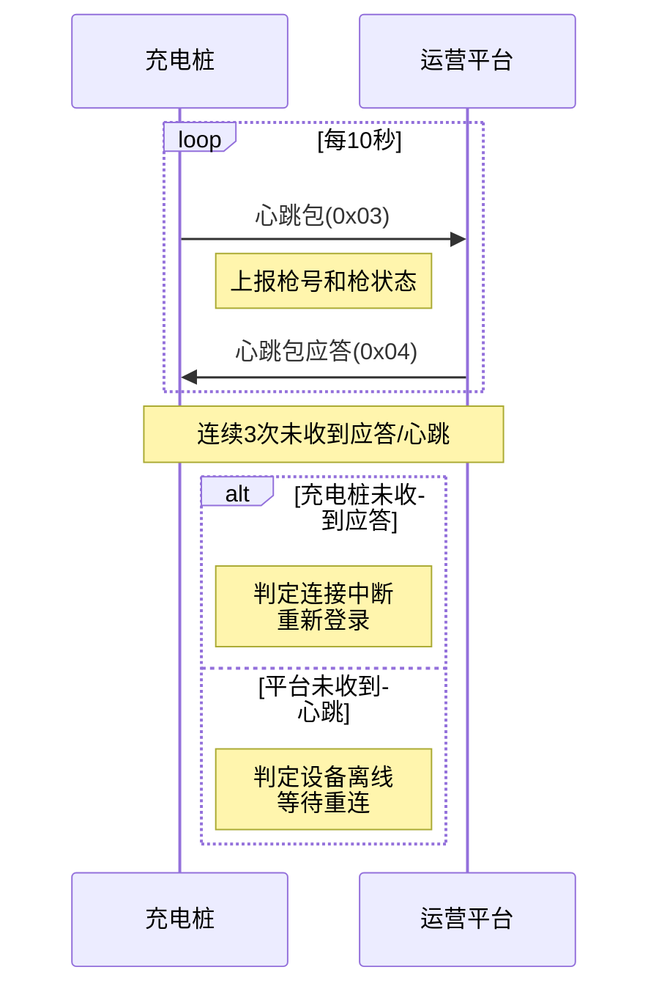

# 心跳包

## 6.3 充电桩心跳包 (0x03)

### 基本信息

| 项目 | 内容 |
|------|------|
| 帧类型码 | 0x03 |
| 传送间隔 | 10秒周期上送 |
| 方向 | 充电桩→运营平台 |

### 功能说明

用于链路状态判断,3次未收到心跳包视为网络异常,需要重新登录。

### 样例报文

```
68 0D 0001 00 03 32010200000001 01 00 6890
```

**报文解析**:
- 起始标志: 68
- 数据长度: 0D
- 序列号域: 0001
- 加密标志: 00
- 帧类型: 03
- 桩编码: 32010200000001
- 枪号: 01 (1号枪)
- 枪状态: 00 (正常)
- 帧校验域: 6890

### 数据定义

| 序号 | 参数名称 | 数据类型 | 长度(Byte) | 备注 |
|------|---------|---------|-----------|------|
| 1 | 桩编码 | BCD码 | 7 | 不足7位补0 |
| 2 | 枪号 | BCD码 | 1 | |
| 3 | 枪状态 | BIN码 | 1 | 0x00: 正常<br>0x01: 故障 |

---

## 6.4 心跳包应答 (0x04)

### 基本信息

| 项目 | 内容 |
|------|------|
| 帧类型码 | 0x04 |
| 传送间隔 | 应答发送 |
| 方向 | 运营平台→充电桩 |

### 功能说明

用于链路状态判断,平台收到心跳包后立即应答。

### 样例报文

```
68 0D 3600 00 04 55031412782305 01 00 65B2
```

**报文解析**:
- 起始标志: 68
- 数据长度: 0D
- 序列号域: 3600
- 加密标志: 00
- 帧类型: 04
- 桩编码: 55031412782305
- 枪号: 01
- 心跳应答: 00
- 帧校验域: 65B2

### 数据定义

| 序号 | 参数名称 | 数据类型 | 长度(Byte) | 备注 |
|------|---------|---------|-----------|------|
| 1 | 桩编码 | BCD码 | 7 | 不足7位补0 |
| 2 | 枪号 | BCD码 | 1 | |
| 3 | 心跳应答 | BIN码 | 1 | 置0 |

---

## 使用场景

### 保持在线
充电桩每10秒向平台发送一次心跳包,维持在线状态。

### 异常检测
- 平台连续3次未收到心跳包,判定为网络异常
- 充电桩连续3次未收到心跳应答,判定为连接中断
- 异常后需要重新登录

### 故障上报
通过心跳包中的枪状态字段,及时上报充电枪的故障状态。

### 交互流程



## 注意事项

1. **周期固定**: 心跳包发送周期固定为10秒,不可随意修改
2. **连续计数**: 需要连续3次未收到才判定异常,防止偶然的网络抖动
3. **及时应答**: 平台收到心跳包后应立即应答,不可延迟
4. **重连机制**: 检测到网络异常后,充电桩需要重新执行登录流程
5. **枪状态同步**: 充电枪状态变化时应及时通过心跳包上报
