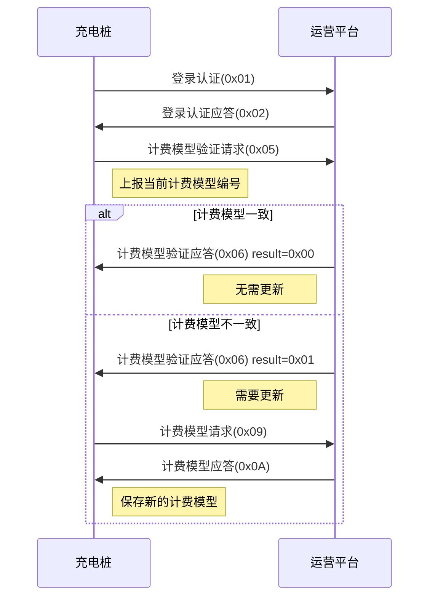

# 计费模型

## 6.5 计费模型验证请求 (0x05)

### 基本信息

| 项目 | 内容 |
|------|------|
| 帧类型码 | 0x05 |
| 传送间隔 | 主动请求,直到成功 |
| 方向 | 充电桩→运营平台 |

### 功能说明

充电桩在登录成功后,都需要对当前计费模型校验,如计费模型与平台当前不一致,则需要向平台请求新的计费模型。

### 样例报文

```
68 0D 0002 00 05 32010200000001 0001 9C00
```

**报文解析**:
- 起始标志: 68
- 数据长度: 0D
- 序列号域: 0002
- 加密标志: 00
- 帧类型: 05
- 桩编码: 32010200000001
- 计费模型编码: 0001
- 帧校验域: 9C00

### 数据定义

| 序号 | 参数名称 | 数据类型 | 长度(Byte) | 备注 |
|------|---------|---------|-----------|------|
| 1 | 桩编号 | BCD码 | 7 | 不足7位补0 |
| 2 | 计费模型编号 | BCD码 | 2 | 首次连接到平台时置零 |

---

## 6.6 计费模型验证请求应答 (0x06)

### 基本信息

| 项目 | 内容 |
|------|------|
| 帧类型码 | 0x06 |
| 传送间隔 | 应答发送 |
| 方向 | 运营平台→充电桩 |

### 功能说明

平台判断当前接收的计费模型是否为桩最新的计费模型,如果不一致需要向平台请求新计费模型,在桩空闲期间下发费率,其他期间无需下发。

### 样例报文

```
68 0E CE04 00 06 55031412782305 0000 00 8E2F
```

**报文解析**:
- 起始标志: 68
- 数据长度: 0E
- 序列号域: CE04
- 加密标志: 00
- 帧类型: 06
- 桩编码: 55031412782305
- 计费模型编号: 0000
- 验证结果: 00 (一致)
- 帧校验域: 8E2F

### 数据定义

| 序号 | 参数名称 | 数据类型 | 长度(Byte) | 备注 |
|------|---------|---------|-----------|------|
| 1 | 桩编号 | BCD码 | 7 | 不足7位补0 |
| 2 | 计费模型编号 | BCD码 | 2 | |
| 3 | 验证结果 | BIN码 | 1 | 0x00 桩计费模型与平台一致<br>0x01 桩计费模型与平台不一致 |

---

## 6.7 充电桩计费模型请求 (0x09)

### 基本信息

| 项目 | 内容 |
|------|------|
| 帧类型码 | 0x09 |
| 传送间隔 | 主动请求,直到成功 |
| 方向 | 充电桩→运营平台 |

### 功能说明

充电桩计费模型与平台不一致时,都需要请求计费模型,如计费模型请求不成功,则禁止充电。

### 样例报文

```
68 0B 0200 00 09 55031412782305 DD25
```

**报文解析**:
- 起始标志: 68
- 数据长度: 0B
- 序列号域: 0200
- 加密标志: 00
- 帧类型: 09
- 桩编码: 55031412782305
- 帧校验域: DD25

### 数据定义

| 序号 | 参数名称 | 数据类型 | 长度(Byte) | 备注 |
|------|---------|---------|-----------|------|
| 1 | 桩编号 | BCD码 | 7 | 不足7位补0 |

---

## 6.8 计费模型请求应答 (0x0A)

### 基本信息

| 项目 | 内容 |
|------|------|
| 帧类型码 | 0x0A |
| 传送间隔 | 应答发送 |
| 方向 | 运营平台→充电桩 |

### 功能说明

用户充电费用计算,每半小时为一个费率段,共48段,每段对应尖峰平谷其中一个费率充电时桩屏幕按此费率分别显示已充电费和服务费。

### 样例报文

```
68 5E 0200 00 0A 55031412782305 0100 400D0300 9C400000 E0930400 9C400000 801A0600 9C400000 20A10700 9C400000 00 00000000000000000000000000000000000000000000000000000000000000000000000000000000000000 5E60
```

**报文解析**:
- 起始标志: 68
- 数据长度: 5E
- 序列号域: 0200
- 加密标志: 00
- 帧类型: 0A
- 桩编码: 55031412782305
- 计费模型编号: 0100
- 尖电费费率: 400D0300 (2.00000元/度)
- 尖服务费费率: 9C400000 (0.40000元/度)
- ...48个时段费率号
- 帧校验域: 5E60

### 数据定义

| 序号 | 参数名称 | 数据类型 | 长度(Byte) | 备注 |
|------|---------|---------|-----------|------|
| 1 | 桩编号 | BCD码 | 7 | 不足7位补0 |
| 2 | 计费模型编号 | BCD码 | 2 | 固定值: 0100 |
| 3 | 尖费电费费率 | BIN码 | 4 | 精确到五位小数 |
| 4 | 尖服务费费率 | BIN码 | 4 | 精确到五位小数 |
| 5 | 峰电费费率 | BIN码 | 4 | 精确到五位小数 |
| 6 | 峰服务费费率 | BIN码 | 4 | 精确到五位小数 |
| 7 | 平电费费率 | BIN码 | 4 | 精确到五位小数 |
| 8 | 平服务费费率 | BIN码 | 4 | 精确到五位小数 |
| 9 | 谷电费费率 | BIN码 | 4 | 精确到五位小数 |
| 10 | 谷服务费费率 | BIN码 | 4 | 精确到五位小数 |
| 11 | 计损比例 | BIN码 | 1 | 见名词解释 |
| 12 | 0:00~0:30时段费率号 | BIN码 | 1 | 0x00: 尖费率<br>0x01: 峰费率<br>0x02: 平费率<br>0x03: 谷费率 |
| 13 | 0:30~1:00时段费率号 | BIN码 | 1 | 同上 |
| ...... | ...... | ...... | ...... | ...... |
| 58 | 23:00~23:30时段费率号 | BIN码 | 1 | 同上 |
| 59 | 23:30~0:00时段费率号 | BIN码 | 1 | 同上 |

---

## 计费模型说明

### 费率类型

计费模型支持四种费率类型:
- **尖费率**: 用电高峰时段,费率最高
- **峰费率**: 用电较高时段
- **平费率**: 用电正常时段
- **谷费率**: 用电低谷时段,费率最低

每种费率包含:
- **电费费率**: 实际电费单价
- **服务费费率**: 充电服务费单价

### 时段划分

- 一天划分为48个时段,每个时段30分钟
- 每个时段对应一种费率类型(尖/峰/平/谷)
- 充电时根据当前时段采用对应费率计费

### 费用计算

**充电费用 = (电费 + 服务费) × 计损电量**

其中:
- 电费 = 电费费率 × 电量
- 服务费 = 服务费费率 × 电量
- 计损电量 = 实际电量 × (1 + 计损比例)

### 交互流程



## 注意事项

1. **必须验证**: 登录成功后必须进行计费模型验证,确保费率正确
2. **禁止充电**: 若计费模型请求不成功,则禁止充电,防止计费错误
3. **空闲更新**: 计费模型应在桩空闲期间更新,避免影响正在进行的充电
4. **费率精度**: 费率精确到五位小数,计算时需注意精度问题
5. **时段对应**: 交易记录中的分时电量必须和平台的计费模型一致
6. **持久保存**: 充电桩需要持久化保存计费模型,断电后不丢失
