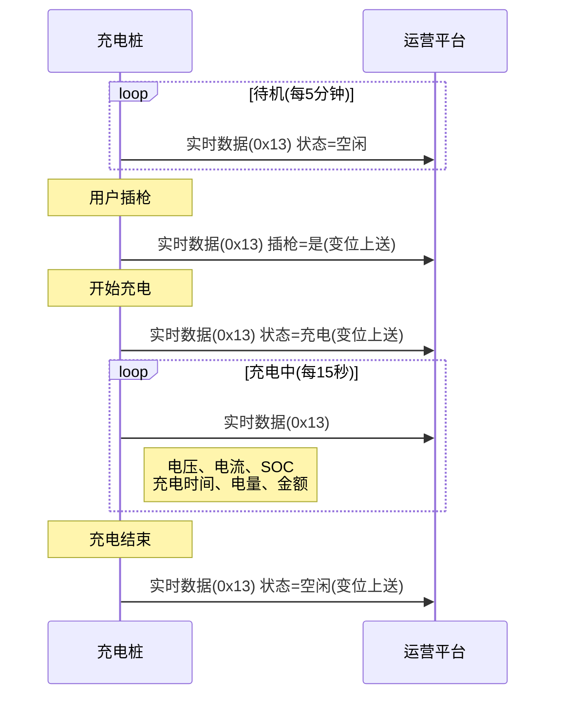
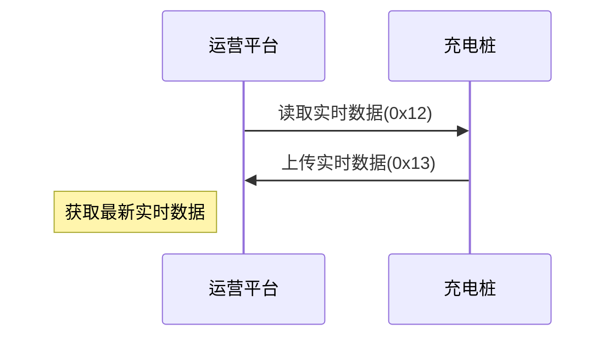

# 实时监测数据

## 7.1 读取实时监测数据 (0x12)

### 基本信息

| 项目 | 内容 |
|------|------|
| 帧类型码 | 0x12 |
| 传送间隔 | 主动请求 |
| 方向 | 运营平台→充电桩 |

### 功能说明

运营平台根据需要主动发起读取实时数据的请求。

### 样例报文

```
68 0C 0000 00 12 32010200000001 01 0069
```

**报文解析**:
- 起始标志: 68
- 数据长度: 0C
- 序列号域: 0000
- 加密标志: 00
- 帧类型: 12
- 桩编码: 32010200000001
- 枪号: 01 (1号枪)
- 帧校验域: 0069

### 数据定义

| 序号 | 参数名称 | 数据类型 | 长度(Byte) | 备注 |
|------|---------|---------|-----------|------|
| 1 | 桩编号 | BCD码 | 7 | 不足7位补0 |
| 2 | 枪号 | BCD码 | 1 | |

---

## 7.2 上传实时监测数据 (0x13)

### 基本信息

| 项目 | 内容 |
|------|------|
| 帧类型码 | 0x13 |
| 传送间隔 | 周期上送、变位上送、召唤 |
| 方向 | 充电桩→运营平台 |

### 功能说明

上送充电枪实时数据,周期上送时,待机5分钟、充电15秒。

### 样例报文

```
68 40 1A03 00 13 00000000000000000000000000000 55031412782305 01 00 01 01 0200 0000 00 000000000000000 00 00 0000 0000 00000000 00000000 00000000 0000 9DAC
```

**报文解析**:
- 起始标志: 68
- 数据长度: 40
- 序列号域: 1A03
- 加密标志: 00
- 帧类型: 13
- 交易流水号: 00000000000000000000000000000 (离线状态,置零)
- 桩编码: 55031412782305
- 枪号: 01
- 状态: 00 (离线)
- 是否归位: 01 (已归位)
- 是否插枪: 01 (是)
- 输出电压: 0200 (0V)
- 输出电流: 0000 (0A)
- 枪线温度: 00 (10℃,偏移-50)
- 枪线编码: 000000000000000
- SOC: 00 (0%)
- 电池组最高温度: 00 (0℃)
- 累计充电时间: 0000 (0min)
- 剩余时间: 0000 (0min)
- 充电度数: 00000000 (0度)
- 计损充电度数: 00000000 (0度)
- 已充金额: 00000000 (0元)
- 硬件故障: 0000 (无故障)
- 帧校验域: 9DAC

### 数据定义

| 序号 | 参数名称 | 数据类型 | 长度(Byte) | 备注 |
|------|---------|---------|-----------|------|
| 1 | 交易流水号 | BCD码 | 16 | 见名词解释 |
| 2 | 桩编号 | BCD码 | 7 | 不足7位补0 |
| 3 | 枪号 | BCD码 | 1 | |
| 4 | 状态 | BIN码 | 1 | 0x00: 离线<br>0x01: 故障<br>0x02: 空闲<br>0x03: 充电<br>需做到变位上送 |
| 5 | 枪是否归位 | BIN码 | 1 | 0x00 否<br>0x01 是<br>0x02 未知(无法检测) |
| 6 | 是否插枪 | BIN码 | 1 | 0x00 否<br>0x01 是<br>需做到变位上送 |
| 7 | 输出电压 | BIN码 | 2 | 精确到小数点后一位;待机置零 |
| 8 | 输出电流 | BIN码 | 2 | 精确到小数点后一位;待机置零 |
| 9 | 枪线温度 | BIN码 | 1 | 整形,偏移量-50;待机置零 |
| 10 | 枪线编码 | BIN码 | 8 | 没有置零 |
| 11 | SOC | BIN码 | 1 | 待机置零;交流桩置零 |
| 12 | 电池组最高温度 | BIN码 | 1 | 整形,偏移量-50℃;待机置零;交流桩置零 |
| 13 | 累计充电时间 | BIN码 | 2 | 单位: min;待机置零 |
| 14 | 剩余时间 | BIN码 | 2 | 单位: min;待机置零、交流桩置零 |
| 15 | 充电度数 | BIN码 | 4 | 精确到小数点后四位;待机置零 |
| 16 | 计损充电度数 | BIN码 | 4 | 精确到小数点后四位;待机置零<br>未设置计损比例时等于充电度数 |
| 17 | 已充金额 | BIN码 | 4 | 精确到小数点后四位;待机置零<br>(电费+服务费)×计损充电度数 |
| 18 | 硬件故障 | BIN码 | 2 | Bit位表示(0否1是),低位到高位顺序:<br>Bit1: 急停按钮动作故障<br>Bit2: 无可用整流模块<br>Bit3: 出风口温度过高<br>Bit4: 交流防雷故障<br>Bit5: 交直流模块DC20通信中断<br>Bit6: 绝缘检测模块FC08通信中断<br>Bit7: 电度表通信中断<br>Bit8: 读卡器通信中断<br>Bit9: RC10通信中断<br>Bit10: 风扇调速板故障<br>Bit11: 直流熔断器故障<br>Bit12: 高压接触器故障<br>Bit13: 门打开 |

---

## 使用场景

### 周期上送

充电桩按固定周期上送实时数据:
- **待机状态**: 每5分钟上送一次
- **充电状态**: 每15秒上送一次

### 变位上送

当以下状态发生变化时,立即上送实时数据:
- **充电状态变化**: 离线→空闲→充电→空闲
- **插枪状态变化**: 未插枪→插枪→未插枪

### 召唤上送

平台主动发送0x12请求时,充电桩立即上送0x13实时数据。

### 数据监控



### 平台召唤



---

## 注意事项

1. **周期准确**: 严格按照待机5分钟、充电15秒的周期上送
2. **变位上送**: 状态变化必须立即上送,不等待周期到来
3. **流水号一致**: 充电中的实时数据流水号必须与启动时一致
4. **待机置零**: 待机状态下,充电相关数据必须置零
5. **精度要求**:
   - 电压、电流精确到0.1
   - 电量、金额精确到0.0001
6. **温度偏移**: 温度值需要减去偏移量-50℃
7. **故障上报**: 硬件故障通过Bit位准确上报
8. **交流桩限制**: 交流桩的SOC、剩余时间、电池温度置零
9. **充电状态**: 充电中不得上送空闲状态,否则订单异常
10. **金额计算**: 已充金额 = (电费+服务费) × 计损充电度数

## 硬件故障位定义

| Bit位 | 故障类型 | 说明 |
|-------|---------|------|
| Bit1 | 急停按钮动作 | 急停按钮被按下 |
| Bit2 | 无可用整流模块 | 充电模块故障 |
| Bit3 | 出风口温度过高 | 散热异常 |
| Bit4 | 交流防雷故障 | 防雷器损坏 |
| Bit5 | DC20通信中断 | 交直流模块通信故障 |
| Bit6 | FC08通信中断 | 绝缘检测模块通信故障 |
| Bit7 | 电度表通信中断 | 无法读取电表数据 |
| Bit8 | 读卡器通信中断 | 无法读卡 |
| Bit9 | RC10通信中断 | 控制模块通信故障 |
| Bit10 | 风扇调速板故障 | 散热系统故障 |
| Bit11 | 直流熔断器故障 | 过流保护动作 |
| Bit12 | 高压接触器故障 | 无法闭合/断开 |
| Bit13 | 门打开 | 柜门未关闭 |

**示例**:
- 故障码 0x0001: Bit1=1, 急停按钮动作
- 故障码 0x0080: Bit8=1, 读卡器通信中断
- 故障码 0x1000: Bit13=1, 门打开
