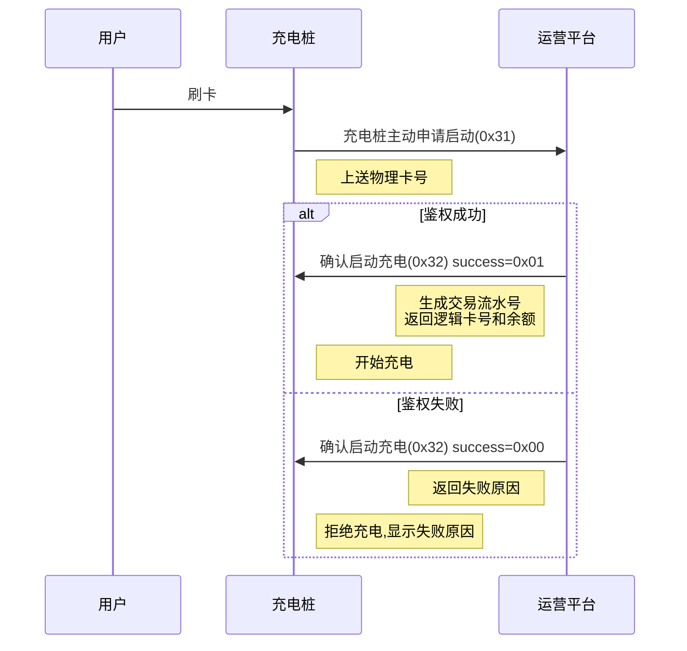
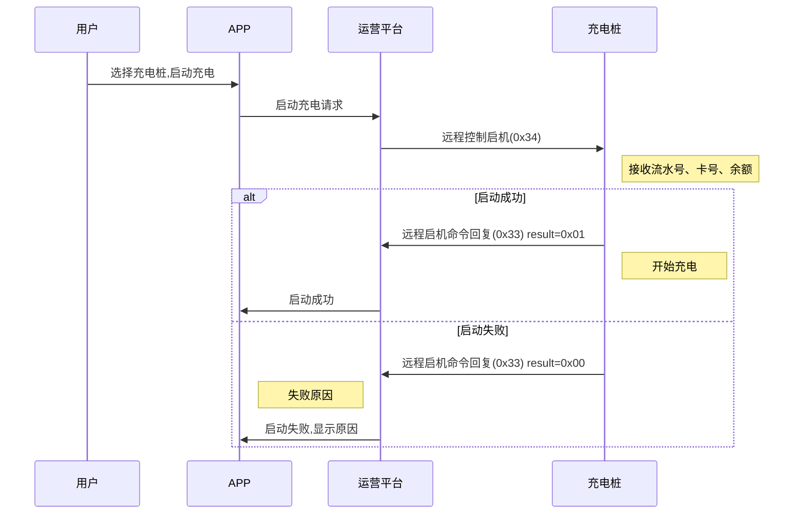

# 充电启动

## 8.1 充电桩主动申请启动充电 (0x31)

### 基本信息

| 项目 | 内容 |
|------|------|
| 帧类型码 | 0x31 |
| 传送间隔 | 按需发送 |
| 方向 | 充电桩→运营平台 |

### 功能说明

用户通过账号密码及刷卡在充电桩上操作请求充电。

### 样例报文

```
68 37 0004 00 31 32010200000001 01 01 00 00000000D14B0A54 00000000000000000000000000000000 00000000000000000000000000000000000000000000000000
```

**报文解析**:
- 起始标志: 68
- 数据长度: 37
- 序列号域: 0004
- 加密标志: 00
- 帧类型: 31
- 桩编码: 32010200000001
- 枪号: 01 (1号枪)
- 启动方式: 01 (刷卡启动)
- 是否需要密码: 00 (不需要)
- 物理卡号: 00000000D14B0A54
- 输入密码: (16字节,全0)
- VIN码: (17字节,全0)

### 数据定义

| 序号 | 参数名称 | 数据类型 | 长度(Byte) | 备注 |
|------|---------|---------|-----------|------|
| 1 | 桩编号 | BCD码 | 7 | 不足7位补0 |
| 2 | 枪号 | BCD码 | 1 | |
| 3 | 启动方式 | BIN码 | 1 | 0x01 刷卡启动<br>0x02 账号启动(暂不支持)<br>0x03 VIN码启动 |
| 4 | 是否需要密码 | BIN码 | 1 | 0x00 不需要<br>0x01 需要 |
| 5 | 账号或物理卡号 | BIN码 | 8 | 不足8位补0 |
| 6 | 输入密码 | BIN码 | 16 | 对用户输入的密码进行16位MD5加密,采用小写上传 |
| 7 | VIN码 | ASCII码 | 17 | 启动方式为VIN码时上送,其他方式置零,需反序上送 |

---

## 8.2 运营平台确认启动充电 (0x32)

### 基本信息

| 项目 | 内容 |
|------|------|
| 帧类型码 | 0x32 |
| 传送间隔 | 应答 |
| 方向 | 运营平台→充电桩 |

### 功能说明

启动充电鉴权结果。

### 样例报文

```
68 2A 0004 00 32 32010200000001011120180612195957085 32010200000001 01 0000001000000573 00000000 00 01 E829
```

**报文解析**:
- 起始标志: 68
- 数据长度: 2A
- 序列号域: 0004
- 加密标志: 00
- 帧类型: 32
- 交易流水号: 32010200000001011120180612195957085
- 桩编码: 32010200000001
- 枪号: 01
- 逻辑卡号: 0000001000000573 (1000000573)
- 账户余额: 00000000 (0.00元)
- 鉴权成功标志: 00 (失败)
- 失败原因: 01 (账户不存在)
- 帧校验域: E829

### 数据定义

| 序号 | 参数名称 | 数据类型 | 长度(Byte) | 备注 |
|------|---------|---------|-----------|------|
| 1 | 交易流水号 | BCD码 | 16 | 见名词解释 |
| 2 | 桩编号 | BCD码 | 7 | 不足7位补0 |
| 3 | 枪号 | BCD码 | 1 | |
| 4 | 逻辑卡号 | BCD码 | 8 | 显示在屏幕上,不足8位补零 |
| 5 | 账户余额 | BIN码 | 4 | 保留两位小数 |
| 6 | 鉴权成功标志 | BIN码 | 1 | 0x00 失败<br>0x01 成功 |
| 7 | 失败原因 | BCD码 | 1 | 0x01 账户不存在<br>0x02 账户冻结<br>0x03 账户余额不足<br>0x04 该卡存在未结账记录<br>0x05 桩停用<br>0x06 该账户不能在此桩上充电<br>0x07 密码错误<br>0x08 电站电容不足<br>0x09 系统中VIN码不存在<br>0x0A 该桩存在未结账记录<br>0x0B 该桩不支持刷卡 |

---

## 8.3 运营平台远程控制启机 (0x34)

### 基本信息

| 项目 | 内容 |
|------|------|
| 帧类型码 | 0x34 |
| 传送间隔 | 按需发送 |
| 方向 | 运营平台→充电桩 |

### 功能说明

当用户通过远程启动充电时,发送本命令(如APP远程启动)。

### 样例报文

```
68 30 007C 00 34 55031412782305012018061914444680 55031412782305 01 0000001000000573 00000000D14B0A54 A0860100 4622
```

**报文解析**:
- 起始标志: 68
- 数据长度: 30
- 序列号域: 007C
- 加密标志: 00
- 帧类型: 34
- 交易流水号: 55031412782305012018061914444680
- 桩编码: 55031412782305
- 枪号: 01
- 逻辑卡号: 0000001000000573 (1000000573)
- 物理卡号: 00000000D14B0A54
- 账户余额: A0860100 (100000分 = 1000.00元)
- 帧校验域: 4622

### 数据定义

| 序号 | 参数名称 | 数据类型 | 长度(Byte) | 备注 |
|------|---------|---------|-----------|------|
| 1 | 交易流水号 | BCD码 | 16 | 见名词解释 |
| 2 | 桩编号 | BCD码 | 7 | 不足7位补0 |
| 3 | 枪号 | BCD码 | 1 | |
| 4 | 逻辑卡号 | BCD码 | 8 | 显示在屏幕上,不足补零,为卡面印刷卡号 |
| 5 | 物理卡号 | BIN码 | 8 | 不足补零,桩与平台交互使用的物理卡号 |
| 6 | 账户余额 | BIN码 | 4 | 保留到小数点两位 |

---

## 8.4 远程启动充电命令回复 (0x33)

### 基本信息

| 项目 | 内容 |
|------|------|
| 帧类型码 | 0x33 |
| 传送间隔 | 应答 |
| 方向 | 充电桩→运营平台 |

### 功能说明

远程启动充电命令回复。

### 样例报文

```
68 1E 0002 00 33 3201020000000011151161555350260 32010200000001 01 01 00 0FE2
```

**报文解析**:
- 起始标志: 68
- 数据长度: 1E
- 序列号域: 0002
- 加密标志: 00
- 帧类型: 33
- 交易流水号: 3201020000000011151161555350260
- 桩编码: 32010200000001
- 枪号: 01
- 启动结果: 01 (成功)
- 失败原因: 00 (无)
- 帧校验域: 0FE2

### 数据定义

| 序号 | 参数名称 | 数据类型 | 长度(Byte) | 备注 |
|------|---------|---------|-----------|------|
| 1 | 交易流水号 | BCD码 | 16 | |
| 2 | 桩编号 | BCD码 | 7 | 不足7位补0 |
| 3 | 枪号 | BCD码 | 1 | |
| 4 | 启动结果 | BCD码 | 1 | 0x00 失败<br>0x01 成功 |
| 5 | 失败原因 | BIN码 | 1 | 0x00 无<br>0x01 设备编号不匹配<br>0x02 枪已在充电<br>0x03 设备故障<br>0x04 设备离线<br>0x05 未插枪 |

**特殊说明**:
桩在收到启充命令后,检测到未插枪则发送0x33报文回复充电失败。若在60秒(以收到0x34时间开始计算)内检测到枪重新连接,则补送0x33成功报文;超时或者离线等其他异常,桩不启充、不补发0x33报文。

---

## 使用场景

### 刷卡充电流程



### APP远程启动流程



---

## 注意事项

### 刷卡启动 (0x31/0x32)

1. **卡号上送**: 物理卡号用于平台鉴权,逻辑卡号用于屏幕显示
2. **VIN码反序**: VIN码需要反序上送
3. **密码加密**: 密码需要MD5加密后上送,使用小写
4. **未收到回复**: 平台未回复或回复失败,充电桩不得启动充电
5. **流水号记录**: 记录平台返回的交易流水号,后续所有报文使用该流水号

### 远程启动 (0x34/0x33)

1. **90秒规则**: 充电桩必须在90秒内回复成功并上送实时数据
2. **未插枪处理**: 未插枪时先回复失败,60秒内插枪则补发成功报文
3. **禁止启动**: 未收到0x34指令或指令失败,充电桩不得启动
4. **流水号一致**: 后续所有报文的流水号必须与0x34中的流水号一致
5. **余额显示**: 在屏幕上显示账户余额供用户参考

### 通用注意事项

1. **启动超时**: 平台下发启动指令后,充电桩必须在90秒内响应
2. **流水号唯一性**: 同一笔订单的所有报文流水号必须一致
3. **余额不足**: 余额不足时拒绝启动充电
4. **订单关闭**: 90秒未响应,平台会关闭订单,后续充电无法计费
5. **停充指令**: 收到停充指令(0x36)必须立即停止充电
