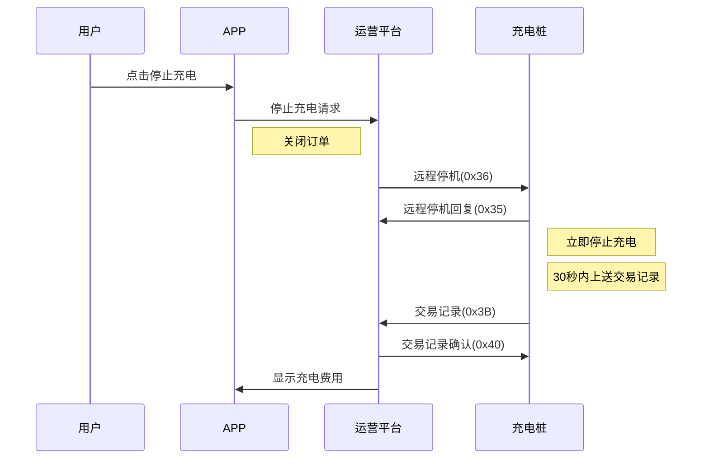
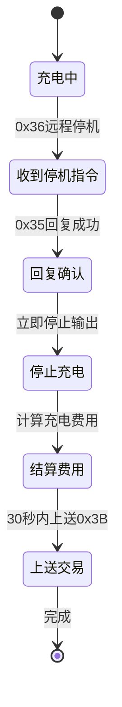
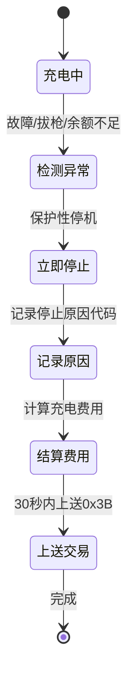

# 充电停止

## 8.5 运营平台远程停机 (0x36)

### 基本信息

| 项目 | 内容 |
|------|------|
| 帧类型码 | 0x36 |
| 传送间隔 | 按需发送 |
| 方向 | 运营平台→充电桩 |

### 功能说明

当用户通过远程停止充电时,发送本命令,如APP停止充电。

### 样例报文

```
68 0C 0003 00 36 32010200000001 01 C1A9
```

**报文解析**:
- 起始标志: 68
- 数据长度: 0C
- 序列号域: 0003
- 加密标志: 00
- 帧类型: 36
- 桩编码: 32010200000001
- 枪号: 01 (1号枪)
- 帧校验域: C1A9

### 数据定义

| 序号 | 参数名称 | 数据类型 | 长度(Byte) | 备注 |
|------|---------|---------|-----------|------|
| 1 | 桩编号 | BCD码 | 7 | 不足7位补0 |
| 2 | 枪号 | BCD码 | 1 | |

---

## 8.6 远程停机命令回复 (0x35)

### 基本信息

| 项目 | 内容 |
|------|------|
| 帧类型码 | 0x35 |
| 传送间隔 | 应答发送 |
| 方向 | 充电桩→运营平台 |

### 功能说明

远程停止充电命令回复,平台发送0x36后即关闭订单,接收到停机指令后设备务必保证停机。

### 样例报文

```
68 0E 0003 00 35 32010200000001 01 01 00 907E
```

**报文解析**:
- 起始标志: 68
- 数据长度: 0E
- 序列号域: 0003
- 加密标志: 00
- 帧类型: 35
- 桩编码: 32010200000001
- 枪号: 01
- 停止结果: 01 (成功)
- 失败原因: 00 (无)
- 帧校验域: 907E

### 数据定义

| 序号 | 参数名称 | 数据类型 | 长度(Byte) | 备注 |
|------|---------|---------|-----------|------|
| 1 | 桩编号 | BCD码 | 7 | 不足7位补0 |
| 2 | 枪号 | BCD码 | 1 | |
| 3 | 停止结果 | BCD码 | 1 | 0x00 失败<br>0x01 成功 |
| 4 | 失败原因 | BIN码 | 1 | 0x00 无<br>0x01 设备编号不匹配<br>0x02 枪未处于充电状态<br>0x03 其他 |

---

## 使用场景

### APP远程停止



### 停止充电原因

充电停止可能由多种原因触发:

| 停止方式 | 停止原因代码 | 说明 |
|---------|------------|------|
| APP远程停止 | 0x40 | 用户主动停止 |
| SOC达到100% | 0x41 | 充满自动停止 |
| 充电电量满足 | 0x42 | 达到设定电量 |
| 充电金额满足 | 0x43 | 达到设定金额 |
| 充电时间满足 | 0x44 | 达到设定时间 |
| 手动停止 | 0x45 | 用户手动按停止键 |
| 余额不足 | 0x4E / 0x6E | 充电中余额不足 |
| 设备故障 | 0x4A-0x69 | 启动失败 |
| 异常中止 | 0x6A-0x8F | 充电过程异常 |

详细的停止原因代码请参见 [充电停止原因代码表](../11-附录/01-充电停止原因代码表.md)

---

## 停止充电流程

### 正常停止流程



### 异常停止流程



---

## 注意事项

### 远程停机

1. **必须停机**: 收到0x36指令后,充电桩务必保证停止充电
2. **订单已关**: 平台发送0x36后即关闭订单,继续充电无法计费
3. **立即响应**: 收到停机指令后应立即回复0x35
4. **安全停止**: 停机过程应确保安全,避免突然断电

### 交易记录上传

1. **30秒规则**: 充电结束后30秒内必须上送交易记录
2. **停止原因**: 准确填写停止原因代码
3. **费用准确**: 确保充电费用计算准确
4. **重试机制**: 未收到0x40确认,5分钟后重试一次

### 异常停止

1. **拔枪停止**: 充电中可拔枪时,应立即上送交易记录
2. **余额不足**: 充电中余额不足,应停止充电并上送交易记录
3. **故障停止**: 设备故障时,应记录故障原因并停止充电
4. **断电保护**: 充电桩断电时,应保存充电数据,重启后上送交易记录

### 费用计算

1. **分时计费**: 跨时段充电需分别计算各时段费用
2. **计损比例**: 正确应用计损比例
3. **精度控制**: 费用精确到分(小数点后两位)
4. **电表读数**: 记录电表起止值,确保计量准确

### 订单一致性

1. **流水号唯一**: 同一订单所有报文流水号必须一致
2. **数据完整**: 交易记录数据必须完整准确
3. **时间准确**: 开始和结束时间必须准确
4. **状态同步**: 充电状态应及时通过实时数据(0x13)上报
