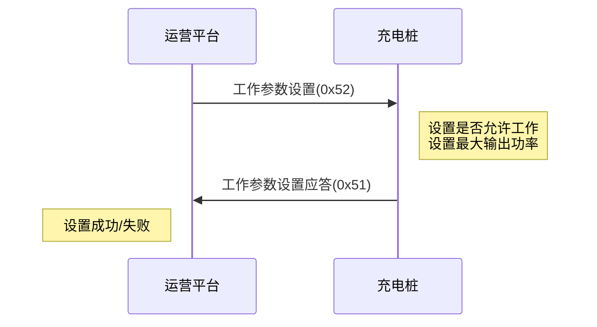

# 充电桩工作参数设置

## 9.1 充电桩工作参数设置 (0x52)

### 基本信息

| 项目 | 内容 |
|------|------|
| 帧类型码 | 0x52 |
| 传送间隔 | 按需发送 |
| 方向 | 运营平台→充电桩 |

### 功能说明

远程设置充电桩是否停用;设置充电桩允许输出功率,以实现电网功率的调节。

### 样例报文

```
68 0D 0008 00 52 32010200000001 01 00 6890
```

**报文解析**:
- 起始标志: 68
- 数据长度: 0D
- 序列号域: 0008
- 加密标志: 00
- 帧类型: 52
- 桩编码: 32010200000001
- 是否允许工作: 01
- 最大允许输出功率: 00
- 帧校验域: 6890

### 数据定义

| 序号 | 参数名称 | 数据类型 | 长度(Byte) | 备注 |
|------|---------|---------|-----------|------|
| 1 | 桩编号 | BCD码 | 7 | |
| 2 | 是否允许工作 | BIN码 | 1 | 0x00表示允许正常工作<br>0x01表示停止使用,锁定充电桩 |
| 3 | 充电桩最大允许输出功率 | BIN码 | 1 | 1BIN表示1%,最大100%,最小30% |

---

## 9.2 充电桩工作参数设置应答 (0x51)

### 基本信息

| 项目 | 内容 |
|------|------|
| 帧类型码 | 0x51 |
| 传送间隔 | 按需发送 |
| 方向 | 充电桩→运营平台 |

### 功能说明

充电桩接收到运营平台充电桩工作参数设置时,响应本数据。

### 样例报文

```
68 0C 0008 00 51 32010200000001 01 C1A9
```

**报文解析**:
- 起始标志: 68
- 数据长度: 0C
- 序列号域: 0008
- 加密标志: 00
- 帧类型: 51
- 桩编码: 32010200000001
- 设置结果: 01
- 帧校验域: C1A9

### 数据定义

| 序号 | 参数名称 | 数据类型 | 长度(Byte) | 备注 |
|------|---------|---------|-----------|------|
| 1 | 桩编号 | BCD码 | 7 | |
| 2 | 设置结果 | BIN码 | 1 | 0x00 失败<br>0x01 成功 |

---

## 使用场景

### 停用充电桩
当需要维护或临时停用充电桩时,平台可下发停用指令。

### 功率调节
根据电网负荷情况,动态调整充电桩最大输出功率,实现:
- 削峰填谷
- 电网保护
- 有序充电管理

### 交互流程


