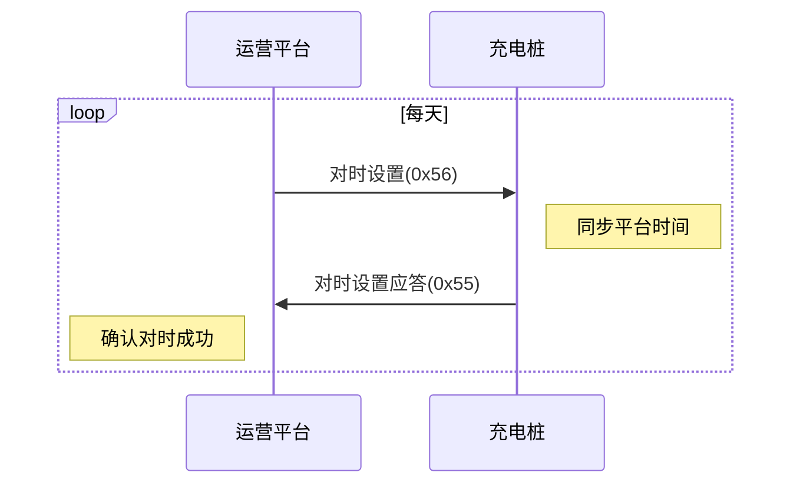

# 对时设置

## 9.3 对时设置 (0x56)

### 基本信息

| 项目 | 内容 |
|------|------|
| 帧类型码 | 0x56 |
| 传送间隔 | 周期发送(1天) |
| 方向 | 运营平台→充电桩 |

### 功能说明

运营平台同步充电桩时钟,以保证充电桩与运营平台的时钟一致。

### 样例报文

```
68 12 00DF 00 56 55031412782305 98B70E11100314 8A13
```

**报文解析**:
- 起始标志: 68
- 数据长度: 12
- 序列号域: 00DF
- 加密标志: 00
- 帧类型: 56
- 桩编码: 55031412782305
- 当前时间: 98B70E11100314 (2020-03-16 17:14:47)
- 帧校验域: 8A13

### 数据定义

| 序号 | 参数名称 | 数据类型 | 长度(Byte) | 备注 |
|------|---------|---------|-----------|------|
| 1 | 桩编号 | BCD码 | 7 | |
| 2 | 当前时间 | BIN码 | 7 | CP56Time2a格式 |

---

## 9.4 对时设置应答 (0x55)

### 基本信息

| 项目 | 内容 |
|------|------|
| 帧类型码 | 0x55 |
| 传送间隔 | 应答 |
| 方向 | 充电桩→运营平台 |

### 功能说明

充电桩接收到运营平台同步充电桩时钟时应答。

### 样例报文

```
68 12 A101 00 55 55031412782305 98B70E11100314 0E9B
```

**报文解析**:
- 起始标志: 68
- 数据长度: 12
- 序列号域: A101
- 加密标志: 00
- 帧类型: 55
- 桩编码: 55031412782305
- 当前时间: 98B70E11100314 (2020-03-16 17:14:47)
- 帧校验域: 0E9B

### 数据定义

| 序号 | 参数名称 | 数据类型 | 长度(Byte) | 备注 |
|------|---------|---------|-----------|------|
| 1 | 桩编号 | BCD码 | 7 | |
| 2 | 当前时间 | BIN码 | 7 | CP56Time2a格式 |

---

## CP56Time2a 时间格式

CP56Time2a是IEC 60870-5-101标准定义的7字节时间格式:

| 字节 | 内容 | 范围 |
|------|------|------|
| Byte1 | 毫秒低字节 | 0-999ms |
| Byte2 | 毫秒高字节 | |
| Byte3 | 分钟 | 0-59 |
| Byte4 | 小时 | 0-23 |
| Byte5 | 日 | 1-31 |
| Byte6 | 月 | 1-12 |
| Byte7 | 年 | 0-99 (2000年起) |

### 时间解析示例

报文: `98B70E11100314`

```
98 B7    - 毫秒: 0xB798 = 47000ms (实际为秒: 47秒)
0E       - 分钟: 0x0E = 14分钟
11       - 小时: 0x11 = 17时
10       - 日: 0x10 = 16日
03       - 月: 0x03 = 3月
14       - 年: 0x14 = 20 (2020年)
```

结果: **2020-03-16 17:14:47**

---

## 使用场景

### 周期对时
平台每天定期向充电桩下发对时命令,确保时钟准确。

### 时钟漂移
防止充电桩本地时钟因晶振误差导致时间偏移。

### 分时计费
准确的时钟对于分时计费至关重要,时间错误会导致计费错误。

### 交易记录
交易记录中的时间戳需要准确,便于对账和统计。

### 交互流程



## 注意事项

1. **周期同步**: 建议每天至少对时一次,确保时钟准确
2. **时区统一**: 平台和充电桩应使用统一的时区(北京时间)
3. **时间跳变**: 对时可能导致时间跳变,需要妥善处理正在进行的充电订单
4. **闰秒处理**: 注意闰秒对时间的影响
5. **精度要求**: 时间精度应在秒级,毫秒字段可用于更高精度需求
6. **计费影响**: 对时操作不应影响正在进行的充电计费,特别是跨时段充电时
