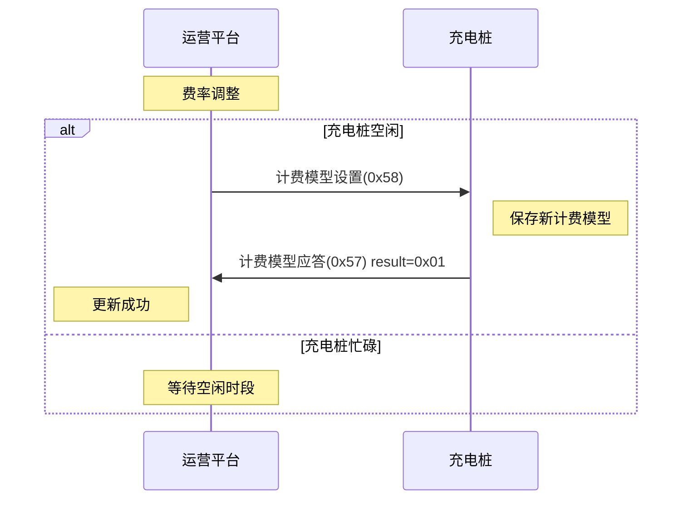

# 计费模型设置

## 9.5 计费模型设置 (0x58)

### 基本信息

| 项目 | 内容 |
|------|------|
| 帧类型码 | 0x58 |
| 传送间隔 | 按需发送 |
| 方向 | 运营平台→充电桩 |

### 功能说明

用户充电费用计算,每半小时为一个费率段,共48段,每段对应尖峰平谷其中一个费率充电时桩屏幕按此费率分别显示已充电费和服务费。

### 样例报文

```
68 5E 0025 00 58 55031412782305 0100 400D0300 9C400000 E0930400 9C400000 801A0600 9C400000 20A10700 9C400000 00 000000000000000000000000000000000000000000000000000000000000000000000000000000000000 0E60
```

**报文解析**:
- 起始标志: 68
- 数据长度: 5E
- 序列号域: 0025
- 加密标志: 00
- 帧类型: 58
- 桩编码: 55031412782305
- 计费模型编码: 0100
- 尖电费费率: 400D0300 (2元/度)
- 尖服务费费率: 9C400000 (0.4元/度)
- 峰电费费率: E0930400 (3元/度)
- 峰服务费费率: 9C400000 (0.4元/度)
- 平电费费率: 801A0600 (4元/度)
- 平服务费费率: 9C400000 (0.4元/度)
- 谷电费费率: 20A10700 (5元/度)
- 谷服务费费率: 9C400000 (0.4元/度)
- 计损比例: 00
- 时段费率号: 48个字节
- 帧校验域: 0E60

### 数据定义

| 序号 | 参数名称 | 数据类型 | 长度(Byte) | 备注 |
|------|---------|---------|-----------|------|
| 1 | 桩编号 | BCD码 | 7 | 不足7位补0 |
| 2 | 计费模型编码 | BCD码 | 2 | |
| 3 | 尖费电费费率 | BIN码 | 4 | 精确到五位小数 |
| 4 | 尖服务费费率 | BIN码 | 4 | 精确到五位小数 |
| 5 | 峰电费费率 | BIN码 | 4 | 精确到五位小数 |
| 6 | 峰服务费费率 | BIN码 | 4 | 精确到五位小数 |
| 7 | 平电费费率 | BIN码 | 4 | 精确到五位小数 |
| 8 | 平服务费费率 | BIN码 | 4 | 精确到五位小数 |
| 9 | 谷电费费率 | BIN码 | 4 | 精确到五位小数 |
| 10 | 谷服务费费率 | BIN码 | 4 | 精确到五位小数 |
| 11 | 计损比例 | BIN码 | 1 | 见名词解释 |
| 12 | 0:00~0:30时段费率号 | BIN码 | 1 | 0: 尖费率<br>1: 峰费率<br>2: 平费率<br>3: 谷费率 |
| 13 | 0:30~1:00时段费率号 | BIN码 | 1 | 同上 |
| ...... | ...... | ...... | ...... | ...... |
| 58 | 23:00~23:30时段费率号 | BIN码 | 1 | 同上 |
| 59 | 23:30~0:00时段费率号 | BIN码 | 1 | 同上 |

---

## 9.6 计费模型应答 (0x57)

### 基本信息

| 项目 | 内容 |
|------|------|
| 帧类型码 | 0x57 |
| 传送间隔 | 按需发送 |
| 方向 | 充电桩→运营平台 |

### 功能说明

充电桩接收到运营平台计费模型时,响应本数据。

### 样例报文

```
68 0C 0009 00 57 32010200000001 01 C1A9
```

**报文解析**:
- 起始标志: 68
- 数据长度: 0C
- 序列号域: 0009
- 加密标志: 00
- 帧类型: 57
- 桩编码: 32010200000001
- 设置结果: 01 (成功)
- 帧校验域: C1A9

### 数据定义

| 序号 | 参数名称 | 数据类型 | 长度(Byte) | 备注 |
|------|---------|---------|-----------|------|
| 1 | 桩编号 | BCD码 | 7 | |
| 2 | 设置结果 | BIN码 | 1 | 0x00 失败<br>0x01 成功 |

---

## 计费模型详解

### 四时段费率

计费模型将一天分为四种费率时段:

| 费率类型 | 适用时段 | 费率特点 |
|---------|---------|---------|
| 尖费率 | 用电高峰 | 费率最高,引导错峰用电 |
| 峰费率 | 用电较高 | 费率较高 |
| 平费率 | 用电正常 | 正常费率 |
| 谷费率 | 用电低谷 | 费率最低,鼓励谷期充电 |

### 时段划分规则

- **48个时段**: 一天24小时划分为48个时段
- **每段30分钟**: 每个时段持续30分钟
- **灵活配置**: 每个时段可独立配置为尖/峰/平/谷任一费率

### 费率计算示例

**尖费率时段充电**:
- 尖电费费率: 2.00000元/度
- 尖服务费费率: 0.40000元/度
- 充电电量: 10度
- 计损比例: 5%

计算过程:
```
计损电量 = 10 × (1 + 5%) = 10.5度
电费 = 2.00000 × 10.5 = 21.00元
服务费 = 0.40000 × 10.5 = 4.20元
总费用 = 21.00 + 4.20 = 25.20元
```

### 跨时段充电

当充电跨越多个费率时段时:

```mermaid
gantt
    title 跨时段充电示例
    dateFormat HH:mm
    section 充电过程
    峰费率 :active, 08:00, 2h
    平费率 :active, 10:00, 2h
    谷费率 :active, 12:00, 1h
```



需要分别计算各时段的充电电量和费用:
- 08:00-10:00 (峰费率): 计算该时段电量 × 峰费率
- 10:00-12:00 (平费率): 计算该时段电量 × 平费率
- 12:00-13:00 (谷费率): 计算该时段电量 × 谷费率

### 典型时段配置示例

| 时段 | 费率类型 | 说明 |
|------|---------|------|
| 00:00-07:00 | 谷 | 夜间低谷 |
| 07:00-10:00 | 峰 | 早高峰 |
| 10:00-14:00 | 平 | 正常时段 |
| 14:00-17:00 | 峰 | 下午高峰 |
| 17:00-21:00 | 尖 | 晚高峰 |
| 21:00-24:00 | 平 | 正常时段 |

---

## 使用场景

### 费率更新
当电网调整峰谷电价时,平台可远程更新充电桩计费模型。

### 分时计费
根据不同时段自动采用相应费率,实现削峰填谷。

### 空闲更新
费率更新应在充电桩空闲时进行,避免影响正在进行的充电。

### 交互流程



## 注意事项

1. **空闲更新**: 必须在桩空闲期间下发,充电中不得更新费率
2. **费率精度**: 费率精确到五位小数,计算时注意精度
3. **时段一致**: 交易记录中的分时电量必须与计费模型一致
4. **持久保存**: 充电桩需持久化保存计费模型,断电不丢失
5. **版本管理**: 通过计费模型编号管理不同版本的费率
6. **验证机制**: 更新后应验证计费模型是否正确保存
7. **跨时段处理**: 正确处理跨费率时段的充电计费
8. **计损比例**: 准确应用计损比例,避免计费误差
