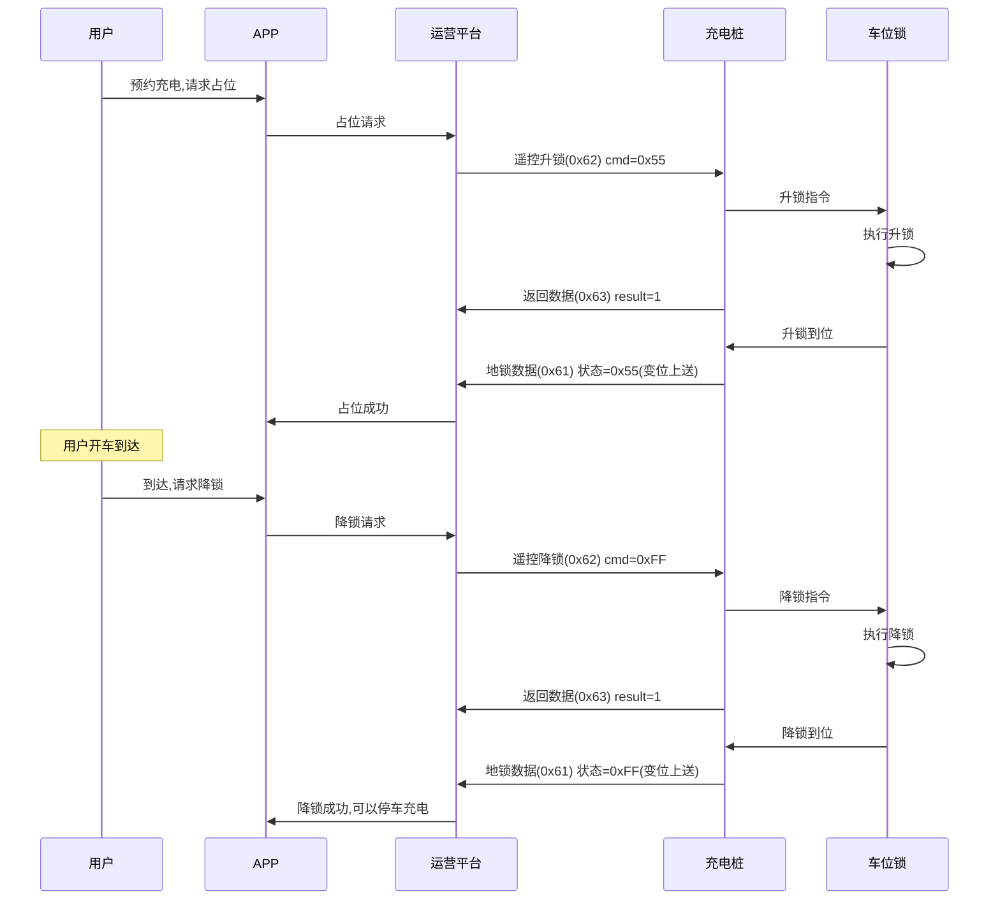
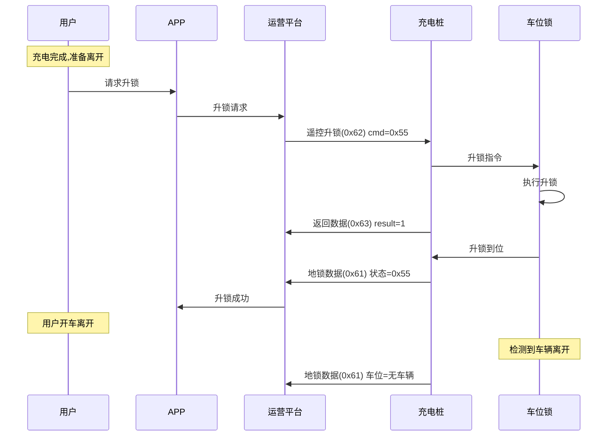
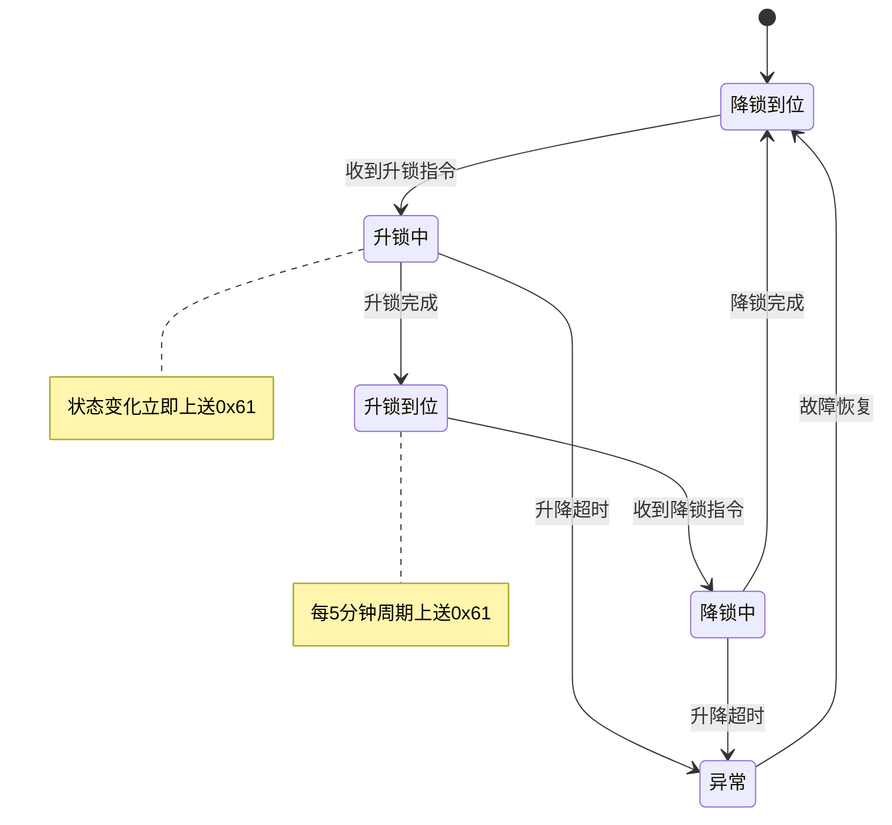

# 车位锁通信协议

地锁状态变化需要传输给平台,若地锁出现故障,则传输故障码至平台,若检测出现故障,则默认地锁为降下状态;若为升降出现故障,则保持现有状态。

## 10.1 地锁数据上送 (0x61)

### 基本信息

| 项目 | 内容 |
|------|------|
| 帧类型码 | 0x61 |
| 传送间隔 | 按需上送 |
| 方向 | 充电桩→运营平台 |

### 功能说明

地锁状态/报警信息变化时,桩立刻上送变位/报警信息;地锁状态不变化时,每隔5分钟周期性上送地锁状态。若无报警信息,不上送。

### 样例报文

```
68 14 0001 00 61 32010200000001 01 00 00 00 00 00000000 6890
```

**报文解析**:
- 起始标志: 68
- 数据长度: 14
- 序列号域: 0001
- 加密标志: 00
- 帧类型: 61
- 桩编码: 32010200000001
- 枪号: 01 (1号枪)
- 车位锁状态: 00 (未到位状态)
- 车位状态: 00 (无车辆)
- 地锁电量状态: 00 (0%)
- 报警状态: 00 (正常无报警)
- 预留位: 00000000
- 帧校验域: 6890

### 数据定义

| 序号 | 参数名称 | 数据类型 | 长度(Byte) | 备注 |
|------|---------|---------|-----------|------|
| 1 | 桩编号 | BCD码 | 7 | 充电桩资产编号,系统参数的编号(终端机器编码) |
| 2 | 枪号 | BIN码 | 1 | |
| 3 | 车位锁状态 | BIN码 | 1 | 0x00: 未到位状态<br>0x55: 升锁到位状态<br>0xFF: 降锁到位状态 |
| 4 | 车位状态 | BIN码 | 1 | 0x00: 无车辆<br>0xFF: 停放车辆 |
| 5 | 地锁电量状态 | BIN码 | 1 | 百分比值0~100 |
| 6 | 报警状态 | BIN码 | 1 | 0x00: 正常无报警<br>0xFF: 待机状态摇臂破坏<br>0x55: 摇臂升降异常(未到位) |
| 7 | 预留位 | BIN码 | 4 | 全部置0 |

---

## 10.2 遥控地锁升锁与降锁命令 (0x62)

### 基本信息

| 项目 | 内容 |
|------|------|
| 帧类型码 | 0x62 |
| 传送间隔 | 按需发送 |
| 方向 | 运营平台→充电桩 |

### 功能说明

服务器下发命令给地锁,地锁执行动作。

### 样例报文

```
68 0D 0001 00 62 32010200000001 01 55 00000000 6890
```

**报文解析**:
- 起始标志: 68
- 数据长度: 0D
- 序列号域: 0001
- 加密标志: 00
- 帧类型: 62
- 桩编码: 32010200000001
- 枪号: 01 (1号枪)
- 升/降地锁: 55 (升锁)
- 预留位: 00000000
- 帧校验域: 6890

### 数据定义

| 序号 | 参数名称 | 数据类型 | 长度(Byte) | 备注 |
|------|---------|---------|-----------|------|
| 1 | 桩编号 | BCD码 | 7 | 充电桩资产编号,系统参数的编号(终端机器编码) |
| 2 | 枪号 | BIN码 | 1 | |
| 3 | 升/降地锁 | BCD码 | 1 | 升锁0x55,降锁0xFF |
| 4 | 预留位 | BIN码 | 4 | 全部置0(可用于多枪) |

---

## 10.3 充电桩返回数据 (0x63)

### 基本信息

| 项目 | 内容 |
|------|------|
| 帧类型码 | 0x63 |
| 传送间隔 | 按需发送 |
| 方向 | 充电桩→运营平台 |

### 功能说明

地锁收到遥控地锁升锁与降锁命令指令,响应本数据。

### 样例报文

```
68 0D 0001 00 63 32010200000001 01 00 00000000 6890
```

**报文解析**:
- 起始标志: 68
- 数据长度: 0D
- 序列号域: 0001
- 加密标志: 00
- 帧类型: 63
- 桩编码: 32010200000001
- 枪号: 01 (1号枪)
- 地锁控制返回标志: 00 (鉴权失败)
- 预留位: 00000000
- 帧校验域: 6890

### 数据定义

| 序号 | 参数名称 | 数据类型 | 长度(Byte) | 备注 |
|------|---------|---------|-----------|------|
| 1 | 桩编号 | BCD码 | 7 | 充电桩资产编号,系统参数的编号(终端机器编码) |
| 2 | 枪号 | BIN码 | 1 | |
| 3 | 地锁控制返回标志 | BIN码 | 1 | 布尔型(1,鉴权成功;0,鉴权失败) |
| 4 | 预留位 | BIN码 | 4 | 全部置0(可用于多枪) |

---

## 车位锁工作原理

### 车位锁状态

车位锁有三种基本状态:
- **未到位状态** (0x00): 升降过程中或异常状态
- **升锁到位** (0x55): 摇臂升起,占用车位
- **降锁到位** (0xFF): 摇臂降下,释放车位

### 车位检测

通过车位检测传感器识别车位是否有车辆停放:
- **无车辆** (0x00): 车位空闲
- **有车辆** (0xFF): 车位被占用

### 报警状态

| 报警代码 | 故障类型 | 说明 |
|---------|---------|------|
| 0x00 | 正常无报警 | 地锁工作正常 |
| 0xFF | 待机状态摇臂破坏 | 摇臂被外力破坏 |
| 0x55 | 摇臂升降异常 | 升降动作未到位 |

---

## 使用场景

### 充电前占位



### 充电后离场



### 状态上送规则



---

## 注意事项

1. **变位上送**: 地锁状态变化时立即上送,不等待周期
2. **周期上送**: 状态不变化时,每5分钟上送一次
3. **故障处理**:
   - 检测故障默认地锁为降下状态
   - 升降故障保持现有状态
4. **电量监控**: 及时上报地锁电量,低电量时预警
5. **安全保护**: 有车辆时不允许升锁,防止损坏车辆
6. **超时处理**: 升降超时应上报异常状态
7. **破坏检测**: 检测到摇臂破坏立即报警
8. **多枪支持**: 预留位可用于支持多个充电枪对应多个车位锁

## 车位锁与充电联动

### 典型充电流程

1. **预约占位**: APP预约→升锁占位→等待用户到达
2. **到达降锁**: 用户到达→降锁→停车→充电
3. **充电完成**: 充电结束→升锁→用户离开→自动降锁

### 状态检测逻辑

| 车位锁状态 | 车位状态 | 允许操作 |
|-----------|---------|---------|
| 降锁到位 | 无车辆 | 允许升锁占位 |
| 降锁到位 | 有车辆 | 不允许升锁(保护车辆) |
| 升锁到位 | 无车辆 | 允许降锁 |
| 升锁到位 | 有车辆 | 不允许降锁(异常情况) |

### 电量管理

- **正常**: 电量>30%,正常工作
- **低电**: 电量20%-30%,发出预警
- **告警**: 电量<20%,需要尽快充电或更换电池
