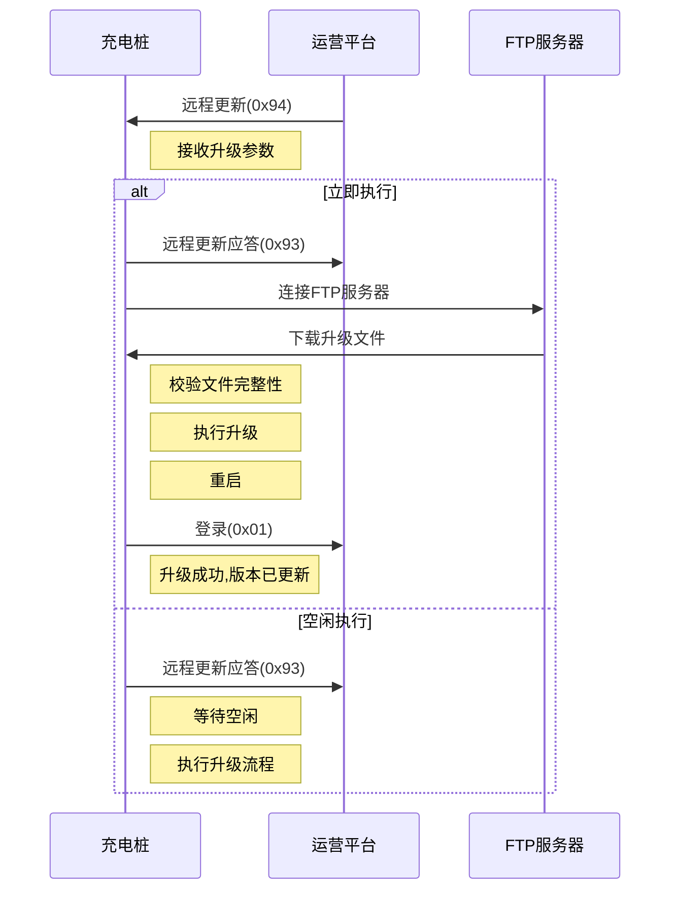
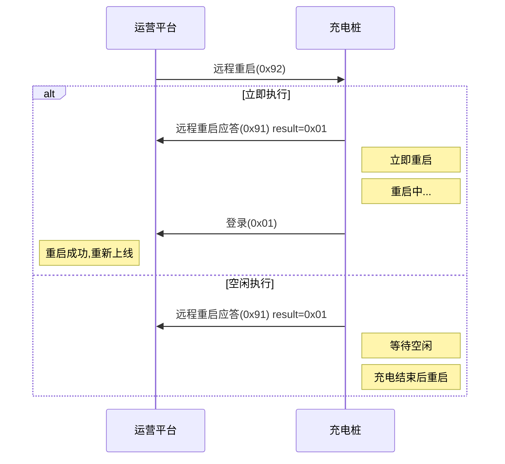

# 远程维护

## 11.1 远程重启 (0x92)

### 基本信息

| 项目 | 内容 |
|------|------|
| 帧类型码 | 0x92 |
| 传送间隔 | 按需发送 |
| 方向 | 运营平台→充电桩 |

### 功能说明

重启充电桩,应对部分问题,如卡死。

### 样例报文

```
68 0C 0011 00 92 32010200000001 01 C1A9
```

**报文解析**:
- 起始标志: 68
- 数据长度: 0C
- 序列号域: 0011
- 加密标志: 00
- 帧类型: 92
- 桩编码: 32010200000001
- 执行控制: 01 (立即执行)
- 帧校验域: C1A9

### 数据定义

| 序号 | 参数名称 | 数据类型 | 长度(Byte) | 备注 |
|------|---------|---------|-----------|------|
| 1 | 桩编号 | BCD码 | 7 | |
| 2 | 执行控制 | BIN码 | 1 | 0x01: 立即执行<br>0x02: 空闲执行 |

---

## 11.2 远程重启应答 (0x91)

### 基本信息

| 项目 | 内容 |
|------|------|
| 帧类型码 | 0x91 |
| 传送间隔 | 按需发送 |
| 方向 | 充电桩→运营平台 |

### 功能说明

充电桩接收到运营平台远程重启指令时,响应本数据。

### 样例报文

```
68 0C 0011 00 91 32010200000001 01 C1A9
```

**报文解析**:
- 起始标志: 68
- 数据长度: 0C
- 序列号域: 0011
- 加密标志: 00
- 帧类型: 91
- 桩编码: 32010200000001
- 设置结果: 01 (成功)
- 帧校验域: C1A9

### 数据定义

| 序号 | 参数名称 | 数据类型 | 长度(Byte) | 备注 |
|------|---------|---------|-----------|------|
| 1 | 桩编号 | BCD码 | 7 | |
| 2 | 设置结果 | BIN码 | 1 | 0x00 失败<br>0x01 成功 |

---

## 11.3 远程更新 (0x94)

### 基本信息

| 项目 | 内容 |
|------|------|
| 帧类型码 | 0x94 |
| 传送间隔 | 按需发送 |
| 方向 | 运营平台→充电桩 |

### 功能说明

对桩进行软件升级,平台升级模式为FTP文件升级,由桩企提供升级需要的更新文件(特定文件名,由桩企定义),平台在数据帧中提供访问更新文件相关服务器地址及下载路径信息,桩下载完更新程序后对文件进行校验,并对桩进行升级。

### 样例报文

```
68 62 0026 00 94 55031412782305 01 0F00 3131342E35352E3131342E313734 1500 7372 7372313233 (文件路径省略) 01 0A
```

**报文解析**:
- 起始标志: 68
- 数据长度: 62
- 序列号域: 0026
- 加密标志: 00
- 帧类型: 94
- 桩编码: 55031412782305
- 桩型号: 01 (直流)
- 桩功率: 0F00 (15kW)
- 升级服务器地址: 114.55.114.174
- 升级服务器端口: 1500 (21)
- 用户名: sr
- 密码: sr123
- 文件路径: (32字节)
- 执行控制: 01 (立即执行)
- 下载超时时间: 0A (10分钟)

### 数据定义

| 序号 | 参数名称 | 数据类型 | 长度(Byte) | 备注 |
|------|---------|---------|-----------|------|
| 1 | 桩编号 | BCD码 | 7 | |
| 2 | 桩型号 | BIN码 | 1 | 0x01: 直流<br>0x02: 交流 |
| 3 | 桩功率 | BIN码 | 2 | 不足2位补零 |
| 4 | 升级服务器地址 | ASCII码 | 16 | 不足16位补零 |
| 5 | 升级服务器端口 | BIN码 | 2 | 不足2位补零 |
| 6 | 用户名 | ASCII码 | 16 | 不足16位补零 |
| 7 | 密码 | ASCII码 | 16 | 不足16位补零 |
| 8 | 文件路径 | ASCII码 | 32 | 不足32位补零,文件路径名由平台定义 |
| 9 | 执行控制 | BIN码 | 1 | 0x01: 立即执行<br>0x02: 空闲执行 |
| 10 | 下载超时时间 | BIN码 | 1 | 单位: min |

---

## 11.4 远程更新应答 (0x93)

### 基本信息

| 项目 | 内容 |
|------|------|
| 帧类型码 | 0x93 |
| 传送间隔 | 按需发送 |
| 方向 | 充电桩→运营平台 |

### 功能说明

充电桩执行过运营平台远程更新指令,响应本数据。

### 样例报文

```
68 0C 0012 00 93 32010200000001 01 C1A9
```

**报文解析**:
- 起始标志: 68
- 数据长度: 0C
- 序列号域: 0012
- 加密标志: 00
- 帧类型: 93
- 桩编码: 32010200000001
- 升级状态: 01 (编号错误)
- 帧校验域: C1A9

### 数据定义

| 序号 | 参数名称 | 数据类型 | 长度(Byte) | 备注 |
|------|---------|---------|-----------|------|
| 1 | 桩编号 | BCD码 | 7 | |
| 2 | 升级状态 | BIN码 | 1 | 0x00: 成功<br>0x01: 编号错误<br>0x02: 程序与桩型号不符<br>0x03: 下载更新文件超时 |

---

## 使用场景

### 远程重启

**适用场景**:
- 充电桩程序卡死
- 系统运行异常
- 需要重新初始化
- 配置更新后需重启生效

**执行策略**:
- **立即执行**: 紧急情况,立即重启
- **空闲执行**: 等待充电桩空闲后重启,不影响正在进行的充电

### 远程升级

**适用场景**:
- 软件版本更新
- 功能升级
- Bug修复
- 协议升级

**升级流程**:



### 重启流程



---

## 注意事项

### 远程重启

1. **充电中断**: 立即执行会中断正在进行的充电,需谨慎使用
2. **空闲判断**: 空闲执行需正确判断桩的空闲状态
3. **重连登录**: 重启后需重新执行登录流程
4. **订单处理**: 重启前应妥善处理未上传的交易记录
5. **数据保存**: 重启不应导致重要数据丢失

### 远程升级

1. **型号匹配**: 升级文件必须与桩型号、功率匹配
2. **文件校验**: 下载后需校验文件完整性(MD5/CRC)
3. **备份恢复**: 升级失败应能回退到原版本
4. **超时处理**: 下载超时应中止升级,避免长时间阻塞
5. **断电保护**: 升级过程中断电应能恢复
6. **版本验证**: 升级后需验证新版本是否正常运行
7. **空闲升级**: 升级应在空闲时进行,避免影响充电
8. **FTP连接**: 需正确处理FTP连接、认证、下载等过程
