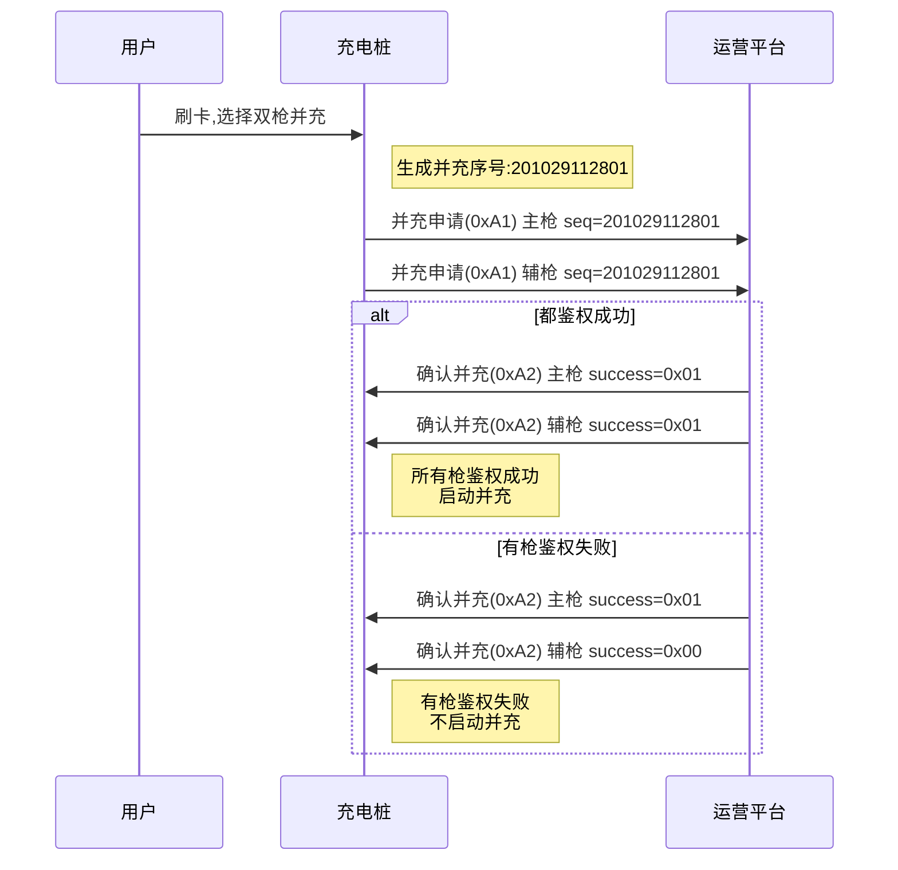
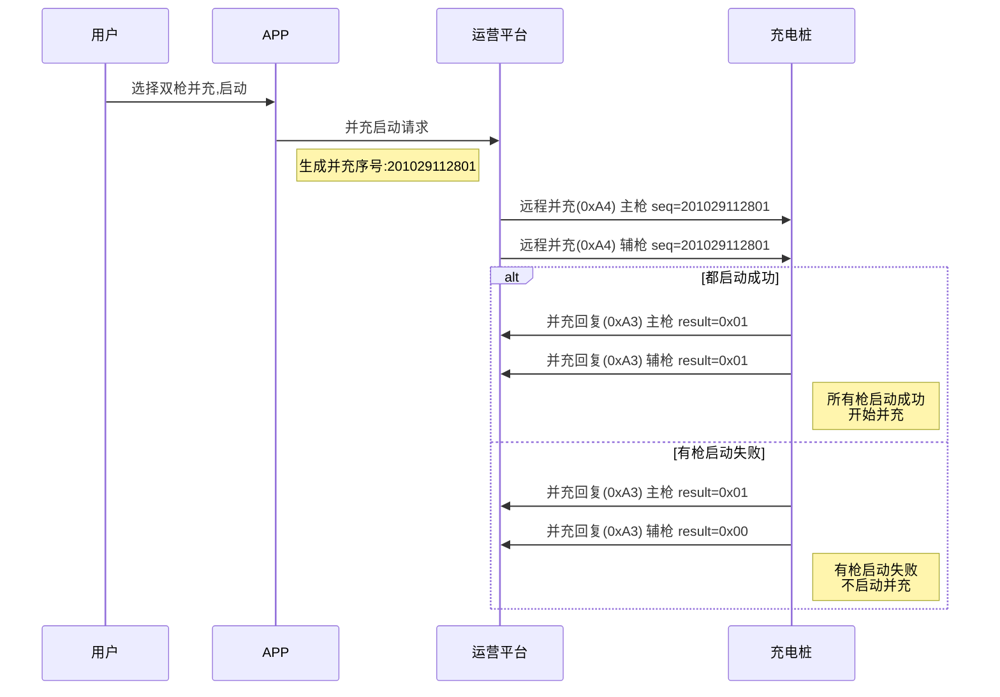
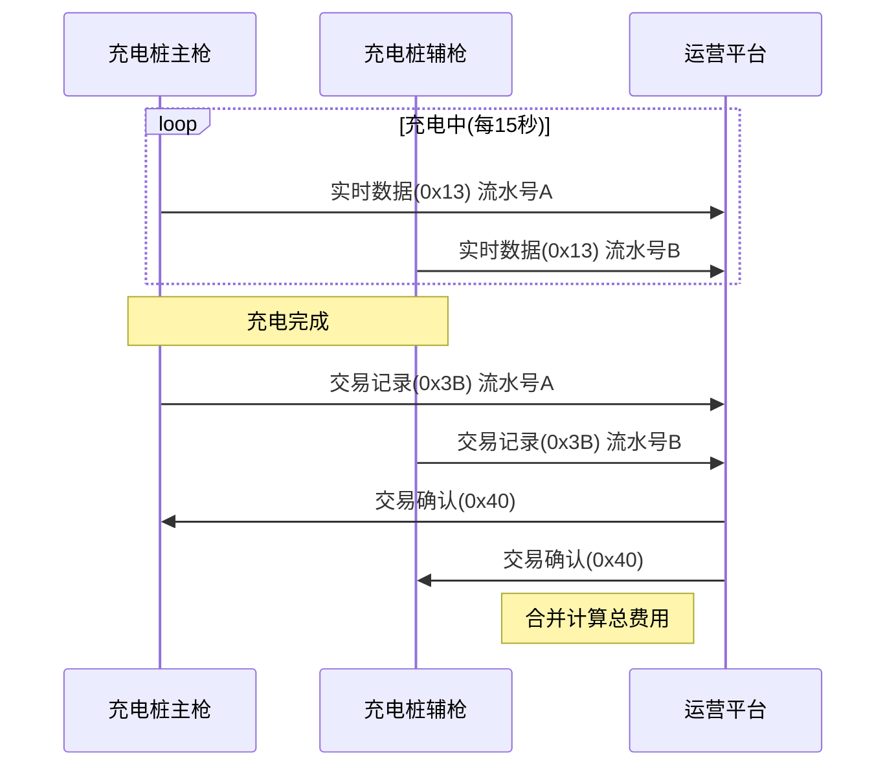

# 双枪并充模式

并充模式允许充电桩的多个充电枪同时为同一辆车充电,提高充电功率,缩短充电时间。

## 12.1 充电桩主动申请并充充电 (0xA1)

### 基本信息

| 项目 | 内容 |
|------|------|
| 帧类型码 | 0xA1 |
| 传送间隔 | 按需发送 |
| 方向 | 充电桩→运营平台 |

### 功能说明

用户通过账号密码及刷卡在充电桩上操作请求充电,多枪并充时每个枪都需要分别上送此帧。

### 样例报文

```
68 3E 0004 00 A1 32010200000001 01 01 00 00000000D14B0A54 00000000000000000000000000000000 00000000000000000000000000000000 00 201029112801
```

**报文解析**:
- 起始标志: 68
- 数据长度: 3E
- 序列号域: 0004
- 加密标志: 00
- 帧类型: A1
- 桩编码: 32010200000001
- 枪号: 01 (1号枪)
- 启动方式: 01 (刷卡启动)
- 是否需要密码: 00 (不需要)
- 物理卡号: 00000000D14B0A54
- 输入密码: (16字节)
- VIN码: (17字节)
- 主辅枪标记: 00 (主枪)
- 并充序号: 201029112801 (2020年10月29日11时28分01秒)

### 数据定义

| 序号 | 参数名称 | 数据类型 | 长度(Byte) | 备注 |
|------|---------|---------|-----------|------|
| 1 | 桩编号 | BCD码 | 7 | 不足7位补0 |
| 2 | 枪号 | BCD码 | 1 | |
| 3 | 启动方式 | BIN码 | 1 | 0x01 刷卡启动<br>0x02 账号启动(暂不支持)<br>0x03 VIN码启动 |
| 4 | 是否需要密码 | BIN码 | 1 | 0x00 不需要<br>0x01 需要 |
| 5 | 账号或物理卡号 | BIN码 | 8 | 不足8位补0 |
| 6 | 输入密码 | BIN码 | 16 | 对用户输入的密码进行16位MD5加密,采用小写上传 |
| 7 | VIN码 | ASCII码 | 17 | 启动方式为VIN码时上送,其他方式置零,需反序上送 |
| 8 | 主辅枪标记 | BIN码 | 1 | 0x00 主枪<br>0x01 辅枪 |
| 9 | 并充序号 | BCD码 | 6 | 由桩生成,生成规则:年月日时分秒<br>多个枪并充时上送并充序号一致,标志为同一次并充操作 |

---

## 12.2 运营平台确认并充启动充电 (0xA2)

### 基本信息

| 项目 | 内容 |
|------|------|
| 帧类型码 | 0xA2 |
| 传送间隔 | 应答 |
| 方向 | 运营平台→充电桩 |

### 功能说明

启动充电鉴权结果,桩需要接收到所有平台并充枪的确认结果,若都鉴权成功则启动并充,否则有一个枪鉴权失败则不启动并充。后续充电实时数据,交易都按对应枪及流水号上送。

### 样例报文

```
68 30 0004 00 A2 32010200000001011120180612195957085 32010200000001 01 0000001000000573 00000000 00 01 201029112801 E829
```

**报文解析**:
- 起始标志: 68
- 数据长度: 30
- 序列号域: 0004
- 加密标志: 00
- 帧类型: A2
- 交易流水号: 32010200000001011120180612195957085
- 桩编码: 32010200000001
- 枪号: 01
- 逻辑卡号: 0000001000000573
- 账户余额: 00000000
- 鉴权成功标志: 00 (失败)
- 失败原因: 01 (账户不存在)
- 并充序号: 201029112801
- 帧校验域: E829

### 数据定义

| 序号 | 参数名称 | 数据类型 | 长度(Byte) | 备注 |
|------|---------|---------|-----------|------|
| 1 | 交易流水号 | BCD码 | 16 | 见名词解释 |
| 2 | 桩编号 | BCD码 | 7 | 不足7位补0 |
| 3 | 枪号 | BCD码 | 1 | |
| 4 | 逻辑卡号 | BCD码 | 8 | 显示在屏幕上,不足8位补零 |
| 5 | 账户余额 | BIN码 | 4 | 保留两位小数 |
| 6 | 鉴权成功标志 | BIN码 | 1 | 0x00 失败<br>0x01 成功 |
| 7 | 失败原因 | BCD码 | 1 | 0x01 账户不存在<br>0x02 账户冻结<br>0x03 账户余额不足<br>0x04 该卡存在未结账记录<br>0x05 桩停用<br>0x06 该账户不能在此桩上充电<br>0x07 密码错误<br>0x08 电站电容不足<br>0x09 系统中VIN码不存在<br>0x0A 该桩存在未结账记录<br>0x0B 该桩不支持刷卡 |
| 8 | 并充序号 | BCD码 | 6 | 0xA1上送的并充序号 |

---

## 12.3 运营平台远程控制并充启机 (0xA4)

### 基本信息

| 项目 | 内容 |
|------|------|
| 帧类型码 | 0xA4 |
| 传送间隔 | 按需发送 |
| 方向 | 运营平台→充电桩 |

### 功能说明

当用户通过远程启动充电并且为并充模式时,发送本命令。

### 样例报文

```
68 36 007C 00 A4 55031412782305012018061914444680 55031412782305 01 0000001000000573 00000000D14B0A54 A0860100 201029112801 4622
```

**报文解析**:
- 起始标志: 68
- 数据长度: 36
- 序列号域: 007C
- 加密标志: 00
- 帧类型: A4
- 交易流水号: 55031412782305012018061914444680
- 桩编码: 55031412782305
- 枪号: 01
- 逻辑卡号: 0000001000000573
- 物理卡号: 00000000D14B0A54
- 账户余额: A0860100 (1000.00元)
- 并充序号: 201029112801
- 帧校验域: 4622

### 数据定义

| 序号 | 参数名称 | 数据类型 | 长度(Byte) | 备注 |
|------|---------|---------|-----------|------|
| 1 | 交易流水号 | BCD码 | 16 | 见名词解释 |
| 2 | 桩编号 | BCD码 | 7 | 不足7位补0 |
| 3 | 枪号 | BCD码 | 1 | |
| 4 | 逻辑卡号 | BCD码 | 8 | 显示在屏幕上,不足补零 |
| 5 | 物理卡号 | BIN码 | 8 | 不足补零,桩与平台交互使用 |
| 6 | 账户余额 | BIN码 | 4 | 保留到小数点两位 |
| 7 | 并充序号 | BCD码 | 6 | 平台生成,生成规则:年月日时分秒<br>多个枪并充时并充序号一致,标志为同一次并充操作 |

---

## 12.4 远程并充启机命令回复 (0xA3)

### 基本信息

| 项目 | 内容 |
|------|------|
| 帧类型码 | 0xA3 |
| 传送间隔 | 应答 |
| 方向 | 充电桩→运营平台 |

### 功能说明

远程启动充电命令回复,并充多枪指令回复应一致。后续充电实时数据,交易都按对应枪及流水号上送。

### 样例报文

```
68 25 0002 00 A3 32010200000001011151161555350260 32010200000001 01 01 00 00 201029112801 0FE2
```

**报文解析**:
- 起始标志: 68
- 数据长度: 25
- 序列号域: 0002
- 加密标志: 00
- 帧类型: A3
- 交易流水号: 32010200000001011151161555350260
- 桩编码: 32010200000001
- 枪号: 01
- 启动结果: 01 (成功)
- 失败原因: 00 (无)
- 主辅枪标记: 00 (主枪)
- 并充序号: 201029112801
- 帧校验域: 0FE2

### 数据定义

| 序号 | 参数名称 | 数据类型 | 长度(Byte) | 备注 |
|------|---------|---------|-----------|------|
| 1 | 交易流水号 | BCD码 | 16 | |
| 2 | 桩编号 | BCD码 | 7 | 不足7位补0 |
| 3 | 枪号 | BCD码 | 1 | |
| 4 | 启动结果 | BCD码 | 1 | 0x00 失败<br>0x01 成功 |
| 5 | 失败原因 | BIN码 | 1 | 0x00 无<br>0x01 设备编号不匹配<br>0x02 枪已在充电<br>0x03 设备故障<br>0x04 设备离线<br>0x05 未插枪 |
| 6 | 主辅枪标记 | BIN码 | 1 | 0x00 主枪<br>0x01 辅枪 |
| 7 | 并充序号 | BCD码 | 6 | 0xA4下发的并充序号 |

---

## 并充模式说明

### 什么是并充

并充(并联充电)是指使用充电桩的多个充电枪同时为同一辆电动汽车充电,通过并联提高总充电功率,缩短充电时间。

### 并充优势

| 优势 | 说明 |
|------|------|
| 充电速度快 | 双枪并充功率翻倍,充电时间减半 |
| 灵活调配 | 根据需求选择单枪或双枪充电 |
| 提高利用率 | 一桩多枪,提高设备使用效率 |

### 主辅枪概念

- **主枪**: 主要充电枪,负责BMS通信
- **辅枪**: 辅助充电枪,提供额外功率

### 并充序号

并充序号用于标识同一次并充操作:
- 格式: YYMMDDhhmmss (年月日时分秒)
- 示例: 201029112801 = 2020年10月29日11时28分01秒
- 作用: 同一次并充的多个枪使用相同的并充序号

---

## 使用场景

### 刷卡并充流程



### APP远程并充流程



### 并充充电过程



---

## 注意事项

### 鉴权规则

1. **全部成功才启动**: 所有枪都鉴权成功才启动并充
2. **一个失败全部取消**: 任何一个枪鉴权失败,整个并充操作取消
3. **序号一致性**: 同一次并充的所有枪使用相同的并充序号

### 流水号管理

1. **独立流水号**: 每个枪有独立的交易流水号
2. **分别上送**: 每个枪分别上送实时数据和交易记录
3. **序号关联**: 通过并充序号关联同一次并充操作

### 费用计算

1. **分别计费**: 每个枪独立计费
2. **费用合并**: 平台合并计算总费用
3. **统一扣费**: 从同一账户扣除总费用

### 功率分配

1. **总功率限制**: 并充总功率不超过充电桩额定功率
2. **动态调整**: 根据需求动态调整各枪功率
3. **均衡分配**: 通常主辅枪功率均分

### 异常处理

1. **单枪故障**: 一个枪故障,另一个枪可继续充电
2. **停充一致**: 停止并充时,所有枪同时停止
3. **余额不足**: 余额不足时,所有枪都停止充电

### 交易记录

1. **分别上送**: 每个枪分别上送交易记录
2. **30秒规则**: 充电结束后30秒内上送
3. **关联查询**: 通过并充序号关联查询所有枪的交易记录
