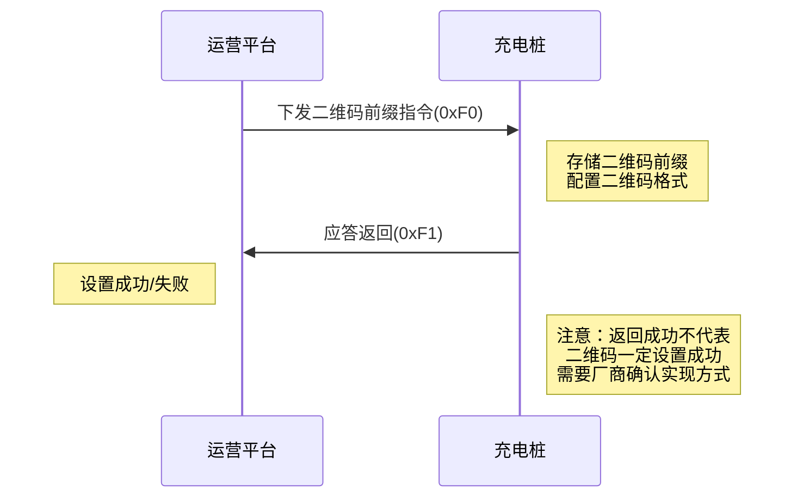

# 二维码前缀下发

## 12.1 后台下发二维码前缀指令 (0xF0)

### 基本信息

| 项目 | 内容 |
|------|------|
| 帧类型码 | 0xF0 |
| 传送间隔 | 按需发送 |
| 方向 | 运营平台→充电桩 |

### 功能说明

后台下发二维码前缀指令给充电桩。充电桩接收到该指令后，会将二维码前缀信息存储到本地，用于生成完整的二维码内容。

二维码生成规则：

- 二维码格式1：`{前缀}{桩编号}#{枪编号-1}{帧编号}`
- 二维码格式2：`{前缀}{组织编号}&id={桩内部ID}&carScope={车位范围}&no={枪编号}`

### 样例报文

```
68 5E 00 06 00 F0 36 10 00 95 12 40 32 01 51 68 74 74 70 73 3a 2f 2f 63 68 61 72 67 69 6e 67 2e 66 7a 63 73 6e 79 2e 63 6f 6d 2f 63 6f 64 65 2f 67 75 6e 44 65 74 61 69 6c 3f 6f 72 67 4e 6f 3d 4d 41 33 38 36 31 37 59 38 26 69 64 3d 31 38 36 30 26 63 61 72 53 63 6f 70 65 3d 31 26 6e 6f 3d d8 c9
```

**报文解析**:

- 起始标志: 68
- 数据长度: 5E (94字节)
- 序列号域: 0006
- 加密标志: 00
- 帧类型: F0
- 桩编码: 3610009512403201 (7字节 BCD码)
- 二维码前缀编码: 51 (1字节 BIN码)
  - 0x00：第一种前缀+桩编号
  - 0x01：第二种前缀+组织号+桩编号
- 二维码前缀长度: 不定长 (ASCII码)
- 二维码前缀: 68747470733a2f2f6368617267696e672e667a63736e792e636f6d2f636f64652f67756e44657461696c3f6f72674e6f3d4d4133383631375938266964 3d313836302663617253636f70653d31266e6f3d
  - ASCII解码: `http://charging.fzcs.com/code/gunDetail?orgNo=333865558&id=1860no=`
- 帧校验域: d8c9

### 数据定义

| 序号 | 参数名称 | 数据类型 | 长度(Byte) | 备注 |
|------|---------|---------|-----------|------|
| 1 | 桩编码 | BCD码 | 7 | 不足7位补0 |
| 2 | 二维码前缀编码 | BIN码 | 1 | 0x00：第一种前缀+桩编号<br>0x01：第二种前缀+组织号+桩编号 |
| 3 | 二维码前缀长度 | BIN码 | 1 | 二维码前缀的字节长度 |
| 4 | 二维码前缀 | ASCII | 可变 | 如："www.baidu.com? No=" |

---

## 12.2 桩应答返回下发二维码前缀指令 (0xF1)

### 基本信息

| 项目 | 内容 |
|------|------|
| 帧类型码 | 0xF1 |
| 传送间隔 | 按需发送 |
| 方向 | 充电桩→运营平台 |

### 功能说明

充电桩接收到运营平台下发的二维码前缀指令后，响应本数据。返回设置结果。

**重要提示**：即使充电桩返回设置成功（0x01），也不代表二维码一定设置成功。实际的二维码设置结果取决于充电桩厂商的具体实现方式。

### 样例报文

```
68 0C 00 06 00 F1 36 10 00 95 12 40 32 01 fc 30
```

**报文解析**:

- 起始标志: 68
- 数据长度: 0C (12字节)
- 序列号域: 0006
- 加密标志: 00
- 帧类型: F1
- 桩编码: 3610009512403201 (7字节 BCD码)
- 下发结果: 01
  - 0x00：失败
  - 0x01：成功
- 帧校验域: fc30

### 数据定义

| 序号 | 参数名称 | 数据类型 | 长度(Byte) | 备注 |
|------|---------|---------|-----------|------|
| 1 | 桩编码 | BCD码 | 7 | 不足7位补0 |
| 2 | 下发结果 | BIN码 | 1 | 0x00：失败<br>0x01：成功 |

---

## 使用场景

### 二维码动态更新

当需要更新充电桩显示的二维码内容时，平台可下发新的二维码前缀指令。

### 多厂商适配

不同厂商的充电桩可能采用不同的二维码生成规则：

- 格式1：简单拼接桩编号和枪编号
- 格式2：包含组织信息、桩ID、车位范围等详细信息

### 交互流程



## 注意事项

1. **厂商实现差异**：不同充电桩厂商对二维码的实现方式可能不同，需要根据实际情况调整
2. **设置确认**：充电桩返回成功（0x01）只表示接收到指令，不保证二维码实际设置成功
3. **前缀格式**：二维码前缀需要使用ASCII编码，确保URL格式正确
4. **长度限制**：二维码前缀的长度理论上不超过200字节（根据二维码前缀长度字段定义）
5. **生成规则**：需要与充电桩厂商确认具体的二维码生成规则和拼接方式
