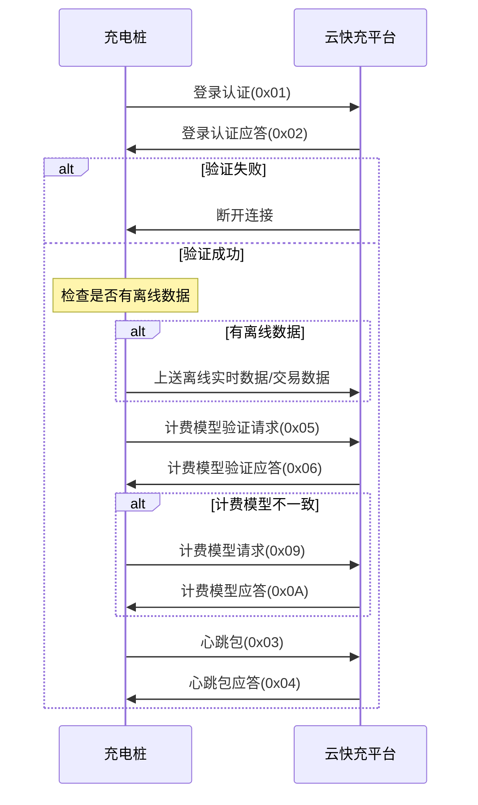
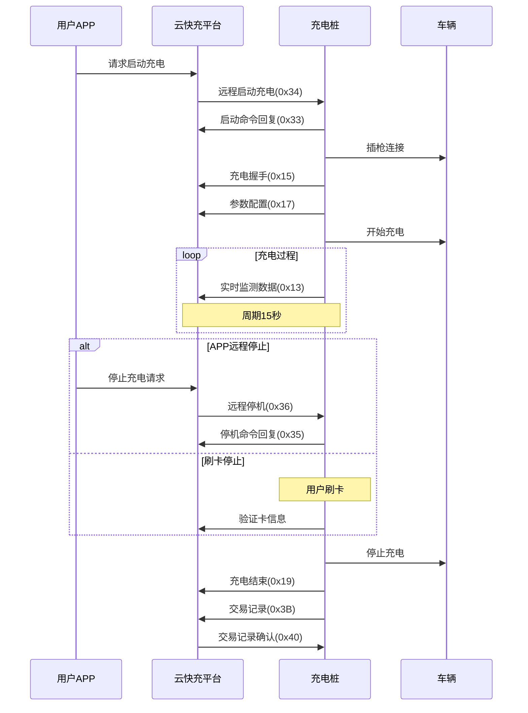
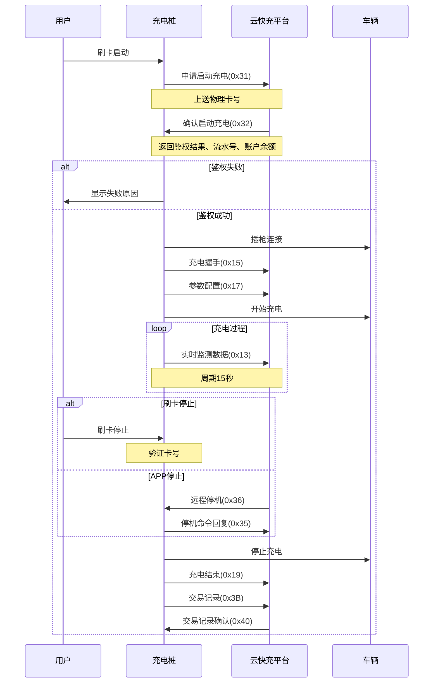
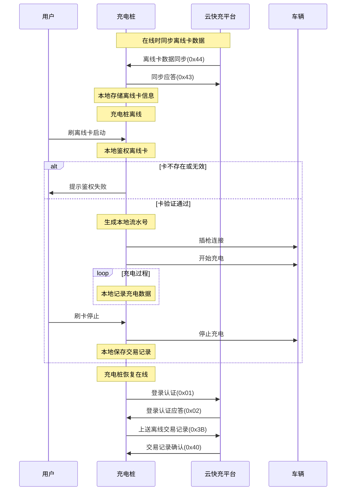

# 充电桩与云快充服务平台交互协议

江苏云快充新能源科技有限公司

<table><tr><td>版本</td><td>版本日期</td><td>修改人</td><td>版本说明</td></tr><tr><td>V1.0</td><td>2018-02-27</td><td>岳龙</td><td>1. 创建初始版本</td></tr><tr><td>V1.1</td><td>2019-08-20</td><td>张博</td><td>1. 刷卡增加失败原因提示</td></tr><tr><td>V1.2</td><td>2020-02-25</td><td>岳龙</td><td>1. 优化报文说明的示例
2. 增加12.3协议需知
3. 补充离线卡功能部分报文
4. 更新交易记录帧为0x39</td></tr><tr><td>V1.3</td><td>2020-05-18</td><td>岳龙</td><td>1. 费率拆分服务费、电费</td></tr><tr><td>V1.4</td><td>2020-09-14</td><td>岳龙</td><td>1. 修改实时数据(0x13)、交易记录(0x3F)中电量相关字段,精度值改为4位小数</td></tr><tr><td>V1.5</td><td>2020-10-15</td><td>李杨敏</td><td>1. 修改交易记录为(0x3B),并修改电表起止值字节长度</td></tr><tr><td>V1.6</td><td>2020-10-29</td><td>岳龙</td><td>增加双枪并充</td></tr></table>

# 目录

1 总则

1.1 协议概述

1.2 通信接口

1.3 接入流程

2 通信协议结构

3 应用层报文帧格式 2

3.1 应用层数据结构 2

3.2 数据格式定义 2

3.3 名词解释 2

4 帧类型定义一缆表 3

5 通信协议流程

5.1 上电流程 5

5.2 app充电流程 5

5.3 刷卡充电 7

5.4 离线充电模式 8

6 注册心跳帧类型码数据定义 8

6.1 充电桩登录认证 8

6.2 登录认证应答 9

6.3 充电桩心跳包 9

6.4 心跳包应答 10

6.5 计费模型验证请求 10

6.6 计费模型验证请求应答 10

6.7 充电桩计费模型请求 11

6.8 计费模型请求应答 11

7 实时数据帧类型码数据定义 12

7.1 读取实时监测数据 12

7.2 上传实时监测数据 12

7.3 充电握手 13

7.4 参数配置 15

7.5 充电结束 15

7.6 错误报文 16

7.7 充电阶段BMS中止 17

7.8 充电阶段充电机中止 18

7.9 充电过程BMS需求与充电机输出 19

7.10 充电过程BMS信息 20

# 8 运营交互帧类型码数据定义 21

8.1 充电桩主动申请启动充电 21

8.2 运营平台确认启动充电 21

8.3 运营平台远程控制启机 22

8.4 远程启动充电命令回复 23

8.5 运营平台远程停机 23

8.6 远程停机命令回复 24

8.7 交易记录 24

8.8 交易记录确认 26

8.9 远程账户余额更新 26

8.10 余额更新应答 26

8.11 离线卡数据同步 27

8.12 离线卡数据同步应答 27

8.13 离线卡数据清除 28

8.14 离线卡数据清除应答 28

8.15 离线卡数据查询 28

8.16 离线卡数据查询应答 29

# 9 运营平台设置帧类型码数据定义 29

9.1 充电桩工作参数设置 29

9.2 充电桩工作参数设置应答 30

9.3 对时设置 30

9.4 对时设置应答 30

9.5 计费模型设置 31

9.6 计费模型应答 31

# 10 车位锁通信协议定义 32

10.1 地锁数据上送 32

10.2 遥控地锁升锁与降锁命令 33

10.3 充电桩返回数据（上行） 33

# 11 电桩远程维护帧类型码数据定义 33

11.1 远程重启 33

11.2 远程重启应答 34

11.3 远程更新 34

11.4 远程更新应答 35

# 12 并充模式帧类型码数据定义 35

12.1 充电桩主动申请并充充电 35

12.2 运营平台确认并充启动充电 36

12.3 运营平台远程控制并充启机 37

12.4 远程并充启机命令回复 37

# 13 附录 38

13.1 充电停止原因代码表 38

13.2 CRC16校验的计算方法 40

13.3 协议需知 42

# 1 总则

# 1.1 协议概述

本协议规定了充电桩与云快充平台之间数据交互的流程、格式和内容。协议整体依据国网104充电桩规约，新增数据部分协议参照GBT-27930对充电桩充电过程中与云快充电平台的交互数据进行了补充，本协议适用于交直流，交流在本协议中部分数据无需上送数据项在下面协议部分均有标注。

# 1.2 通信接口

充电桩和充电运营管理系统之间的通信接口采用基于TCP/IP Socket的通信方式实现，按照长连接工作模式。两个系统可部署在同一个或者不同的企业网络环境中，可以通过局域网或者互联网实现互相连接通信。

充电桩通信联接方式支持有线网络接口、无线GPRS 连接运营平台服务器或者多个充电桩经过集中器与运营平台连接。

充电桩支持服务器的直接 IP 地址与网络域名解析, 地址与连接端口均为可设置参数, 测试服务器地址为 121.199.192.223, 端口号为 8768。

# 1.3 接入流程

桩企按照协议内容开发完成后，首先平台会分配测试桩的设备编号以及平台登陆账户，桩企可以登陆测试平台查看测试桩与平台的上行下数据帧以及上行数据解析内容，在数据帧解析通过后，平台会提供云快充app测试版本（只支持安卓手机）以及充电卡来对整个充电流程进行调试，最后在测试环境测试通过后，由平台提供正式环境的相关配置信息。

# 2 通信协议结构

本协议的通信协议结构如图1所示。本协议采用的TCP/IP传输定义与标准定义一致。

<table><tr><td>应用功能</td><td>初始化</td><td>用户进程</td></tr><tr><td colspan="2">本协议中定义的ASDU</td><td rowspan="2">应用层(第7层)</td></tr><tr><td colspan="2">APCI(应用规约控制信息)传输接口(用户到TCP的接口)</td></tr><tr><td rowspan="4" colspan="2">TCP/IP 协议子集</td><td>传输层(第4层)</td></tr><tr><td>网络层(第3层)</td></tr><tr><td>链路层(第2层)</td></tr><tr><td>物理层(第1层)</td></tr><tr><td colspan="3">注:第5,第6层未用</td></tr></table>

# 3 应用层报文帧格式

# 3.1 应用层数据结构

<table><tr><td>起始标志</td><td>数据长度</td><td>序列号域</td><td>加密标志</td><td>帧类型标志</td><td>消息体</td><td>帧校验域</td></tr><tr><td>1字节</td><td>1字节</td><td>2字节</td><td>1字节</td><td>1字节</td><td>N字节</td><td>2字节</td></tr></table>


数据结构定义说明：


$\bullet$  起始标识符代表一帧数据的开始，固定为  $0 \times 68$

- 数据域字节数，数据域长度不超过200字节。不加密时为原数据长度，加密时，为加密后数据长度。其值为“序列号域+加密标志+帧类型标志+消息体”字节数之和。

- 序列号域即为数据包的发送顺序号，从 0 开始顺序增加，如是应答数据包，则与询问数据包序号保持一致，当桩与平台网络断开重新建立连接或者溢出后归 0。

- 加密标志只针对消息体（数据单元）。0x00：不加密，0x01:3DES

帧类型标志定义了上下行数据帧。

- 帧校验域：从序列号域到数据域的CRC校验，校验多项式为0x180D，低字节在前，高字节在后，计算方式见附录。

# 3.2 数据格式定义

数据格式包括BCD码、BIN码、ASCII，BIN码均为低位在前高位在后。协议中小数值均乘倍率（保留小数点位数）上送平台（例如：电压为225.1，保留一位小数，上送到平台值为2251，即0x8CB）。CP56Time2a格式如下：

<table><tr><td colspan="3">Milseconds(D7-D0)</td></tr><tr><td colspan="3">Milseconds(D15-D8)</td></tr><tr><td>IV(D7)</td><td>RES1</td><td>Minutes(D5-D0)</td></tr><tr><td>SU(D7)</td><td>RES2</td><td>Hours(D4-D0)</td></tr><tr><td colspan="2">DAY of WEEK</td><td>DAY of MONTH(D4-D0)</td></tr><tr><td>RES3</td><td colspan="2">Month(D3-D0)</td></tr><tr><td>RES4</td><td colspan="2">Years(D6-D0)</td></tr></table>

# 3.3 名词解释

- 充电卡：平台默认充电卡为M1卡（不带储值），读卡器读取到的卡号为“物理卡号”，卡号储存在第0扇区0块，卡面印刷的卡号为“逻辑卡号”，物理卡号用于充电桩与服务器数据交互，逻辑卡号用于显示在桩屏幕上便于用户核对卡信息。IC卡或者CPU卡均采用平台M1卡的鉴权模式，不使用数据储存与写入功能。

- 交易流水号：交易流水号为一次充电操作过程的统一标记，从远程启动充电或者卡鉴权回复

时产生到最后桩结束充电的交易记录均使用同一个流水号，由平台产生（离线模式由桩按此规则生成），生成规则为格式桩号（7bytes）+枪号（1byte）+年月日时分秒（6bytes）+自增序号（2bytes）；示例：32010600019236012001061803423060。

- 计损比例：计损比例定义在费率帧中，此项非零时，充电桩需要对上送平台充电量加上此比例，如<实时监测数据>中“计损电度”，则为“电度”基础上加上此比例得到的值。同理见<交易记录>中“计损尖电量”、“计损峰电量”、“计损平电量”、“计损谷电量”、“计损总电量”；（目前平台不支持计损功能，计损比例置0）。

桩编号：由平台生成提供给桩使用，不支持桩企自行生成的桩编号。示例:3201060001923601

- 枪号：由7个字节桩编号+1个字节的枪号生成。示例：3201060001923601/3201060001923602

# 4 帧类型定义一缆表

充电桩定义的帧类型码为奇数，运营平台定义的帧类型码为偶数；帧类型码分段定义，已定义的帧类型码不可重定义为其他定义；

<table><tr><td>帧类型码</td><td>帧类型码名称</td><td>数据传送方向</td><td>备注</td></tr><tr><td>0x01</td><td>充电桩登录认证</td><td>充电桩-&gt;运营平台</td><td>充电桩每次复位或通信离线,都需重新登录,并成功后才能进行后续交互</td></tr><tr><td>0x02</td><td>登录认证应答</td><td>运营平台-&gt;充电桩</td><td></td></tr><tr><td>0x03</td><td>充电桩心跳包</td><td>充电桩-&gt;运营平台</td><td></td></tr><tr><td>0x04</td><td>心跳包应答</td><td>运营平台-&gt;充电桩</td><td></td></tr><tr><td>0x05</td><td>计费模型验证请求</td><td>充电桩-&gt;运营平台</td><td></td></tr><tr><td>0x06</td><td>计费模型验证请求应答</td><td>运营平台-&gt;充电桩</td><td></td></tr><tr><td>0x09</td><td>充电桩计费模型请求</td><td>充电桩-&gt;运营平台</td><td></td></tr><tr><td>0x0A</td><td>计费模型请求应答</td><td>运营平台-&gt;充电桩</td><td></td></tr><tr><td></td><td></td><td></td><td></td></tr><tr><td>0x12</td><td>读取实时监测数据</td><td>运营平台-&gt;充电桩</td><td></td></tr><tr><td>0x13</td><td>离线监测数据</td><td>充电桩-&gt;运营平台</td><td></td></tr><tr><td>0x15</td><td>充电握手</td><td>充电桩-&gt;运营平台</td><td></td></tr><tr><td>0x17</td><td>参数配置</td><td>充电桩-&gt;运营平台</td><td></td></tr><tr><td>0x19</td><td>充电结束</td><td>充电桩-&gt;运营平台</td><td></td></tr><tr><td>0x1B</td><td>错误报文</td><td>充电桩-&gt;运营平台</td><td></td></tr><tr><td>0x1D</td><td>充电阶段BMS中止</td><td>充电桩-&gt;运营平台</td><td></td></tr><tr><td>0x21</td><td>充电阶段充电机中止</td><td>充电桩-&gt;运营平台</td><td></td></tr><tr><td>0x23</td><td>充电过程BMS需求、充电机输出</td><td>充电桩-&gt;运营平台</td><td></td></tr><tr><td>0x25</td><td>充电过程BMS信息</td><td>充电桩-&gt;运营平台</td><td></td></tr><tr><td></td><td></td><td></td><td></td></tr><tr><td>0x31</td><td>充电桩主动申请启动充电</td><td>充电桩-&gt;运营平台</td><td></td></tr><tr><td>0x32</td><td>运营平台确认启动充电</td><td>运营平台-&gt;充电桩</td><td></td></tr><tr><td>0x33</td><td>远程启机命令回复</td><td>充电桩-&gt;运营平台</td><td></td></tr><tr><td>0x34</td><td>运营平台远程控制启机</td><td>运营平台-&gt;充电桩</td><td></td></tr><tr><td>0x35</td><td>远程停机命令回复</td><td>充电桩-&gt;运营平台</td><td></td></tr><tr><td>0x36</td><td>运营平台远程停机</td><td>运营平台-&gt;充电桩</td><td></td></tr><tr><td>0x3B</td><td>交易记录</td><td>充电桩-&gt;运营平台</td><td></td></tr><tr><td>0x40</td><td>交易记录确认</td><td>运营平台-&gt;充电桩</td><td></td></tr><tr><td>0x41</td><td>余额更新应答</td><td>充电桩-&gt;运营平台</td><td></td></tr><tr><td>0x42</td><td>远程账户余额更新</td><td>运营平台-&gt;充电桩</td><td></td></tr><tr><td>0x43</td><td>卡数据同步应答</td><td>充电桩-&gt;运营平台</td><td></td></tr><tr><td>0x44</td><td>离线卡数据同步</td><td>运营平台-&gt;充电桩</td><td></td></tr><tr><td>0x45</td><td>离线卡数据清除应答</td><td>充电桩-&gt;运营平台</td><td></td></tr><tr><td>0x46</td><td>离线卡数据清除</td><td>运营平台-&gt;充电桩</td><td></td></tr><tr><td>0x47</td><td>离线卡数据查询应答</td><td>充电桩-&gt;运营平台</td><td></td></tr><tr><td>0x48</td><td>离线卡数据查询</td><td>运营平台-&gt;充电桩</td><td></td></tr><tr><td>0x51</td><td>充电桩工作参数设置应答</td><td>充电桩-&gt;运营平台</td><td></td></tr><tr><td>0x52</td><td>充电桩工作参数设置</td><td>运营平台-&gt;充电桩</td><td></td></tr><tr><td>0x55</td><td>对时设置应答</td><td>充电桩-&gt;运营平台</td><td></td></tr><tr><td>0x56</td><td>对时设置</td><td>运营平台-&gt;充电桩</td><td></td></tr><tr><td>0x57</td><td>计费模型应答</td><td>充电桩-&gt;运营平台</td><td></td></tr><tr><td>0x58</td><td>计费模型设置</td><td>运营平台-&gt;充电桩</td><td></td></tr><tr><td></td><td></td><td></td><td></td></tr><tr><td>0x61</td><td>地锁数据上送(充电桩上送)</td><td>充电桩-&gt;运营平台</td><td></td></tr><tr><td>0x62</td><td>遥控地锁升锁与降锁命令(下行)</td><td>运营平台-&gt;充电桩</td><td></td></tr><tr><td>0x63</td><td>充电桩返回数据(上行)</td><td>充电桩-&gt;运营平台</td><td></td></tr><tr><td></td><td></td><td></td><td></td></tr><tr><td>0x91</td><td>远程重启应答</td><td>充电桩-&gt;运营平台</td><td></td></tr><tr><td>0x92</td><td>远程重启</td><td>运营平台-&gt;充电桩</td><td></td></tr><tr><td>0x93</td><td>远程更新应答</td><td>充电桩-&gt;运营平台</td><td></td></tr><tr><td>0x94</td><td>远程更新</td><td>运营平台-&gt;充电桩</td><td></td></tr><tr><td></td><td></td><td></td><td></td></tr><tr><td>0xA1</td><td>充电桩主动申请并充充电</td><td>充电桩-&gt;运营平台</td><td></td></tr><tr><td>0xA2</td><td>运营平台确认并充启动充电</td><td>运营平台-&gt;充电桩</td><td></td></tr><tr><td>0xA3</td><td>远程并充启机命令回复</td><td>运营平台-&gt;充电桩</td><td></td></tr><tr><td>0xA4</td><td>运营平台远程控制并充启机</td><td>充电桩-&gt;运营平台</td><td></td></tr></table>

# 5 通信协议流程

# 5.1 上电流程

充电桩在上电或者离线恢复后连接到云快充平台，首先上送充电桩登陆认证，平台对桩的信息进行校验，并回复登陆认证应答，如果不符合则会断开当前建立的连接，如果验证通过，则桩先检查是否有离线状态下本地储存的实时监测数据或者交易数据，如果有则先上送到平台进行处理，随后充电桩发起充电计费模型的请求，平台检测计费模型与当前运营费率是否一致，并回复计费模型请求应答，如果不一致，桩需要向平台请求新的计费模型。




# 5.2 app充电流程

app 充电流程与刷卡充电流程互通，即 app 充电可以用卡结束，app 鉴权时会将用户绑定的卡信息下发到充电桩，用于卡结束验证，卡充电可以用 app 结束充电。




# 5.3 刷卡充电




# 5.4 离线充电模式




# 6 注册心跳帧类型码数据定义

# 6.1 充电桩登录认证

<table><tr><td>帧类型码</td><td colspan="2">0x01</td><td>传送间隔</td><td>通信中断后上电复位</td></tr><tr><td>功能</td><td colspan="4">充电桩将桩设置的运营编码上传给运营平台，以实现运营平台将运营编码与充电桩建立连接关系</td></tr><tr><td>样例报文</td><td colspan="4">68（起始标志）22（数据长度）0000（序列号域）00（加密标志）01（类型）55031412782305（桩编码）00（桩类型）02（充电枪数量）0F（通信协议版本：V1.5）56342E312E353000（程序版本：v4.1.50）01（网络链接类型）01010101010101010101（sim卡）04（运营商）675A（帧校验域）</td></tr><tr><td colspan="5"></td></tr><tr><td>序号</td><td>参数名称</td><td>数据类型</td><td>长度(Byte)</td><td>备注</td></tr><tr><td>1</td><td>桩编码</td><td>BCD码</td><td>7</td><td>不足7位补0</td></tr><tr><td>2</td><td>桩类型</td><td>BIN码</td><td>1</td><td>0表示直流桩,1表示交流桩</td></tr><tr><td>3</td><td>充电枪数量</td><td>BIN码</td><td>1</td><td></td></tr><tr><td>4</td><td>通信协议版本</td><td>BIN码</td><td>1</td><td>版本号乘10,v1.0表示0x0A</td></tr><tr><td>5</td><td>程序版本</td><td>ASCII码</td><td>8</td><td>不足8位补零</td></tr><tr><td>6</td><td>网络链接类型</td><td>BIN码</td><td>1</td><td>0x00 SIM卡
0x01 LAN
0x02 WAN
0x03 其他</td></tr><tr><td>7</td><td>Sim卡</td><td>BCD码</td><td>10</td><td>不足10位补零,取不到置零</td></tr><tr><td>8</td><td>运营商</td><td>BIN码</td><td>1</td><td>0x00移动
0x02电信
0x03联通
0x04其他</td></tr></table>

# 6.2 登录认证应答

<table><tr><td>帧类型码</td><td colspan="2">0x02</td><td>传送间隔</td><td>应答发送</td></tr><tr><td>功能</td><td colspan="4">回复电桩登陆结果</td></tr><tr><td>样例报文</td><td colspan="4">68（起始标志）0C（数据长度）0000（序列号域）00（加密标志）02（类型）55 03 14 12 78 23 05（桩编码）00（登陆结果：成功）DA 4C（帧校验域）</td></tr><tr><td colspan="5"></td></tr><tr><td>序号</td><td>参数名称</td><td>数据类型</td><td>长度(Byte)</td><td>备注</td></tr><tr><td>1</td><td>桩编码</td><td>BCD码</td><td>7</td><td>不足7位补0</td></tr><tr><td>2</td><td>登陆结果</td><td>BIN码</td><td>1</td><td>0x00: 登陆成功 0x01: 登陆失败</td></tr></table>

# 6.3 充电桩心跳包

<table><tr><td>帧类型码</td><td colspan="2">0x03</td><td>传送间隔</td><td>10秒周期上送</td></tr><tr><td>功能</td><td colspan="4">用于链路状态判断,3次未收到心跳包视为网络异常,需要重新登陆</td></tr><tr><td>样例报文</td><td colspan="4">68(起始标志)0D(数据长度)0001(序列号域)00(加密标志)03(类型)32010200000001(桩编码)0x01(枪号:1号枪)00(枪状态:正常)6890(帧校验域)</td></tr><tr><td colspan="5"></td></tr><tr><td>序号</td><td>参数名称</td><td>数据类型</td><td>长度(Byte)</td><td>备注</td></tr><tr><td>1</td><td>桩编码</td><td>BCD码</td><td>7</td><td>不足7位补0</td></tr><tr><td>2</td><td>枪号</td><td>BCD码</td><td>1</td><td></td></tr><tr><td>3</td><td>枪状态</td><td>BIN码</td><td>1</td><td>0x00:正常 0x01:故障</td></tr></table>

# 6.4 心跳包应答

<table><tr><td>帧类型码</td><td colspan="2">0x04</td><td>传送间隔</td><td>应答发送</td></tr><tr><td>功能</td><td colspan="4">用于链路状态判断</td></tr><tr><td>样例报文</td><td colspan="4">68（起始标志）0D（数据长度）3600（序列号域）00（加密标志）04（类型）55031412782305（桩编码）01（枪号）00（心跳应答）65B2（帧校验域）</td></tr><tr><td colspan="5"></td></tr><tr><td>序号</td><td>参数名称</td><td>数据类型</td><td>长度(Byte)</td><td>备注</td></tr><tr><td>1</td><td>桩编码</td><td>BCD码</td><td>7</td><td>不足7位补0</td></tr><tr><td>2</td><td>枪号</td><td>BCD码</td><td>1</td><td></td></tr><tr><td>3</td><td>心跳应答</td><td>BIN码</td><td>1</td><td>置0</td></tr></table>

# 6.5 计费模型验证请求

<table><tr><td>帧类型码</td><td colspan="2">0x05</td><td>传送间隔</td><td>主动请求,直到成功</td></tr><tr><td>功能</td><td colspan="4">充电桩在登陆成功后,都需要对当前计费模型校验,如计费模型与平台当前不一致,则需要向平台请求新的计费模型</td></tr><tr><td>样例报文</td><td colspan="4">68(起始标志)0D(数据长度)0002(序列号域)00(加密标志)05(类型)32010200000001(桩编码)0001(计费模型编码)9C00(帧校验域)</td></tr><tr><td colspan="5"></td></tr><tr><td>序号</td><td>参数名称</td><td>数据类型</td><td>长度(Byte)</td><td>备注</td></tr><tr><td>1</td><td>桩编号</td><td>BCD码</td><td>7</td><td>不足7位补0</td></tr><tr><td>2</td><td>计费模型编号</td><td>BCD码</td><td>2</td><td>首次连接到平台时置零</td></tr></table>

# 6.6 计费模型验证请求应答

<table><tr><td>帧类型码</td><td colspan="2">0x06</td><td>传送间隔</td><td>应答发送</td></tr><tr><td>功能</td><td colspan="4">平台判断当前接收的计费模型是否为桩最新的计费模型,如果不一致需要向平台请求新计费模型,在桩空闲期间下发费率,其他期间无需下发</td></tr><tr><td>样例报文</td><td colspan="4">68(起始标志) 0E(数据长度) CE 04(序列号域) 00(加密标志) 06(帧类型标志) 55 03 14 1278 23 05(桩编码) 00 00(计费模型编号) 00(验证结果) 8E 2F(帧校验域)</td></tr><tr><td colspan="5"></td></tr><tr><td>序号</td><td>参数名称</td><td>数据类型</td><td>长度(Byte)</td><td>备注</td></tr><tr><td>1</td><td>桩编号</td><td>BCD码</td><td>7</td><td>不足7位补0</td></tr><tr><td>2</td><td>计费模型编号</td><td>BCD码</td><td>2</td><td></td></tr><tr><td>3</td><td>验证结果</td><td>BIN码</td><td>1</td><td>0x00 桩计费模型与平台一致0x01 桩计费模型与平台不一致</td></tr></table>

# 6.7 充电桩计费模型请求

<table><tr><td>帧类型码</td><td colspan="2">0x09</td><td>传送间隔</td><td>主动请求,直到成功</td></tr><tr><td>功能</td><td colspan="4">充电桩计费模型与平台不一致时,都需要请求计费模型,如计费模型请求不成功,则禁止充电</td></tr><tr><td>样例报文</td><td colspan="4">68(起始标志)0B(数据长度)0200(序列号域)00(加密标志)09(类型)55031412782305(桩编码)DD25(帧校验域)</td></tr><tr><td colspan="5"></td></tr><tr><td>序号</td><td>参数名称</td><td>数据类型</td><td>长度(Byte)</td><td>备注</td></tr><tr><td>1</td><td>桩编号</td><td>BCD码</td><td>7</td><td>不足7位补0</td></tr></table>

# 6.8 计费模型请求应答

<table><tr><td>帧类型码</td><td colspan="2">0x0A</td><td>传送间隔</td><td>应答发送</td></tr><tr><td>功能</td><td colspan="4">用户充电费用计算,每半小时为一个费率段,共48段,每段对应尖峰平谷其中一个费率充电时桩屏幕按此费率分别显示已充电费和服务费</td></tr><tr><td>样例报文</td><td colspan="4">68(起始标志)5E(数据长度)02 00(序列号域)00(加密标志)0A(帧类型标志)55 03 14 1278 23 05(桩编码)01 00(计费模型编号)40 0D 03 00(尖电费费率)9C 40 00 00(尖服务费费率)E0 93 04 00(峰电费费率)9C 40 00 00(峰服务费费率)80 1A 06 00(平电费费率)9C 40 00 00(平服务费费率)20 A1 07 00(谷电费费率)9C 40 00 00(谷服务费费率)00(计损比例)00(时段费率号48个)00 00 00 00 00 00 00 00 00 00 00 00 00 00 00 00 00 00 00 00 00 00 00 00 00 00 00 00 00 00 00 00 00 00 5E 60(帧校验域)</td></tr><tr><td colspan="5"></td></tr><tr><td>序号</td><td>参数名称</td><td>数据类型</td><td>长度(Byte)</td><td>备注</td></tr><tr><td>1</td><td>桩编号</td><td>BCD码</td><td>7</td><td>不足7位补0</td></tr><tr><td>2</td><td>计费模型编号</td><td>BCD码</td><td>2</td><td>固定值:01 00</td></tr><tr><td>3</td><td>尖费电费费率</td><td>BIN码</td><td>4</td><td>精确到五位小数</td></tr><tr><td>4</td><td>尖服务费费率</td><td>BIN码</td><td>4</td><td>精确到五位小数</td></tr><tr><td>5</td><td>峰电费费率</td><td>BIN码</td><td>4</td><td>精确到五位小数</td></tr><tr><td>6</td><td>峰服务费费率</td><td>BIN码</td><td>4</td><td>精确到五位小数</td></tr><tr><td>7</td><td>平电费费率</td><td>BIN码</td><td>4</td><td>精确到五位小数</td></tr><tr><td>8</td><td>平服务费费率</td><td>BIN码</td><td>4</td><td>精确到五位小数</td></tr><tr><td>9</td><td>谷电费费率</td><td>BIN码</td><td>4</td><td>精确到五位小数</td></tr><tr><td>10</td><td>谷服务费费率</td><td>BIN码</td><td>4</td><td>精确到五位小数</td></tr><tr><td>11</td><td>计损比例</td><td>BIN码</td><td>1</td><td>见名词解释</td></tr><tr><td>12</td><td>0:00~0:30时段费率号</td><td>BIN码</td><td>1</td><td>0x00:尖费率0x01:峰费率0x02:平费率0x03:谷费率</td></tr><tr><td>13</td><td>0:30~1:00时段费率号</td><td>BIN码</td><td>1</td><td>同上</td></tr><tr><td>......</td><td>......</td><td>......</td><td>......</td><td>......</td></tr><tr><td>58</td><td>23:00~23:30时段费率号</td><td>BIN码</td><td>1</td><td>同上</td></tr><tr><td>59</td><td>23:30~0:00时段费率号</td><td>BIN码</td><td>1</td><td>同上</td></tr></table>

# 7 实时数据帧类型码数据定义

# 7.1 读取实时监测数据

<table><tr><td>帧类型码</td><td colspan="2">0x12</td><td>传送间隔</td><td>主动请求</td></tr><tr><td>功能</td><td colspan="4">运营平台根据需要主动发起读取实时数据的请求</td></tr><tr><td>样例报文</td><td colspan="4">68（起始标志）0C（数据长度）0000（序列号域）00（加密标志）12（类型）32010200000001（桩编码）01（枪号：1枪）0069（帧校验域）</td></tr><tr><td colspan="5"></td></tr><tr><td>序号</td><td>参数名称</td><td>数据类型</td><td>长度(Byte)</td><td>备注</td></tr><tr><td>1</td><td>桩编号</td><td>BCD码</td><td>7</td><td>不足7位补0</td></tr><tr><td>2</td><td>枪号</td><td>BCD码</td><td>1</td><td></td></tr></table>

# 7.2 上传实时监测数据

<table><tr><td>帧类型码</td><td colspan="2">0x13</td><td>传送间隔</td><td>周期上送、变位上送、召唤</td></tr><tr><td>功能</td><td colspan="4">上送充电枪实时数据,周期上送时,待机5分钟、充电15秒</td></tr><tr><td>样例报文</td><td colspan="4">68(起始标志)40(数据长度)1A03(序列号域)00(加密标志)13(类型)00000000000000000000000000000(交易流水号)55031412782305(桩编码)01(枪号:1号枪)00(状态:离线)01(是否归位:已归位)01(是否插枪:是)0200(输出电压:0)0000(输出电流:0)00(枪线温度:10)000000000000000(枪线编码)00(soc:0)00(电池组最高温度:0)00 00(累计充电时间:0)00 00(剩余时间:0)00 00 00 00(充电度数:0)00 00 00 00(计损充电度数:0)00 00 00 00(已充金额:0)0000(硬件故障:无)9DAC(帧校验域)</td></tr><tr><td colspan="5"></td></tr><tr><td>序号</td><td>参数名称</td><td>数据类型</td><td>长度(Byte)</td><td>备注</td></tr><tr><td>1</td><td>交易流水号</td><td>BCD码</td><td>16</td><td>见名词解释</td></tr><tr><td>2</td><td>桩编号</td><td>BCD码</td><td>7</td><td>不足7位补0</td></tr><tr><td>3</td><td>枪号</td><td>BCD码</td><td>1</td><td></td></tr><tr><td>4</td><td>状态</td><td>BIN码</td><td>1</td><td>0x00:离线0x01:故障0x02:空闲0x03:充电需做到变位上送</td></tr><tr><td>5</td><td>枪是否归位</td><td>BIN码</td><td>1</td><td>0x00否0x01是0x02未知(无法检测到枪是否插回枪座即未知)</td></tr><tr><td>6</td><td>是否插枪</td><td>BIN 码</td><td>1</td><td>0x00 否 0x01 是需做到变位上送</td></tr><tr><td>7</td><td>输出电压</td><td>BIN 码</td><td>2</td><td>精确到小数点后一位;待机置零</td></tr><tr><td>8</td><td>输出电流</td><td>BIN 码</td><td>2</td><td>精确到小数点后一位;待机置零</td></tr><tr><td>9</td><td>枪线温度</td><td>BIN 码</td><td>1</td><td>整形,偏移量-50;待机置零</td></tr><tr><td>10</td><td>枪线编码</td><td>BIN 码</td><td>8</td><td>没有置零</td></tr><tr><td>11</td><td>SOC</td><td>BIN 码</td><td>1</td><td>待机置零;交流桩置零</td></tr><tr><td>12</td><td>电池组最高温度</td><td>BIN 码</td><td>1</td><td>整形,偏移量-50 °C;待机置零;交流桩置零</td></tr><tr><td>13</td><td>累计充电时间</td><td>BIN 码</td><td>2</td><td>单位: min;待机置零</td></tr><tr><td>14</td><td>剩余时间</td><td>BIN 码</td><td>2</td><td>单位: min;待机置零、交流桩置零</td></tr><tr><td>15</td><td>充电度数</td><td>BIN 码</td><td>4</td><td>精确到小数点后四位;待机置零</td></tr><tr><td>16</td><td>计损充电度数</td><td>BIN 码</td><td>4</td><td>精确到小数点后四位;待机置零未设置计损比例时等于充电度数</td></tr><tr><td>17</td><td>已充金额</td><td>BIN 码</td><td>4</td><td>精确到小数点后四位;待机置零(电费+服务费)*计损充电度数</td></tr><tr><td>18</td><td>硬件故障</td><td>BIN 码</td><td>2</td><td>Bit 位表示(0否1是),低位到高位顺序Bit1:急停按钮动作故障;Bit2:无可用整流模块;Bit3:出风口温度过高;Bit4:交流防雷故障;Bit5:交直流模块 DC20通信中断;Bit6:绝缘检测模块 FC08通信中断;Bit7:电度表通信中断;Bit8:读卡器通信中断;Bit9:RC10通信中断;Bit10:风扇调速板故障;Bit11:直流熔断器故障;Bit12:高压接触器故障;Bit13:门打开;</td></tr></table>

# 7.3 充电握手

<table><tr><td>帧类型码</td><td>0x15</td><td>传送间隔</td><td colspan="2">主动上送</td></tr><tr><td>功能</td><td colspan="4">GBT-27930 充电桩与 BMS 充电握手阶段报文</td></tr><tr><td>样例报文</td><td colspan="4">68（起始标志）4D（数据长度）0015（序列号域）00（加密标志）15（类型）
3201020000000011151116155535026（交易流水号）32010200000001（桩编码）01（枪号）
000000(BMS 通信协议版本号)00（BMS 电池类型）0000（BMS 整车动力蓄电池系统额定容量）</td></tr><tr><td></td><td colspan="4">0000(BMS整车动力蓄电池系统额定总电压) 00000000(BMS电池生产厂商名称) 00000000(BMS电池组序号) 00(BMS电池组生产日期年) 00(BMS电池组生产日期月) 00(BMS电池组生产日期日) 000000(BMS电池组充电次数) 00(BMS电池组产权标识) 00(预留位)000000000000000000000000000(BMS车辆识别码) 000000000000000000000000(BMS软件版本号) FED2(帧校验域)</td></tr><tr><td colspan="5"></td></tr><tr><td>序号</td><td>参数名称</td><td>数据类型</td><td>长度(Byte)</td><td>备注</td></tr><tr><td>1</td><td>交易流水号</td><td>BCD码</td><td>16</td><td>见名词解释</td></tr><tr><td>2</td><td>桩编号</td><td>BCD码</td><td>7</td><td>不足7位补0</td></tr><tr><td>3</td><td>枪号</td><td>BCD码</td><td>1</td><td></td></tr><tr><td>4</td><td>BMS通信协议版本号</td><td>BIN</td><td>3</td><td>当前版本为V1.1,表示为:byte3,byte2-0001H;byte1-01H</td></tr><tr><td>5</td><td>BMS电池类型</td><td>BIN</td><td>1</td><td>电池类型,01H:铅酸电池;02H:氢电池;03H:磷酸铁锂电池;04H:锰酸锂电池;05H:钴酸锂电池;06H:三元材料电池;07H:聚合物锂离子电池;08H:钛酸锂电池;FFH:其他;</td></tr><tr><td>6</td><td>BMS整车动力蓄电池系统额定容量</td><td>BIN</td><td>2</td><td>0.1Ah/位,0Ah偏移量</td></tr><tr><td>7</td><td>BMS整车动力蓄电池系统额定总电压</td><td>BIN</td><td>2</td><td>0.1V/位,0V偏移量</td></tr><tr><td>8</td><td>BMS电池生产厂商名称</td><td>BIN</td><td>4</td><td>标准ASCII码</td></tr><tr><td>9</td><td>BMS电池组序号</td><td>BIN</td><td>4</td><td>预留,由厂商自行定义</td></tr><tr><td>10</td><td>BMS电池组生产日期年</td><td>BIN</td><td>1</td><td>1985年偏移量,数据范围:1985~2235年</td></tr><tr><td>11</td><td>BMS电池组生产日期月</td><td>BIN</td><td>1</td><td>0月偏移量,数据范围:1~12月</td></tr><tr><td>12</td><td>BMS电池组生产日期日</td><td>BIN</td><td>1</td><td>0日偏移量,数据范围:1~31日</td></tr><tr><td>13</td><td>BMS电池组充电次数</td><td>BIN</td><td>3</td><td>1次/位,0次偏移量,以BMS统计为准</td></tr><tr><td>14</td><td>BMS电池组产权标识</td><td>BIN</td><td>1</td><td>(&lt;0&gt;:=租赁;&lt;1&gt;:=车自有)</td></tr><tr><td>15</td><td>预留位</td><td>BIN</td><td>1</td><td></td></tr><tr><td>16</td><td>BMS车辆识别码</td><td>BIN</td><td>17</td><td>VIN</td></tr><tr><td>17</td><td>BMS软件版本号</td><td>BIN</td><td>8</td><td>Byte8、byte7、byte6-000001H~FFFFFFEH,预留,填FFFFFFFH;Byte5-byte2作为BMS软件版本编译时间信息标记,Byte5,byte4-0001H~FFFEH表示“年”(例如2015年:填写Byte5—DFH,byte4-07H);Byte3-01H~0CH表示“月”(例如11月:填写Byte3-0BH);Byte2-01H~1FH表示“日”(例</td></tr><tr><td></td><td></td><td></td><td></td><td>如10日：填写Byte2-0AH）；Byte1-01H～FEH表示版本流水号（例如16：填写Byte1-10H）。</td></tr></table>

# 7.4 参数配置

<table><tr><td>帧类型码</td><td colspan="2">0x17</td><td>传送间隔</td><td>主动上送</td></tr><tr><td>功能</td><td colspan="4">GBT-27930充电桩与BMS参数配置阶段报文</td></tr><tr><td>样例报文</td><td colspan="4">68(起始标志)31(数据长度)0016(序列号域)00(加密标志)17(类型)320102000000001115116155535026(交易流水号)32010200000001(桩编码)01(枪号)0000(BMS单体动力蓄电池最高允许充电电压)0000(BMS最高允许充电电流)0000(BMS动力蓄电池标称总能量)0000(BMS最高允许充电总电压)00(BMS最高允许温度)0000(BMS整车动力蓄电池荷电状态(soc))0000(BMS整车动力蓄电池当前电池电压)0000(电桩最高输出电压)0000(电桩最低输出电压)0000(电桩最大输出电流)0000(电桩最小输出电流)D18A(帧校验域)</td></tr><tr><td colspan="5"></td></tr><tr><td>序号</td><td>参数名称</td><td>数据类型</td><td>长度(Byte)</td><td>备注</td></tr><tr><td>1</td><td>交易流水号</td><td>BCD码</td><td>16</td><td>见名词解释</td></tr><tr><td>2</td><td>桩编号</td><td>BCD码</td><td>7</td><td>不足7位补0</td></tr><tr><td>3</td><td>枪号</td><td>BCD码</td><td>1</td><td></td></tr><tr><td>4</td><td>BMS单体动力蓄电池最高允许充电电压</td><td>BIN</td><td>2</td><td>0.01 V/位,0 V偏移量;数据范围:0~24 V</td></tr><tr><td>5</td><td>BMS最高允许充电电流</td><td>BIN</td><td>2</td><td>0.1 A/位,-400A偏移量</td></tr><tr><td>6</td><td>BMS动力蓄电池标称总能量</td><td>BIN</td><td>2</td><td>0.1 kWh/位,0 kWh偏移量;数据范围:0~1000 kWh</td></tr><tr><td>7</td><td>BMS最高允许充电总电压</td><td>BIN</td><td>2</td><td>0.1 V/位,0 V偏移量</td></tr><tr><td>8</td><td>BMS最高允许温度</td><td>BIN</td><td>1</td><td>1°C/位,-50°C偏移量;数据范围:-50°C~+200°C</td></tr><tr><td>9</td><td>BMS整车动力蓄电池荷电状态(soc)</td><td>BIN</td><td>2</td><td>0.1%/位,0%偏移量;数据范围:0~100%</td></tr><tr><td>10</td><td>BMS整车动力蓄电池当前电池电压</td><td>BIN</td><td>2</td><td>整车动力蓄电池总电压</td></tr><tr><td>11</td><td>电桩最高输出电压</td><td>BIN</td><td>2</td><td>0.1 V/位,0 V偏移量</td></tr><tr><td>12</td><td>电桩最低输出电压</td><td>BIN</td><td>2</td><td>0.1 V/位,0 V偏移量</td></tr><tr><td>13</td><td>电桩最大输出电流</td><td>BIN</td><td>2</td><td>0.1 A/位,-400 A偏移量</td></tr><tr><td>14</td><td>电桩最小输出电流</td><td>BIN</td><td>2</td><td>0.1 A/位,-400 A偏移量</td></tr></table>

# 7.5 充电结束

<table><tr><td>帧类型码</td><td>0x19</td><td>传送间隔</td><td>主动上送</td></tr></table>

<table><tr><td>功能</td><td colspan="4">GBT-27930充电桩与BMS充电结束阶段报文</td></tr><tr><td>样例报文</td><td colspan="4">68(起始标志)2B(数据长度)0016(序列号域)00(加密标志)19(类型)320102000000001115116155535026(交易流水号)32010200000001(桩编码)01(枪号)00(BMS中止荷电状态SOC)0000(BMS动力蓄电池单体最低电压)0000(BMS动力蓄电池单体最高电压)00(BMS动力蓄电池最低温度)00(BMS动力蓄电池最高温度)0000(电桩累计充电时间)0000(电桩输出能量)00000000(电桩充电机编号)AE36(帧校验域)</td></tr><tr><td colspan="5"></td></tr><tr><td>序号</td><td>参数名称</td><td>数据类型</td><td>长度(Byte)</td><td>备注</td></tr><tr><td>1</td><td>交易流水号</td><td>BCD码</td><td>16</td><td>见名词解释</td></tr><tr><td>2</td><td>桩编号</td><td>BCD码</td><td>7</td><td>不足7位补0</td></tr><tr><td>3</td><td>枪号</td><td>BCD码</td><td>1</td><td></td></tr><tr><td>4</td><td>BMS中止荷电状态SOC</td><td>BIN</td><td>1</td><td>1%/位,0%偏移量;数据范围:0~100%</td></tr><tr><td>5</td><td>BMS动力蓄电池单体最低电压</td><td>BIN</td><td>2</td><td>0.01 V/位,0 V偏移量;数据范围:0~24 V</td></tr><tr><td>6</td><td>BMS动力蓄电池单体最高电压</td><td>BIN</td><td>2</td><td>0.01 V/位,0 V偏移量;数据范围:0~24 V</td></tr><tr><td>7</td><td>BMS动力蓄电池最低温度</td><td>BIN</td><td>1</td><td>1°C/位,-50°C偏移量;数据范围:-50°C~+200°C</td></tr><tr><td>8</td><td>BMS动力蓄电池最高温度</td><td>BIN</td><td>1</td><td>1°C/位,-50°C偏移量;数据范围:-50°C~+200°C</td></tr><tr><td>9</td><td>电桩累计充电时间</td><td>BIN</td><td>2</td><td>1 min/位,0 min偏移量;数据范围:0~600 min</td></tr><tr><td>10</td><td>电桩输出能量</td><td>BIN</td><td>2</td><td>0.1 kWh/位,0 kWh偏移量;数据范围:0~1000 kWh</td></tr><tr><td>11</td><td>电桩充电机编号</td><td>BIN</td><td>4</td><td>充电机编号,1/位,1偏移量,数据范围:0~0xFFFFFFF</td></tr></table>

# 7.6 错误报文

<table><tr><td>帧类型码</td><td colspan="2">0x1B</td><td>传送间隔</td><td>主动上送</td></tr><tr><td>功能</td><td colspan="4">GBT-27930 充电桩与 BMS 充电错误报文</td></tr><tr><td>样例报文</td><td colspan="4">68（起始标志）24（数据长度）0017（序列号域）00（加密标志）1B（类型）3201020000000011151116155535026（交易流水号）32010200000001（桩编码）01（枪号）00（序号 4-6）00（序号 7-9）00（序号 10-12）00（13-14）00（15-16）00（17-19）00（20-23）00（24-25）A2F3（帧校验域）</td></tr><tr><td colspan="5"></td></tr><tr><td>序号</td><td>参数名称</td><td>数据类型</td><td>长度</td><td>备注</td></tr><tr><td>1</td><td>交易流水号</td><td>BCD 码</td><td>16 Byte</td><td>见名词解释</td></tr><tr><td>2</td><td>桩编号</td><td>BCD 码</td><td>7 Byte</td><td>不足 7 位补 0</td></tr><tr><td>3</td><td>枪号</td><td>BCD码</td><td>1 Byte</td><td></td></tr><tr><td>4</td><td>接收SPN2560=0x00的充电机辨识报文超时</td><td>BIN</td><td>2位</td><td>&lt;00&gt;:=正常; &lt;01&gt;:=超时; &lt;10&gt;:=不可信状态</td></tr><tr><td>5</td><td>接收SPN2560=0xAA的充电机辨识报文超时</td><td>BIN</td><td>2位</td><td>&lt;00&gt;:=正常; &lt;01&gt;:=超时; &lt;10&gt;:=不可信状态</td></tr><tr><td>6</td><td>预留位</td><td>BIN</td><td>4位</td><td>0000</td></tr><tr><td>7</td><td>接收充电机的时间同步和充电机最大输出能力报文超时</td><td>BIN</td><td>2位</td><td>&lt;00&gt;:=正常; &lt;01&gt;:=超时; &lt;10&gt;:=不可信状态</td></tr><tr><td>8</td><td>接收充电机完成充电准备报文超时</td><td>BIN</td><td>2位</td><td>&lt;00&gt;:=正常; &lt;01&gt;:=超时; &lt;10&gt;:=不可信状态</td></tr><tr><td>9</td><td>预留位</td><td>BIN</td><td>4位</td><td>0000</td></tr><tr><td>10</td><td>接收充电机充电状态报文超时</td><td>BIN</td><td>2位</td><td>&lt;00&gt;:=正常; &lt;01&gt;:=超时; &lt;10&gt;:=不可信状态</td></tr><tr><td>11</td><td>接收充电机中止充电报文超时</td><td>BIN</td><td>2位</td><td>&lt;00&gt;:=正常; &lt;01&gt;:=超时; &lt;10&gt;:=不可信状态</td></tr><tr><td>12</td><td>预留位</td><td>BIN</td><td>4位</td><td>0000</td></tr><tr><td>13</td><td>接收充电机充电统计报文超时</td><td>BIN</td><td>2位</td><td>&lt;00&gt;:=正常; &lt;01&gt;:=超时; &lt;10&gt;:=不可信状态</td></tr><tr><td>14</td><td>BMS其他</td><td>BIN</td><td>6位</td><td></td></tr><tr><td>15</td><td>接收BMS和车辆的辨识报文超时</td><td>BIN</td><td>2位</td><td>&lt;00&gt;:=正常; &lt;01&gt;:=超时; &lt;10&gt;:=不可信状态</td></tr><tr><td>16</td><td>预留位</td><td>BIN</td><td>6位</td><td></td></tr><tr><td>17</td><td>接收电池充电参数报文超时</td><td>BIN</td><td>2位</td><td>&lt;00&gt;:=正常; &lt;01&gt;:=超时; &lt;10&gt;:=不可信状态</td></tr><tr><td>18</td><td>接收BMS完成充电准备报文超时</td><td>BIN</td><td>2位</td><td>&lt;00&gt;:=正常; &lt;01&gt;:=超时; &lt;10&gt;:=不可信状态</td></tr><tr><td>19</td><td>预留位</td><td>BIN</td><td>4位</td><td></td></tr><tr><td>20</td><td>接收电池充电总状态报文超时</td><td>BIN</td><td>2位</td><td>&lt;00&gt;:=正常; &lt;01&gt;:=超时; &lt;10&gt;:=不可信状态</td></tr><tr><td>21</td><td>接收电池充电要求报文超时</td><td>BIN</td><td>2位</td><td>&lt;00&gt;:=正常; &lt;01&gt;:=超时; &lt;10&gt;:=不可信状态</td></tr><tr><td>22</td><td>接收BMS中止充电报文超时</td><td>BIN</td><td>2位</td><td>&lt;00&gt;:=正常; &lt;01&gt;:=超时; &lt;10&gt;:=不可信状态</td></tr><tr><td>23</td><td>预留位</td><td>BIN</td><td>2位</td><td></td></tr><tr><td>24</td><td>接收BMS充电统计报文超时</td><td>BIN</td><td>2位</td><td>&lt;00&gt;:=正常; &lt;01&gt;:=超时; &lt;10&gt;:=不可信状态</td></tr><tr><td>25</td><td>充电机其他</td><td>BIN</td><td>6位</td><td></td></tr></table>

# 7.7 充电阶段BMS中止

<table><tr><td>帧类型码</td><td>0x1D</td><td>传送间隔</td><td colspan="2">主动上送</td></tr><tr><td>功能</td><td colspan="4">GBT-27930 充电桩与 BMS 充电阶段 BMS 中止报文</td></tr><tr><td>样例报文</td><td colspan="4">68（起始标志）20（数据长度）0018（序列号域）00（加密标志）1D（类型）32010200000000115116155535026（交易流水号）32010200000001（桩编码）01（枪号）00（BMS中止充电原因）0000（BMS 中止充电故障原因）00（BMS 中止充电错误原因）8445（帧校验域）</td></tr><tr><td colspan="5"></td></tr><tr><td>序号</td><td>参数名称</td><td>数据类型</td><td>长度 Byte</td><td>备注</td></tr><tr><td>1</td><td>交易流水号</td><td>BCD 码</td><td>16</td><td>见名词解释</td></tr><tr><td>2</td><td>桩编号</td><td>BCD 码</td><td>7</td><td>不足 7 位补 0</td></tr><tr><td>3</td><td>枪号</td><td>BCD 码</td><td>1</td><td></td></tr><tr><td>4</td><td>BMS 中止充电原因</td><td>BIN</td><td>1</td><td>1-2 位——所需求的 SOC 目标值3-4 位——达到总电压的设定值5-6 位——达到单体电压设定值7-8 位——充电机主动中止</td></tr><tr><td>5</td><td>BMS 中止充电故障原因</td><td>BIN</td><td>2</td><td>1-2 位——绝缘故障3-4 位——输出连接器过温故障5-6 位——BMS 元件、输出连接器过温7-8 位——充电连接器故障9-10 位——电池组温度过高故障11-12 位——高压继电器故障13 位-14 位——检测点 2 电压检测故障15-16 位——其他故障</td></tr><tr><td>6</td><td>BMS 中止充电错误原因</td><td>BIN</td><td>1</td><td>1-2 位——电流过大3-4 位——电压异常5-8 位——预留位</td></tr></table>

# 7.8 充电阶段充电机中止

<table><tr><td>帧类型码</td><td colspan="2">0x21</td><td>传送间隔</td><td colspan="2">主动上送</td></tr><tr><td>功能</td><td colspan="5">GBT-27930 充电桩与 BMS 充电阶段充电机中止报文</td></tr><tr><td>样例报文</td><td colspan="5">68（起始标志）20（数据长度）0018（序列号域）00（加密标志）21（类型）320102000000001115116155535026（交易流水号）32010200000001（桩编码）01（枪号）00（BMS中止充电原因）0000（BMS 中止充电故障原因）00（BMS 中止充电错误原因）8445（帧校验域）</td></tr><tr><td colspan="6"></td></tr><tr><td>序号</td><td>参数名称</td><td>数据类型</td><td colspan="2">字节长度 Byte</td><td>备注</td></tr><tr><td>1</td><td>交易流水号</td><td>BCD 码</td><td colspan="2">16</td><td>见名词解释</td></tr><tr><td>2</td><td>桩编号</td><td>BCD 码</td><td colspan="2">7</td><td>不足 7 位补 0</td></tr><tr><td>3</td><td>枪号</td><td>BCD 码</td><td colspan="2">1</td><td></td></tr><tr><td>4</td><td>充电机 中止充电原因</td><td>BIN</td><td colspan="2">1</td><td>1-2 位——达到充电机设定的条件中止3-4 位——人工中止5-6 位——异常中止</td></tr><tr><td></td><td></td><td></td><td colspan="2"></td><td>7-8位——BMS主动中止</td></tr><tr><td>5</td><td>充电机中止充电故障原因</td><td>BIN</td><td>2</td><td colspan="2">1-2位——充电机过温故障3-4位——充电连接器故障5-6位——充电机内部过温故障7-8位——所需电量不能传送9-10位——充电机急停故障11-12位——其他故障13-16位——预留位</td></tr><tr><td>6</td><td>充电机中止充电错误原因</td><td>BIN</td><td>1</td><td colspan="2">1-2位——电流不匹配3-4位——电压异常5-8位——预留位</td></tr></table>

# 7.9 充电过程BMS需求与充电机输出

<table><tr><td>帧类型码</td><td colspan="2">0x23</td><td>传送间隔</td><td>周期上送(15秒)</td></tr><tr><td>功能</td><td colspan="4">GBT-27930充电桩与BMS充电过程BMS需求、充电机输出</td></tr><tr><td>样例报文</td><td colspan="4">68(起始标志)30(数据长度)0019(序列号域)00(加密标志)23(类型)3201020000000011151116155535026(交易流水号)32010200000001(桩编码)01(枪号)0000(BMS电压需求)0000(BMS电流需求)00(BMS充电模式)0000(BMS充电电压测量值)0000(BMS充电电流测量值)0000(BMS最高单体动力蓄电池电压及组号)00(BMS当前荷电状态SOC(%)0000(BMS估算剩余充电时间)0000(电桩电压输出值)0000(电桩电流输出值)0000(累计充电时间)1D57(帧校验域)</td></tr><tr><td colspan="5"></td></tr><tr><td>序号</td><td>参数名称</td><td>数据类型</td><td>长度(Byte)</td><td>备注</td></tr><tr><td>1</td><td>交易流水号</td><td>BCD码</td><td>16</td><td>见名词解释</td></tr><tr><td>2</td><td>桩编号</td><td>BCD码</td><td>7</td><td>不足7位补0</td></tr><tr><td>3</td><td>枪号</td><td>BCD码</td><td>1</td><td></td></tr><tr><td>4</td><td>BMS电压需求</td><td>BIN</td><td>2</td><td>0.1V/位,0V偏移量</td></tr><tr><td>5</td><td>BMS电流需求</td><td>BIN</td><td>2</td><td>0.1A/位,-400A偏移量</td></tr><tr><td>6</td><td>BMS充电模式</td><td>BIN</td><td>1</td><td>0x01:恒压充电;0x02:恒流充电</td></tr><tr><td>7</td><td>BMS充电电压测量值</td><td>BIN</td><td>2</td><td>0.1V/位,0V偏移量</td></tr><tr><td>8</td><td>BMS充电电流测量值</td><td>BIN</td><td>2</td><td>0.1A/位,-400A偏移量</td></tr><tr><td>9</td><td>BMS最高单体动力蓄电池电压及组号</td><td>BIN</td><td>2</td><td>1-12位:最高单体动力蓄电池电压,数据分辨率:0.01V/位,0V偏移量;数据范围:0~24V;13-16位:最高单体动力蓄电池电压所在组号,数据分辨率:1/位,0偏移量;数据范围:0~15</td></tr><tr><td>10</td><td>BMS当前荷电状态SOC(%)</td><td>BIN</td><td>1</td><td>1%/位,0%偏移量;数据范围:0~100%</td></tr><tr><td>11</td><td>BMS 估算剩余充电时间</td><td>BIN</td><td>2</td><td>1 min/位,0 min 偏移量; 数据范围: 0~600 min</td></tr><tr><td>12</td><td>电桩电压输出值</td><td>BIN</td><td>2</td><td>0.1 V/位,0 V 偏移量</td></tr><tr><td>13</td><td>电桩电流输出值</td><td>BIN</td><td>2</td><td>0.1 A/位,-400 A 偏移量</td></tr><tr><td>14</td><td>累计充电时间</td><td>BIN</td><td>2</td><td>1 min/位,0 min 偏移量; 数据范围: 0~600 min</td></tr></table>

# 7.10 充电过程BMS信息

<table><tr><td>帧类型码</td><td colspan="2">0x25</td><td>传送间隔</td><td>周期上送(15秒)</td></tr><tr><td>功能</td><td colspan="4">GBT-27930充电桩与BMS充电过程BMS信息</td></tr><tr><td>样例报文</td><td colspan="4">68(起始标志)23(数据长度)0021(序列号域)00(加密标志)25(类型)3201020000000011151116155535026(交易流水号)32010200000001(桩编码)01(枪号)00(BMS最高单体动力蓄电池电压所在编号)00(BMS最高动力蓄电池温度)00(最高温度检测点编号)00(最低动力蓄电池温度)00(最低动力蓄电池温度检测点编号)00(9-12)00(13-16)72B9(帧校验域)</td></tr><tr><td colspan="5"></td></tr><tr><td>序号</td><td>参数名称</td><td>数据类型</td><td>长度</td><td>备注</td></tr><tr><td>1</td><td>交易流水号</td><td>BCD码</td><td>16Byte</td><td>见名词解释</td></tr><tr><td>2</td><td>桩编号</td><td>BCD码</td><td>7Byte</td><td>不足7位补0</td></tr><tr><td>3</td><td>枪号</td><td>BCD码</td><td>1Byte</td><td></td></tr><tr><td>4</td><td>BMS最高单体动力蓄电池电压所在编号</td><td>BIN</td><td>1Byte</td><td>1/位,1偏移量;数据范围:1~256</td></tr><tr><td>5</td><td>BMS最高动力蓄电池温度</td><td>BIN</td><td>1Byte</td><td>1°C/位,-50°C偏移量;数据范围:-50°C~+200°C</td></tr><tr><td>6</td><td>最高温度检测点编号</td><td>BIN</td><td>1Byte</td><td>1/位,1偏移量;数据范围:1~128</td></tr><tr><td>7</td><td>最低动力蓄电池温度</td><td>BIN</td><td>1Byte</td><td>1°C/位,-50°C偏移量;数据范围:-50°C~+200°C</td></tr><tr><td>8</td><td>最低动力蓄电池温度检测点编号</td><td>BIN</td><td>1Byte</td><td>1/位,1偏移量;数据范围:1~128</td></tr><tr><td>9</td><td>BMS单体动力蓄电池电压过高/过低</td><td>BIN</td><td>2位</td><td>(&lt;00&gt;:=正常; &lt;01&gt;:=过高;&lt;10&gt;:=过低)</td></tr><tr><td>10</td><td>BMS整车动力蓄电池荷电状态SOC过高/过低</td><td>BIN</td><td>2位</td><td>(&lt;00&gt;:=正常; &lt;01&gt;:=过高;&lt;10&gt;:=过低)</td></tr><tr><td>11</td><td>BMS动力蓄电池充电过电流</td><td>BIN</td><td>2位</td><td>(&lt;00&gt;:=正常; &lt;01&gt;:=过流;&lt;10&gt;:=不可信状态)</td></tr><tr><td>12</td><td>BMS动力蓄电池温度过高</td><td>BIN</td><td>2位</td><td>(&lt;00&gt;:=正常; &lt;01&gt;:=过流;&lt;10&gt;:=不可信状态)</td></tr><tr><td>13</td><td>BMS动力蓄电池绝缘状态</td><td>BIN</td><td>2位</td><td>(&lt;00&gt;:=正常; &lt;01&gt;:=过流;&lt;10&gt;:=不可信状态)</td></tr><tr><td>14</td><td>BMS动力蓄电池组输出连接器连接状态</td><td>BIN</td><td>2位</td><td>(&lt;00&gt;:=正常; &lt;01&gt;:=过流;&lt;10&gt;:=不可信状态)</td></tr><tr><td>15</td><td>充电禁止</td><td>BIN</td><td>2位</td><td>(&lt;00&gt;:=禁止; &lt;01&gt;:=允许)</td></tr><tr><td>16</td><td>预留位</td><td>BIN</td><td>2位</td><td>00</td></tr></table>

# 8 运营交互帧类型码数据定义

# 8.1 充电桩主动申请启动充电

<table><tr><td>帧类型码</td><td colspan="2">0x31</td><td>传送间隔</td><td>按需发送</td></tr><tr><td>功能</td><td colspan="4">用户通过帐号密码及刷卡在充电桩上操作请求充电</td></tr><tr><td>样例报文</td><td>68(起始标志)37(数据长度)0004(序列号域)00(加密标志)31(类型)32010200000001(桩编码)01(枪号:1枪)01(启动方式:刷卡启动)00(是否需要密码:不需要)00000000D14B0A54(物理卡号:D14B0A54)0000000000000000000000000000000000000000000000000000000000000000000000000000000000000000000000000000</td><td>数据类型</td><td>长度(Byte)</td><td>备注</td></tr><tr><td colspan="5"></td></tr><tr><td>序号</td><td>参数名称</td><td>数据类型</td><td>长度(Byte)</td><td></td></tr><tr><td>1</td><td>桩编号</td><td>BCD码</td><td>7</td><td>不足7位补0</td></tr><tr><td>2</td><td>枪号</td><td>BCD码</td><td>1</td><td></td></tr><tr><td>3</td><td>启动方式</td><td>BIN码</td><td>1</td><td>0x01 表示通过刷卡启动充电0x02 表求通过帐号启动充电(暂不支持)0x03 表示vin码启动充电</td></tr><tr><td>4</td><td>是否需要密码</td><td>BIN码</td><td>1</td><td>0x00 不需要 0x01 需要</td></tr><tr><td>5</td><td>账号或者物理卡号</td><td>BIN码</td><td>8</td><td>不足8位补0,具体见示例</td></tr><tr><td>6</td><td>输入密码</td><td>BIN码</td><td>16</td><td>对用户输入的密码进行16位MD5加密,采用小写上传</td></tr><tr><td>7</td><td>VIN码</td><td>ASCII码</td><td>17位</td><td>启动方式为vin码启动充电时上送,其他方式置零(ASCII码),VIN码需要反序上送</td></tr></table>

# 8.2 运营平台确认启动充电

<table><tr><td>帧类型码</td><td>0x32</td><td>传送间隔</td><td colspan="2">应答</td></tr><tr><td>功能</td><td colspan="4">启动充电鉴权结果</td></tr><tr><td>样例报文</td><td colspan="4">68（起始标志）2A（数据长度）00 04（系列号域）00（加密标志）32（标志）32 01 02 00
00 00 01 01 20 18 06 12 19 59 57 85（交易流水号）32 01 02 00 00 00 01（桩编码）
01（枪号：1枪）00 00 00 00 00 00 00 00（逻辑卡号）00 00 00 00（账户余额）00（鉴</td></tr><tr><td></td><td colspan="4">权成功标志) 01 (失败原因) E8 29 (帧校验域)</td></tr><tr><td colspan="5"></td></tr><tr><td>序号</td><td>参数名称</td><td>数据类型</td><td>长度(Byte)</td><td>备注</td></tr><tr><td>1</td><td>交易流水号</td><td>BCD 码</td><td>16</td><td>见名词解释</td></tr><tr><td>2</td><td>桩编号</td><td>BCD 码</td><td>7</td><td>不足 7 位补 0</td></tr><tr><td>3</td><td>枪号</td><td>BCD 码</td><td>1</td><td></td></tr><tr><td>4</td><td>逻辑卡号</td><td>BCD 码</td><td>8</td><td>显示在屏幕上,不足 8 位补零</td></tr><tr><td>5</td><td>账户余额</td><td>BIN 码</td><td>4</td><td>保留两位小数</td></tr><tr><td>6</td><td>鉴权成功标志</td><td>BIN 码</td><td>1</td><td>0x00 失败 0x01 成功</td></tr><tr><td>7</td><td>失败原因</td><td>BCD 码</td><td>1</td><td>0x01 账户不存在0x02 账户冻结0x03 账户余额不足0x04 该卡存在未结账记录0x05 桩停用0x06 该账户不能在此桩上充电0x07 密码错误0x08 电站电容不足0x09 系统中 vin 码不存在0xA 该桩存在未结账记录0xB 该桩不支持刷卡</td></tr></table>

# 8.3 运营平台远程控制启机

<table><tr><td>帧类型码</td><td colspan="2">0x34</td><td>传送间隔</td><td>按需发送</td></tr><tr><td>功能</td><td colspan="4">当用户通过远程启动充电时,发送本命令</td></tr><tr><td>样例报文</td><td colspan="4">68(起始标志)30(数据长度)007C(序列号域)00(加密标志)34(类型)55031412782305012018061914444680(交易流水号)55031412782305(桩编码)01(枪号:1枪)0000001000000573(逻辑卡号:1000000573)00000000D14B0A54(物理卡号:D14B0A54)A0860100(账户余额:1000.00)4622</td></tr><tr><td colspan="5"></td></tr><tr><td>序号</td><td>参数名称</td><td>数据类型</td><td>长度(Byte)</td><td>备注</td></tr><tr><td>1</td><td>交易流水号</td><td>BCD码</td><td>16</td><td>见名词解释</td></tr><tr><td>2</td><td>桩编号</td><td>BCD码</td><td>7</td><td>不足7位补0</td></tr><tr><td>3</td><td>枪号</td><td>BCD码</td><td>1</td><td></td></tr><tr><td>4</td><td>逻辑卡号</td><td>BCD码</td><td>8</td><td>显示在屏幕上,不足补零,逻辑卡号为卡面印刷卡号</td></tr><tr><td>5</td><td>物理卡号</td><td>BIN码</td><td>8</td><td>不足补零,桩与平台交互需使用的物理卡号</td></tr><tr><td>6</td><td>账户余额</td><td>BIN码</td><td>4</td><td>保留到小数点两位</td></tr></table>


8.4 远程启动充电命令回复


<table><tr><td>帧类型码</td><td colspan="2">0x33</td><td>传送间隔</td><td>应答</td></tr><tr><td>功能</td><td colspan="4">远程启动充电命令回复</td></tr><tr><td>样例报文</td><td colspan="4">68(起始标志)1E(数据长度)0002(序列号域)00(加密标志)33(类型)3201020000000011151161555350260(交易流水号)32010200000001(桩编码)01(枪号:1枪)01(启动结果:成功)00(失败原因:无)0FE2(帧校验域)</td></tr><tr><td colspan="5"></td></tr><tr><td>序号</td><td>参数名称</td><td>数据类型</td><td>长度(Byte)</td><td>备注</td></tr><tr><td>1</td><td>交易流水号</td><td>BCD码</td><td>16</td><td></td></tr><tr><td>2</td><td>桩编号</td><td>BCD码</td><td>7</td><td>不足7位补0</td></tr><tr><td>3</td><td>枪号</td><td>BCD码</td><td>1</td><td></td></tr><tr><td>4</td><td>启动结果</td><td>BCD码</td><td>1</td><td>0x00失败 0x01成功</td></tr><tr><td>4</td><td>失败原因</td><td>BIN码</td><td>1</td><td>0x00无0x01设备编号不匹配0x02枪已在充电0x03设备故障0x04设备离线0x05未插枪桩在收到启充命令后,检测到未插枪则发送0x33报文回复充电失败。若在60秒(以收到0x34时间开始计算)内检测到枪重新连接,则补送0x33成功报文;超时或者离线等其他异常,桩不启充、不补发0x33报文</td></tr><tr><td></td><td></td><td></td><td></td><td></td></tr></table>


8.5 运营平台远程停机


<table><tr><td>帧类型码</td><td colspan="2">0x36</td><td>传送间隔</td><td>按需发送</td></tr><tr><td>功能</td><td colspan="4">当用户通过远程停止充电时,发送本命令,如APP停止充电</td></tr><tr><td>样例报文</td><td colspan="4">68(起始标志)0C(数据长度)0003(序列号域)00(加密标志)36(类型)32010200000001(桩编码)01(枪号:1枪)C1A9(帧校验域)</td></tr><tr><td colspan="5"></td></tr><tr><td>序号</td><td>参数名称</td><td>数据类型</td><td>长度(Byte)</td><td>备注</td></tr><tr><td>1</td><td>桩编号</td><td>BCD码</td><td>7</td><td>不足7位补0</td></tr><tr><td>2</td><td>枪号</td><td>BCD码</td><td>1</td><td></td></tr></table>

# 8.6 远程停机命令回复

<table><tr><td>帧类型码</td><td colspan="2">0x35</td><td>传送间隔</td><td>应答发送</td></tr><tr><td>功能</td><td colspan="4">远程停止充电命令回复,平台发送0x36后即关闭订单,接收到停机指令后设备务必保证停机。</td></tr><tr><td>样例报文</td><td colspan="4">68(起始标志)0E(数据长度)0003(序列号域)00(加密标志)35(类型)32010200000001(桩编码)01(枪号:1枪)01(停止结果:成功)00(失败原因:00)907E(帧校验域)</td></tr><tr><td colspan="5"></td></tr><tr><td>序号</td><td>参数名称</td><td>数据类型</td><td>长度(Byte)</td><td>备注</td></tr><tr><td>1</td><td>桩编号</td><td>BCD码</td><td>7</td><td>不足7位补0</td></tr><tr><td>2</td><td>枪号</td><td>BCD码</td><td>1</td><td></td></tr><tr><td>3</td><td>停止结果</td><td>BCD码</td><td>1</td><td>0x00失败 0x01成功</td></tr><tr><td>4</td><td>失败原因</td><td>BIN码</td><td>1</td><td>0x00无
0x01设备编号不匹配
0x02枪未处于充电状态
0x03其他</td></tr></table>

# 8.7 交易记录

<table><tr><td>帧类型码</td><td colspan="2">0x3B</td><td>传送间隔</td><td>主动上送</td></tr><tr><td>功能</td><td colspan="4">充电桩在网络正常情况下,主运发送结算账单,直到运营平台响应成账单上传成功(若未收到0x40回复间隔30s再重试一次,最多重试3次),收到账单结算成功,本账单在充电桩本地删除。每次接收到启机命令并已执行启机过程,无论启机成功与否,都需在订单结束充电后生成账单上传</td></tr><tr><td>样例报文</td><td>68(起始标志)A2(数据长度)8001(序列号域)00(加密标志)3B(类型)55031412782305012018061910262392(交易流水号)55031412782305(桩编码)01(枪号:1枪)98B70E11100314(开始时间:2020-03-16 17:14:47)98B70E11100314(结束时间:2020-03-16 17:14:47)D0FB0100(尖单价:1.30000)00000000(尖电量:0)00000000(计损尖电量:0)00000000(尖金额:0)D0FB0100(峰单价:1.30000)00000000(峰电量:0)00000000(计损峰电量:0)00000000(峰金额:0)D0FB0100(平单价:1.30000)00000000(平电量:0)00000000(计损平电量:0)00000000(平金额:0)D0FB0100(谷单价:1.30000)00000000(谷电量:0)00000000(计损谷电量:0)00000000(谷金额:0)00000000(电表总起值:0)000000000(电表总止值:0)00000000(总电量:0)00000000(计损总电量:0)00000000(消费金额:0)0000000000000000000000000000000000000000000000000000000000000000000000000000000000000000000000000000</td><td>数据类型</td><td rowspan="2">长度(Byte)</td><td rowspan="2">备注</td></tr><tr><td>序号</td><td>参数名称</td><td>数据类型</td></tr><tr><td>1</td><td>交易流水号</td><td>BCD码</td><td>16</td><td>见名词解释</td></tr><tr><td>2</td><td>桩编号</td><td>BCD码</td><td>7</td><td>不足7位补0</td></tr><tr><td>3</td><td>枪号</td><td>BCD码</td><td>1</td><td></td></tr><tr><td>4</td><td>开始时间</td><td>BIN</td><td>7</td><td>CP56Time2a格式</td></tr><tr><td>5</td><td>结束时间</td><td>BIN</td><td>7</td><td>CP56Time2a格式</td></tr><tr><td>6</td><td>尖单价</td><td>BIN</td><td>4</td><td>精确到小数点后五位（尖电费+尖服务费，见费率帧）</td></tr><tr><td>7</td><td>尖电量</td><td>BIN</td><td>4</td><td>精确到小数点后四位</td></tr><tr><td>8</td><td>计损尖电量</td><td>BIN</td><td>4</td><td>精确到小数点后四位</td></tr><tr><td>9</td><td>尖金额</td><td>BIN</td><td>4</td><td>精确到小数点后四位</td></tr><tr><td>10</td><td>峰单价</td><td>BIN</td><td>4</td><td>精确到小数点后五位（峰电费+峰服务费）</td></tr><tr><td>11</td><td>峰电量</td><td>BIN</td><td>4</td><td>精确到小数点后四位</td></tr><tr><td>12</td><td>计损峰电量</td><td>BIN</td><td>4</td><td>精确到小数点后四位</td></tr><tr><td>13</td><td>峰金额</td><td>BIN</td><td>4</td><td>精确到小数点后四位</td></tr><tr><td>14</td><td>平单价</td><td>BIN</td><td>4</td><td>精确到小数点后五位（平电费+平服务费）</td></tr><tr><td>15</td><td>平电量</td><td>BIN</td><td>4</td><td>精确到小数点后四位</td></tr><tr><td>16</td><td>计损平电量</td><td>BIN</td><td>4</td><td>精确到小数点后四位</td></tr><tr><td>17</td><td>平金额</td><td>BIN</td><td>4</td><td>精确到小数点后四位</td></tr><tr><td>18</td><td>谷单价</td><td>BIN</td><td>4</td><td>精确到小数点后五位（谷电费+谷服务费）</td></tr><tr><td>19</td><td>谷电量</td><td>BIN</td><td>4</td><td>精确到小数点后四位</td></tr><tr><td>20</td><td>计损谷电量</td><td>BIN</td><td>4</td><td>精确到小数点后四位</td></tr><tr><td>21</td><td>谷金额</td><td>BIN</td><td>4</td><td>精确到小数点后四位</td></tr><tr><td>22</td><td>电表总起值</td><td>BIN</td><td>5</td><td>精确到小数点后四位</td></tr><tr><td>23</td><td>电表总止值</td><td>BIN</td><td>5</td><td>精确到小数点后四位</td></tr><tr><td>24</td><td>总电量</td><td>BIN</td><td>4</td><td>精确到小数点后四位</td></tr><tr><td>25</td><td>计损总电量</td><td>BIN</td><td>4</td><td>精确到小数点后四位</td></tr><tr><td>26</td><td>消费金额</td><td>BIN</td><td>4</td><td>精确到小数点后四位，包含电费、服务费</td></tr><tr><td>27</td><td>电动汽车唯一标识</td><td>ASCII</td><td>17</td><td>VIN码，此处VIN码和充电时VIN码不同，正序直接上传，无需补0和反序</td></tr><tr><td>28</td><td>交易标识</td><td>BIN</td><td>1</td><td>0x01:app启动0x02:卡启动0x04:离线卡启动0x05:vin码启动充电</td></tr><tr><td>29</td><td>交易日期、时间</td><td>BIN</td><td>7</td><td>CP56Time2a格式</td></tr><tr><td>30</td><td>停止原因</td><td>BIN</td><td>1</td><td>见附录11.1</td></tr><tr><td>31</td><td>物理卡号</td><td>BIN码</td><td>8</td><td>不足8位补0</td></tr></table>

# 8.8 交易记录确认

<table><tr><td>帧类型码</td><td colspan="2">0x40</td><td>传送间隔</td><td>应答发送</td></tr><tr><td>功能</td><td colspan="4">运营平台接收到结算账单上传后，都需回复此确认信息。若桩未收到回复帧，则5分钟后继续上送一次交易记录，此情况下无论平台是否成功回复都停止上送。这一帧仅是报文交互使用，意指平台成功接收到交易记录报文，并不代表交易订单成功结算</td></tr><tr><td>样例报文</td><td colspan="4">68（起始标志）15（数据长度）0002（序列号域）00（加密标志）40（类型）
55031412782305012018061910262392（交易流水号）00（确认结果）48B1（帧校验域）</td></tr><tr><td colspan="5"></td></tr><tr><td>序号</td><td>参数名称</td><td>数据类型</td><td>长度(Byte)</td><td>备注</td></tr><tr><td>1</td><td>交易流水号</td><td>BCD码</td><td>16</td><td></td></tr><tr><td>2</td><td>确认结果</td><td>BIN码</td><td>1</td><td>0x00上传成功 0x01非法账单</td></tr></table>

# 8.9 远程账户余额更新

<table><tr><td>帧类型码</td><td colspan="2">0x42</td><td>传送间隔</td><td>按需发送</td></tr><tr><td>功能</td><td colspan="4">平台在用户完成充值后会将用户更新的余额下发到充电桩,桩接收到此数据帧需要对当前充电用户的信息进行校验并更新余额信息</td></tr><tr><td>样例报文</td><td colspan="4">68(起始标志)18(数据长度)0006(序列号域)00(加密标志)42(类型)32010200000001(桩编码)01(枪号)00000000D14BOA54(物理卡号:D14BOA54)00000000(修改后账户金额:0)72EA(帧校验域)</td></tr><tr><td colspan="5"></td></tr><tr><td>序号</td><td>参数名称</td><td>数据类型</td><td>长度(Byte)</td><td>备注</td></tr><tr><td>1</td><td>桩编号</td><td>BCD码</td><td>7</td><td></td></tr><tr><td>2</td><td>枪号</td><td>BCD码</td><td>1</td><td></td></tr><tr><td>3</td><td>物理卡号</td><td>BIN码</td><td>8</td><td>不足8位补零
如果不为零,需要校验本次充电是否为此卡充电
如果为零,则不校验,直接更新桩当前充电用户余额</td></tr><tr><td>4</td><td>修改后账户金额</td><td>BIN码</td><td>4</td><td>保留两位小数</td></tr></table>

# 8.10 余额更新应答

<table><tr><td>帧类型码</td><td>0x41</td><td>传送间隔</td><td>应答回复</td></tr><tr><td>功能</td><td colspan="3">平台在用户完成充值后会将用户更新的余额下发到充电桩，桩接收到此数据帧需要对当前充电用户的信息进行校验并更新余额信息</td></tr><tr><td>样例报文</td><td colspan="3">68（起始标志）13（数据长度）0006（序列号域）00（加密标志）41（类型）3201020000001（桩编码）00000000D14B0A54（物理卡号：D14B0A54）0x01（修改结果）4AC4（帧校验域）</td></tr><tr><td colspan="4"></td></tr></table>

<table><tr><td>序号</td><td>参数名称</td><td>数据类型</td><td>长度(Byte)</td><td>备注</td></tr><tr><td>1</td><td>桩编号</td><td>BCD码</td><td>7</td><td></td></tr><tr><td>2</td><td>物理卡号</td><td>BIN码</td><td>8</td><td>不足8位补零，非必填；有物理卡号时桩需要较验当前充电是否这此卡充电，没有物理卡号则直接更新当前充电用户余额</td></tr><tr><td>3</td><td>修改结果</td><td>BIN码</td><td>1</td><td>0x00-修改成功
0x01-设备编号错误
0x02-卡号错误</td></tr></table>

# 8.11 离线卡数据同步

<table><tr><td>帧类型码</td><td colspan="2">0x44</td><td>传送间隔</td><td>按需下发</td></tr><tr><td>功能</td><td colspan="4">离线卡适用于桩离线充电模式,平台在充电桩在线时会下发此数据帧到充电桩,充电桩接收到后储存离线卡信息到桩本地(如果已存在离线卡则用最新的数据覆盖本地数据,不存在则插入),若用户刷卡充电时桩处理离线模式,则刷鉴权走桩本地进行判断。</td></tr><tr><td>样例报文</td><td colspan="4">68(起始标志)2C(数据长度)0007(序列号域)00(加密标志)44(类型)3201020000001(桩编码)0x01(下发卡个数)000000010000001(逻辑卡号)00000000D14B0A54(物理卡号:D14B0A54)F264(帧校验域)</td></tr><tr><td colspan="5"></td></tr><tr><td>序号</td><td>参数名称</td><td>数据类型</td><td>长度(Byte)</td><td>备注</td></tr><tr><td>1</td><td>桩编号</td><td>BCD码</td><td>7</td><td></td></tr><tr><td>2</td><td>下发卡个数</td><td>BIN码</td><td>1</td><td>最大15个</td></tr><tr><td>3</td><td>第1个卡逻辑卡号</td><td>BCD码</td><td>8</td><td>离线卡逻辑卡号</td></tr><tr><td>......</td><td>......</td><td>......</td><td>......</td><td></td></tr><tr><td>N+2</td><td>第N个卡物理卡号</td><td>BIN码</td><td>8</td><td>离线卡物理卡号</td></tr></table>

# 8.12 离线卡数据同步应答

<table><tr><td>帧类型码</td><td colspan="2">0x43</td><td>传送间隔</td><td>应答</td></tr><tr><td>功能</td><td colspan="4">离线卡数据同步应答</td></tr><tr><td>样例报文</td><td colspan="4">68(起始标志)0D(数据长度)0007(序列号域)00(加密标志)43(类型)32010200000001(桩编码)01(保存结果)00(失败原因)6890(帧校验域)</td></tr><tr><td>序号</td><td>参数名称</td><td>数据类型</td><td>长度(Byte)</td><td>备注</td></tr><tr><td>1</td><td>桩编号</td><td>BCD码</td><td>7</td><td></td></tr><tr><td>3</td><td>保存结果</td><td>BIN码</td><td>1</td><td>0x00 失败 0x01 成功</td></tr><tr><td>4</td><td>失败原因</td><td>BIN码</td><td>1</td><td>0x01 卡号格式错误
0x02 储存空间不足</td></tr></table>

# 8.13 离线卡数据清除

<table><tr><td>帧类型码</td><td colspan="2">0x46</td><td>传送间隔</td><td>按需下发</td></tr><tr><td>功能</td><td colspan="4">离线卡清除是平台主动下发的操作,平台在充电桩在线时会下发此数据帧到充电桩,充电桩接收到离线卡数据清除报文后清除到桩本地对应的离线卡数据</td></tr><tr><td>样例报文</td><td colspan="4">68(起始标志)2C(数据长度)0007(序列号域)00(加密标志)46(类型)32010200000001(桩编码)0x01(清除离线卡的个数)00000000D14B0A54(物理卡号:D14B0A54)F264(帧校验域)</td></tr><tr><td>序号</td><td>参数名称</td><td>数据类型</td><td>长度(Byte)</td><td>备注</td></tr><tr><td>1</td><td>桩编号</td><td>BCD码</td><td>7</td><td></td></tr><tr><td>2</td><td>清除离线卡的个数</td><td>BIN码</td><td>1</td><td>最大24个</td></tr><tr><td>3</td><td>第1个卡物理卡号</td><td>BIN码</td><td>8</td><td>离线卡物理卡号</td></tr><tr><td>......</td><td>......</td><td>......</td><td>......</td><td></td></tr><tr><td>N+2</td><td>第N个卡物理卡号</td><td>BIN码</td><td>8</td><td>离线卡物理卡号</td></tr></table>

# 8.14 离线卡数据清除应答

<table><tr><td>帧类型码</td><td colspan="2">0x45</td><td>传送间隔</td><td>应答</td></tr><tr><td>功能</td><td colspan="4">离线卡数据清除应答</td></tr><tr><td>样例报文</td><td colspan="4">68(起始标志)OD(数据长度)0007(序列号域)00(加密标志)45(类型)3201020000001(桩编码)00000000D14B0A54(物理卡号:D14B0A54)00(失败原因)00000000E14C0A54(物理卡号:540A4CE1)00(失败原因)6890(帧校验域)</td></tr><tr><td>序号</td><td>参数名称</td><td>数据类型</td><td>长度(Byte)</td><td>备注</td></tr><tr><td>1</td><td>桩编号</td><td>BCD码</td><td>7</td><td></td></tr><tr><td>2</td><td>第1个卡物理卡号</td><td>BIN码</td><td>8</td><td>离线卡物理卡号</td></tr><tr><td>3</td><td>清除标记</td><td>BIN码</td><td>1</td><td>0x00清除失败 0x01清除成功</td></tr><tr><td>4</td><td>失败原因</td><td>BCD码</td><td>1</td><td>0x01卡号格式错误0x02清除成功</td></tr><tr><td>......</td><td>......</td><td>......</td><td>......</td><td></td></tr><tr><td>N+1</td><td>第N个卡物理卡号</td><td>BIN码</td><td>8</td><td>离线卡物理卡号</td></tr><tr><td>N+2</td><td>清除标记</td><td>BIN码</td><td>1</td><td>0x00清除失败 0x01清除成功</td></tr><tr><td>N+3</td><td>失败原因</td><td>BCD码</td><td>1</td><td>0x00清除成功0x01卡号格式错误</td></tr></table>

# 8.15 离线卡数据查询

<table><tr><td>帧类型码</td><td>0x48</td><td>传送间隔</td><td colspan="2">按需下发</td></tr><tr><td>功能</td><td colspan="4">离线卡数据查询由平台主动向桩发起的查询请求，平台在充电桩在线时会按需下发此数据帧到充电桩，桩接收到该报文后进行查询桩本地是否存在对应的离线卡</td></tr><tr><td>样例报文</td><td colspan="4">68（起始标志）2C（数据长度）0007（序列号域）00（加密标志）48（类型）32010200000001</td></tr><tr><td></td><td colspan="4">(桩编码)0x01(查询的离线卡个数)0000000D14B0A54(物理卡号:D14B0A54)F264(帧校验域)</td></tr><tr><td>序号</td><td>参数名称</td><td>数据类型</td><td>长度(Byte)</td><td>备注</td></tr><tr><td>1</td><td>桩编号</td><td>BCD码</td><td>7</td><td></td></tr><tr><td>2</td><td>查询的离线卡个数</td><td>BIN码</td><td>1</td><td>最大26个</td></tr><tr><td>3</td><td>第1个卡物理卡号</td><td>BIN码</td><td>8</td><td>离线卡物理卡号</td></tr><tr><td>......</td><td>......</td><td>......</td><td>......</td><td></td></tr><tr><td>N+2</td><td>第N个卡物理卡号</td><td>BIN码</td><td>8</td><td>离线卡物理卡号</td></tr></table>

# 8.16 离线卡数据查询应答

<table><tr><td>帧类型码</td><td colspan="2">0x47</td><td>传送间隔</td><td>应答</td></tr><tr><td>功能</td><td colspan="4">离线卡数据查询应答</td></tr><tr><td>样例报文</td><td colspan="4">68（起始标志）0D（数据长度）0007（序列号域）00（加密标志）47（类型）3201020000001（桩编码）00000000D14B0A54（物理卡号：D14B0A54）01（查询结果）00000000E14C0A54（物理卡号：540A4CE1）00（查询结果）6890（帧校验域）</td></tr><tr><td>序号</td><td>参数名称</td><td>数据类型</td><td>长度(Byte)</td><td>备注</td></tr><tr><td>1</td><td>桩编号</td><td>BCD码</td><td>7</td><td></td></tr><tr><td>2</td><td>第1个卡物理卡号</td><td>BIN码</td><td>8</td><td>离线卡物理卡号</td></tr><tr><td>3</td><td>查询结果</td><td>BIN码</td><td>1</td><td>0x00不存在
0x01存在</td></tr><tr><td>……</td><td>……</td><td>……</td><td>……</td><td></td></tr><tr><td>N+1</td><td>第N+1个卡物理卡号</td><td>BIN码</td><td>8</td><td>离线卡物理卡号</td></tr><tr><td>N+2</td><td>查询结果</td><td>BIN码</td><td>1</td><td>0x00不存在
0x01存在</td></tr></table>

# 9 运营平台设置帧类型码数据定义

# 9.1 充电桩工作参数设置

<table><tr><td>帧类型码</td><td colspan="2">0x52</td><td>传送间隔</td><td>按需发送</td></tr><tr><td>功能</td><td colspan="4">远程设置充电桩是否停用；设置充电桩允许输出功率，以实现电网功率的调节</td></tr><tr><td>样例报文</td><td colspan="4">68（起始标志）OD（数据长度）0008（序列号域）00（加密标志）52（类型）32010200000001（桩编码）0x01（是否允许工作）0x00（充电桩最大允许输出功率）6890（帧校验域）</td></tr><tr><td colspan="5"></td></tr><tr><td>序号</td><td>参数名称</td><td>数据类型</td><td>长度(Byte)</td><td>备注</td></tr><tr><td>1</td><td>桩编号</td><td>BCD码</td><td>7</td><td></td></tr><tr><td>2</td><td>是否允许工作</td><td>BIN码</td><td>1</td><td>0x00表示允许正常工作
0x01表示停止使用，锁定充电桩</td></tr><tr><td>3</td><td>充电桩最大允许输出功率</td><td>BIN码</td><td>1</td><td>1BIN表示1%，最大100%，最小30%</td></tr></table>

# 9.2 充电桩工作参数设置应答

<table><tr><td>帧类型码</td><td colspan="2">0x51</td><td>传送间隔</td><td>按需发送</td></tr><tr><td>功能</td><td colspan="4">充电桩接收到运营平台充电桩工作参数设置时,响应本数据</td></tr><tr><td>样例报文</td><td colspan="4">68(起始标志)0C(数据长度)0008(序列号域)00(加密标志)51(类型)32010200000001(桩编码)0x01(设置结果)C1A9(帧校验域)</td></tr><tr><td colspan="5"></td></tr><tr><td>序号</td><td>参数名称</td><td>数据类型</td><td>长度(Byte)</td><td>备注</td></tr><tr><td>1</td><td>桩编号</td><td>BCD码</td><td>7</td><td></td></tr><tr><td>2</td><td>设置结果</td><td>BIN码</td><td>1</td><td>0x00 失败 0x01 成功</td></tr></table>

# 9.3 对时设置

<table><tr><td>帧类型码</td><td colspan="2">0x56</td><td>传送间隔</td><td>周期发送(1天)</td></tr><tr><td>功能</td><td colspan="4">运营平台同步充电桩时钟,以保证充电桩与运营平台的时钟一致</td></tr><tr><td>样例报文</td><td colspan="4">68(起始标志)12(数据长度)00DF(序列号域)00(加密标志)56(类型)55031412782305(桩编码)98B70E11100314(当前时间:2020-03-16 17:14:47)8A13(帧校验域)</td></tr><tr><td colspan="5"></td></tr><tr><td>序号</td><td>参数名称</td><td>数据类型</td><td>长度(Byte)</td><td>备注</td></tr><tr><td>1</td><td>桩编号</td><td>BCD码</td><td>7</td><td></td></tr><tr><td>2</td><td>当前时间</td><td>BIN码</td><td>7</td><td>CP56Time2a格式</td></tr></table>

# 9.4 对时设置应答

<table><tr><td>帧类型码</td><td colspan="2">0x55</td><td>传送间隔</td><td>应答</td></tr><tr><td>功能</td><td colspan="4">充电桩接收到运营平台同步充电桩时钟时应答</td></tr><tr><td>样例报文</td><td colspan="4">68（起始标志）12（数据长度）A101（序列号域）00（加密标志）55（类型）55031412782305（桩编码）98B70E11100314（当前时间：2020-03-16 17:14:47）0E9B（帧校验域）</td></tr><tr><td colspan="5"></td></tr><tr><td>序号</td><td>参数名称</td><td>数据类型</td><td>长度(Byte)</td><td>备注</td></tr><tr><td>1</td><td>桩编号</td><td>BCD码</td><td>7</td><td></td></tr><tr><td>2</td><td>当前时间</td><td>BIN码</td><td>7</td><td>CP56Time2a格式</td></tr></table>

# 9.5 计费模型设置

<table><tr><td>帧类型码</td><td colspan="2">0x58</td><td>传送间隔</td><td>按需发送</td></tr><tr><td>功能</td><td colspan="4">用户充电费用计算,每半小时为一个费率段,共48段,每段对应尖峰平谷其中一个费率充电时桩屏幕按此费率分别显示已充电费和服务费</td></tr><tr><td>样例报文</td><td colspan="4">68(起始标志)5E(数据长度)0025(序列号域)00(加密标志)58(类型)55031412782305(桩编码)0100(计费模型编码)40 0D 03 00(尖电费费率,2元/度)9C 40 00 00(尖服务费费率,0.4元/度)E0 93 04 00(峰电费费率,2元/度)9C 40 00 00(峰服务费费率,0.4元/度)80 1A 06 00(平电费费率,4元/度)9C 40 00 00(平服务费费率,0.4元/度)20 A1 0700(谷电费费率,5元/度)9C 40 00 00(谷服务费费率,0.4元/度)00(计损比例)00(0:00~0:30时段费率号)00(0:30~1:00时段费率号)0000000000000000000000000000000000000000000000000000000000000000000000000000000000000000000000000000E60</td></tr><tr><td colspan="5"></td></tr><tr><td>序号</td><td>参数名称</td><td>数据类型</td><td>长度(Byte)</td><td>备注</td></tr><tr><td>1</td><td>桩编号</td><td>BCD码</td><td>7</td><td>不足7位补0</td></tr><tr><td>2</td><td>计费模型编码</td><td>BCD码</td><td>2</td><td></td></tr><tr><td>3</td><td>尖费电费费率</td><td>BIN码</td><td>4</td><td>精确到五位小数</td></tr><tr><td>4</td><td>尖服务费费率</td><td>BIN码</td><td>4</td><td>精确到五位小数</td></tr><tr><td>5</td><td>峰电费费率</td><td>BIN码</td><td>4</td><td>精确到五位小数</td></tr><tr><td>6</td><td>峰服务费费率</td><td>BIN码</td><td>4</td><td>精确到五位小数</td></tr><tr><td>7</td><td>平电费费率</td><td>BIN码</td><td>4</td><td>精确到五位小数</td></tr><tr><td>8</td><td>平服务费费率</td><td>BIN码</td><td>4</td><td>精确到五位小数</td></tr><tr><td>9</td><td>谷电费费率</td><td>BIN码</td><td>4</td><td>精确到五位小数</td></tr><tr><td>10</td><td>谷服务费费率</td><td>BIN码</td><td>4</td><td>精确到五位小数</td></tr><tr><td>11</td><td>计损比例</td><td>BIN码</td><td>1</td><td>见名词解释</td></tr><tr><td>12</td><td>0:00~0:30时段费率号</td><td>BIN码</td><td>1</td><td>0:尖费率1:峰费率2:平费率3:谷费率</td></tr><tr><td>13</td><td>0:30~1:00时段费率号</td><td>BIN码</td><td>1</td><td>同上</td></tr><tr><td>......</td><td>......</td><td>......</td><td>......</td><td>......</td></tr><tr><td>58</td><td>23:00~23:30时段费率号</td><td>BIN码</td><td>1</td><td>同上</td></tr><tr><td>59</td><td>23:30~0:00时段费率号</td><td>BIN码</td><td>1</td><td>同上</td></tr></table>

# 9.6 计费模型应答

<table><tr><td>帧类型码</td><td colspan="2">0x57</td><td>传送间隔</td><td>按需发送</td></tr><tr><td>功能</td><td colspan="4">充电桩接收到运营平台计费模型时,响应本数据</td></tr><tr><td>样例报文</td><td colspan="4">68(起始标志)0C(数据长度)0009(序列号域)00(加密标志)57(类型)32010200000001(桩编码)01(设置结果)C1A9(帧校验域)</td></tr><tr><td colspan="5"></td></tr><tr><td>序号</td><td>参数名称</td><td>数据类型</td><td>长度(Byte)</td><td>备注</td></tr><tr><td>1</td><td>桩编号</td><td>BCD码</td><td>7</td><td></td></tr><tr><td>2</td><td>设置结果</td><td>BIN码</td><td>1</td><td>0x00 失败 0x01 成功</td></tr></table>

# 10 车位锁通信协议定义

地锁状态变化需要传输给平台，若地锁出现故障，则传输故障码至平台，若检测出现故障则，默认地锁为降下状态；若为升降出现故障，则保持现有状态

# 10.1 地锁数据上送

<table><tr><td>帧类型码</td><td colspan="2">0x61</td><td>传送间隔</td><td>按需上送</td></tr><tr><td>功能</td><td colspan="4">地锁状态/报警信息变化时,桩立刻上送变位/报警信息;地锁状态不变化时,每隔5分钟周期性上送地锁状态。若无报警信息,不上送。</td></tr><tr><td>样例报文</td><td colspan="4">68(起始标志)14(数据长度)0001(序列号域)00(加密标志)61(类型)32010200000001(桩编码)0x01(枪号:1号枪)00(车位状态:无车辆)00(地锁电量状态:0)00(报警状态)00000000(预留位)6890(帧校验域)</td></tr><tr><td colspan="5"></td></tr><tr><td>序号</td><td>参数名称</td><td>数据类型</td><td>长度(Byte)</td><td>备注</td></tr><tr><td>1</td><td>桩编号</td><td>BCD码</td><td>7</td><td>充电桩资产编号,系统参数的编号(终端机器编码)</td></tr><tr><td>2</td><td>枪号</td><td>BIN码</td><td>1</td><td></td></tr><tr><td>3</td><td>车位锁状态</td><td>BIN码</td><td>1</td><td>0x00:未到位状态0x55:升锁到位状态0xFF:降锁到位状态</td></tr><tr><td>4</td><td>车位状态</td><td>BIN码</td><td>1</td><td>0x00:无车辆0xFF:停放车辆</td></tr><tr><td>5</td><td>地锁电量状态</td><td>BIN码</td><td>1</td><td>百分比值0~100</td></tr><tr><td>6</td><td>报警状态</td><td>BIN码</td><td>1</td><td>0x00:正常无报警0xFF:待机状态摇臂破坏0x55:摇臂升降异常(未到位)</td></tr><tr><td>7</td><td>预留位</td><td>BIN码</td><td>4</td><td>全部置0</td></tr></table>

# 10.2 遥控地锁升锁与降锁命令

<table><tr><td>帧类型码</td><td colspan="2">0x62</td><td>传送间隔</td><td>按需发送</td></tr><tr><td>功能</td><td colspan="4">服务器下发命令给地锁，地锁执行动作</td></tr><tr><td>样例报文</td><td colspan="4">68（起始标志）0D（数据长度）0001（序列号域）00（加密标志）62（类型）32010200000001（桩编码）0x01（枪号：1号枪）55（升/降地锁）00000000（预留位）6890（帧校验域）</td></tr><tr><td colspan="5"></td></tr><tr><td>序号</td><td>参数名称</td><td>数据类型</td><td>长度(Byte)</td><td>备注</td></tr><tr><td>1</td><td>桩编号</td><td>BCD码</td><td>7</td><td>充电桩资产编号,系统参数的编号(终端机器编码)</td></tr><tr><td>2</td><td>枪号</td><td>BIN码</td><td>1</td><td></td></tr><tr><td>3</td><td>升/降地锁</td><td>BCD码</td><td>1</td><td>升锁0X55，降锁0XFF</td></tr><tr><td>4</td><td>预留位</td><td>BIN码</td><td>4</td><td>全部置0（可用于多枪）</td></tr></table>

# 10.3 充电桩返回数据（上行）

<table><tr><td>帧类型码</td><td colspan="2">0x63</td><td>传送间隔</td><td>按需发送</td></tr><tr><td>功能</td><td colspan="4">地锁收到遥控地锁升锁与降锁命令指令,响应本数据</td></tr><tr><td>样例报文</td><td colspan="4">68(起始标志)0D(数据长度)0001(序列号域)00(加密标志)63(类型)32010200000001(桩编码)0x01(枪号:1号枪)00(地锁控制返回标志)00000000(预留位)6890(帧校验域)</td></tr><tr><td colspan="5"></td></tr><tr><td>序号</td><td>参数名称</td><td>数据类型</td><td>长度(Byte)</td><td>备注</td></tr><tr><td>1</td><td>桩编号</td><td>BCD码</td><td>7</td><td>充电桩资产编号,系统参数的编号(终端机器编码)</td></tr><tr><td>2</td><td>枪号</td><td>BIN码</td><td>1</td><td></td></tr><tr><td>3</td><td>地锁控制返回标志</td><td>BIN码</td><td>1</td><td>布尔型(1,鉴权成功;0,鉴权失败)</td></tr><tr><td>5</td><td>预留位</td><td>BIN码</td><td>4</td><td>全部置0(可用于多枪)</td></tr></table>

# 11 电桩远程维护帧类型码数据定义

# 11.1 远程重启

<table><tr><td>帧类型码</td><td>0x92</td><td>传送间隔</td><td colspan="2">按需发送</td></tr><tr><td>功能</td><td colspan="4">重启充电桩，应对部分问题，如卡死</td></tr><tr><td>样例报文</td><td colspan="4">68（起始标志）0C（数据长度）0011（序列号域）00（加密标志）92（类型）32010200000001</td></tr><tr><td></td><td colspan="4">(桩编码)01(执行控制)C1A9(帧校验域)</td></tr><tr><td colspan="5"></td></tr><tr><td>序号</td><td>参数名称</td><td>数据类型</td><td>长度(Byte)</td><td>备注</td></tr><tr><td>1</td><td>桩编号</td><td>BCD码</td><td>7</td><td></td></tr><tr><td>2</td><td>执行控制</td><td>BIN码</td><td>1</td><td>0x01:立即执行
0x02:空闲执行</td></tr></table>

# 11.2 远程重启应答

<table><tr><td>帧类型码</td><td colspan="2">0x91</td><td>传送间隔</td><td>按需发送</td></tr><tr><td>功能</td><td colspan="4">充电桩接收到运营平台远程重启指令时,响应本数据</td></tr><tr><td>样例报文</td><td colspan="4">68(起始标志)OC(数据长度)0011(序列号域)00(加密标志)91(类型)32010200000001(桩编码)01(设置结果)C1A9(帧校验域)</td></tr><tr><td colspan="5"></td></tr><tr><td>序号</td><td>参数名称</td><td>数据类型</td><td>长度(Byte)</td><td>备注</td></tr><tr><td>1</td><td>桩编号</td><td>BCD码</td><td>7</td><td></td></tr><tr><td>2</td><td>设置结果</td><td>BIN码</td><td>1</td><td>0x00 失败 0x01 成功</td></tr></table>

# 11.3 远程更新

<table><tr><td>帧类型码</td><td colspan="2">0x94</td><td>传送间隔</td><td>按需发送</td></tr><tr><td>功能</td><td colspan="4">对桩进行软件升级,平台升级模式为ftp文件升级,由桩企提供升级需要的更新文件(特定文件名,由桩企定义),平台在数据帧中提供访问更新文件相关服务器地址及下载路径信息,桩下载完更新程序后对文件进行较验,并对桩进行升级。</td></tr><tr><td>样例报文</td><td colspan="4">68(起始标志)62(数据长度)0026(序列号域)00(加密标志)94(类型)55031412782305(桩编码)01(桩型号)0F00(桩功率)3131342E35352E3131342E3137340000(升级服务器地址)1500(升级服务器端口)73720000000000000000000000000(用户名)73723132330000000000000000000000000000000000000000000000000000000000000000000000000000000000000000000000000000)</td></tr><tr><td colspan="5"></td></tr><tr><td>序号</td><td>参数名称</td><td>数据类型</td><td>长度(Byte)</td><td>备注</td></tr><tr><td>1</td><td>桩编号</td><td>BCD码</td><td>7</td><td></td></tr><tr><td>2</td><td>桩型号</td><td>BIN码</td><td>1</td><td>0x01:直流0x02:交流</td></tr><tr><td>3</td><td>桩功率</td><td>BIN码</td><td>2</td><td>不足2位补零</td></tr><tr><td>4</td><td>升级服务器地址</td><td>ASCII码</td><td>16</td><td>不足16位补零</td></tr><tr><td>5</td><td>升级服务器端口</td><td>BIN码</td><td>2</td><td>不足2位补零</td></tr><tr><td>6</td><td>用户名</td><td>ASCII码</td><td>16</td><td>不足16位补零</td></tr><tr><td>7</td><td>密码</td><td>ASCII码</td><td>16</td><td>不足16位补零</td></tr><tr><td>8</td><td>文件路径</td><td>ASCII 码</td><td>32</td><td>不足 32 位补零，文件路径名由平台定义</td></tr><tr><td>9</td><td>执行控制</td><td>BIN 码</td><td>1</td><td>0x01: 立即执行
0x02: 空闲执行</td></tr><tr><td>10</td><td>下载超时时间</td><td>BIN 码</td><td>1</td><td>单位：min</td></tr></table>

# 11.4 远程更新应答

<table><tr><td>帧类型码</td><td colspan="2">0x93</td><td>传送间隔</td><td>按需发送</td></tr><tr><td>功能</td><td colspan="4">充电桩执行过运营平台远程更新指令,响应本数据</td></tr><tr><td>样例报文</td><td colspan="4">68(起始标志)0C(数据长度)0012(序列号域)00(加密标志)93(类型)32010200000001(桩编码)01(升级状态)C1A9(帧校验域)</td></tr><tr><td colspan="5"></td></tr><tr><td>序号</td><td>参数名称</td><td>数据类型</td><td>长度(Byte)</td><td>备注</td></tr><tr><td>1</td><td>桩编号</td><td>BCD码</td><td>7</td><td></td></tr><tr><td>2</td><td>升级状态</td><td>BIN码</td><td>1</td><td>0x00-成功0x01-编号错误0x02-程序与桩型号不符0x03-下载更新文件超时</td></tr></table>

# 12 并充模式帧类型码数据定义

# 12.1 充电桩主动申请并充充电

<table><tr><td>帧类型码</td><td colspan="2">0xA1</td><td>传送间隔</td><td>按需发送</td></tr><tr><td>功能</td><td colspan="4">用户通过帐号密码及刷卡在充电桩上操作请求充电,多枪并充时每个枪都需要分别上送此帧。</td></tr><tr><td>样例报文</td><td>68(起始标志)3E(数据长度)0004(序列号域)00(加密标志)A1(类型)32010200000001(桩编码)01(枪号:1枪)01(启动方式:刷卡启动)00(是否需要密码:不需要)00000000D14B0A54(物理卡号:D14B0A54)0000000000000000000000000000000000000000000000000000000000000000000000000000000000000000000000000000</td><td>数据类型</td><td>长度(Byte)</td><td>备注</td></tr><tr><td colspan="5"></td></tr><tr><td>序号</td><td>参数名称</td><td colspan="2">数据类型</td><td>备注</td></tr><tr><td>1</td><td>桩编号</td><td colspan="2">BCD码</td><td>7不足7位补0</td></tr><tr><td>2</td><td>枪号</td><td colspan="2">BCD码</td><td>1</td></tr><tr><td>3</td><td>启动方式</td><td colspan="2">BIN码</td><td>10x01表示通过刷卡启动充电</td></tr><tr><td></td><td></td><td></td><td></td><td>0x02 表求通过帐号启动充电(暂不支持)
0x03 表示vin码启动充电</td></tr><tr><td>4</td><td>是否需要密码</td><td>BIN 码</td><td>1</td><td>0x00 不需要 0x01 需要</td></tr><tr><td>5</td><td>账号或者物理卡号</td><td>BIN 码</td><td>8</td><td>不足 8 位补 0,具体见示例</td></tr><tr><td>6</td><td>输入密码</td><td>BIN 码</td><td>16</td><td>对用户输入的密码进行16位MD5加密,采用小写上传</td></tr><tr><td>7</td><td>VIN 码</td><td>ASCII 码</td><td>17位</td><td>启动方式为vin码启动充电时上送,其他方式置零(ASCII码),VIN码需要反序上送</td></tr><tr><td>8</td><td>主辅枪标记</td><td>BIN 码</td><td>1</td><td>0x00 主枪 0x01辅枪</td></tr><tr><td>9</td><td>并充序号</td><td>BCD 码</td><td>6</td><td>由桩生成,生成规则:年月日时分秒,多个枪并充时上送并充序号一致,标志为同一次并充操作</td></tr></table>

# 12.2 运营平台确认并充启动充电

<table><tr><td>帧类型码</td><td colspan="2">0xA2</td><td>传送间隔</td><td>应答</td></tr><tr><td>功能</td><td colspan="4">启动充电鉴权结果,桩需要接收到所有平台并充枪的确认结果,若都鉴权成功则启动并充,否则有一个枪鉴权失败则不启动并充。后续充电实时数据,交易都按对应枪及流水号上送。</td></tr><tr><td>样例报文</td><td colspan="4">68(起始标志)30(数据长度)00 04(系列号域)00(加密标志)32(标志)32 01 02 0000 00 01 01 20 18 06 12 19 59 57 85(交易流水号)32 01 02 00 00 00 01(桩编码)01(枪号:1枪)00 00 00 00 00 00 00 00(逻辑卡号)00 00 00 00(账户余额)00(鉴权成功标志)01(失败原因)201029112801(并充序号)E8 29(帧校验域)</td></tr><tr><td colspan="5"></td></tr><tr><td>序号</td><td>参数名称</td><td>数据类型</td><td>长度(Byte)</td><td>备注</td></tr><tr><td>1</td><td>交易流水号</td><td>BCD码</td><td>16</td><td>见名词解释</td></tr><tr><td>2</td><td>桩编号</td><td>BCD码</td><td>7</td><td>不足7位补0</td></tr><tr><td>3</td><td>枪号</td><td>BCD码</td><td>1</td><td></td></tr><tr><td>4</td><td>逻辑卡号</td><td>BCD码</td><td>8</td><td>显示在屏幕上,不足8位补零</td></tr><tr><td>5</td><td>账户余额</td><td>BIN码</td><td>4</td><td>保留两位小数</td></tr><tr><td>6</td><td>鉴权成功标志</td><td>BIN码</td><td>1</td><td>0x00 失败 0x01 成功</td></tr><tr><td>7</td><td>失败原因</td><td>BCD码</td><td>1</td><td>0x01 账户不存在0x02 账户冻结0x03 账户余额不足0x04 该卡存在未结账记录</td></tr><tr><td></td><td></td><td></td><td></td><td>0x05 桩停用
0x06 该账户不能在此桩上充电
0x07 密码错误
0x08 电站电容不足
0x09 系统中vin码不存在
0x0A 该桩存在未结账记录
0x0B 该桩不支持刷卡</td></tr><tr><td>9</td><td>并充序号</td><td>BCD 码</td><td>6</td><td>0xA1上送并充序号</td></tr></table>

# 12.3 运营平台远程控制并充启机

<table><tr><td>帧类型码</td><td colspan="2">0xA4</td><td>传送间隔</td><td>按需发送</td></tr><tr><td>功能</td><td colspan="4">当用户通过远程启动充电并且为并充模式时,发送本命令</td></tr><tr><td>样例报文</td><td colspan="4">68(起始标志)36(数据长度)007C(序列号域)00(加密标志)A4(类型)55031412782305012018061914444680(交易流水号)55031412782305(桩编码)01(枪号:1枪)0000001000000573(逻辑卡号:1000000573)00000000D14B0A54(物理卡号:D14B0A54)A0860100(账户余额:1000.00)201029112801(并充序号)4622</td></tr><tr><td colspan="5"></td></tr><tr><td>序号</td><td>参数名称</td><td>数据类型</td><td>长度(Byte)</td><td>备注</td></tr><tr><td>1</td><td>交易流水号</td><td>BCD码</td><td>16</td><td>见名词解释</td></tr><tr><td>2</td><td>桩编号</td><td>BCD码</td><td>7</td><td>不足7位补0</td></tr><tr><td>3</td><td>枪号</td><td>BCD码</td><td>1</td><td></td></tr><tr><td>4</td><td>逻辑卡号</td><td>BCD码</td><td>8</td><td>显示在屏幕上,不足补零,逻辑卡号为卡面印刷卡号</td></tr><tr><td>5</td><td>物理卡号</td><td>BIN码</td><td>8</td><td>不足补零,桩与平台交互需使用的物理卡号</td></tr><tr><td>6</td><td>账户余额</td><td>BIN码</td><td>4</td><td>保留到小数点两位</td></tr><tr><td>7</td><td>并充序号</td><td>BCD码</td><td>6</td><td>平台生成,生成规则:年月日时分秒,多个枪并充时上送并充序号一致,标志为同一次并充操作</td></tr></table>

# 12.4 远程并充启机命令回复

<table><tr><td>帧类型码</td><td>0xA3</td><td>传送间隔</td><td colspan="2">应答</td></tr><tr><td>功能</td><td colspan="4">远程启动充电命令回复，并充多枪指令回复应一致。后续充电实时数据，交易都按对应枪及流水号上送</td></tr><tr><td>样例报文</td><td colspan="4">68（起始标志）25（数据长度）0002（序列号域）00（加密标志）A3（类型）</td></tr><tr><td></td><td colspan="4">32010200000000111511161555350260(交易流水号)32010200000001(桩编码)01(枪号:1枪)01(启动结果:成功)00(失败原因:无)00(主辅枪标记)201029112801(并充序号)0FE2(帧校验域)</td></tr><tr><td colspan="5"></td></tr><tr><td>序号</td><td>参数名称</td><td>数据类型</td><td>长度(Byte)</td><td>备注</td></tr><tr><td>1</td><td>交易流水号</td><td>BCD码</td><td>16</td><td></td></tr><tr><td>2</td><td>桩编号</td><td>BCD码</td><td>7</td><td>不足7位补0</td></tr><tr><td>3</td><td>枪号</td><td>BCD码</td><td>1</td><td></td></tr><tr><td>4</td><td>启动结果</td><td>BCD码</td><td>1</td><td>0x00失败 0x01成功</td></tr><tr><td>5</td><td>失败原因</td><td>BIN码</td><td>1</td><td>0x00无0x01设备编号不匹配0x02枪已在充电0x03设备故障0x04设备离线0x05未插枪桩在收到启充命令后,检测到未插枪则发送0x33报文回复充电失败。若在60秒(以收到0x34时间开始计算)内检测到枪重新连接,则补送0x33成功报文;超时或者离线等其他异常,桩不启充、不补发0x33报文</td></tr><tr><td>6</td><td>主辅枪标记</td><td>BIN码</td><td>1</td><td>0x00 主枪 0x01辅枪</td></tr><tr><td>7</td><td>并充序号</td><td>BCD码</td><td>6</td><td>0xA4下发的并充序号</td></tr></table>

# 13 附录

# 13.1 充电停止原因代码表

<table><tr><td>类别</td><td>代码</td><td>具体原因</td></tr><tr><td rowspan="6">充电完成</td><td>0x40</td><td>结束充电，APP远程停止</td></tr><tr><td>0x41</td><td>结束充电，SOC达到100%</td></tr><tr><td>0x42</td><td>结束充电，充电电量满足设定条件</td></tr><tr><td>0x43</td><td>结束充电，充电金额满足设定条件</td></tr><tr><td>0x44</td><td>结束充电，充电时间满足设定条件</td></tr><tr><td>0x45</td><td>结束充电，手动停止充电</td></tr><tr><td></td><td>0x46~0x49</td><td>其他方式(预留)</td></tr><tr><td rowspan="28">充电启动失败</td><td>0x4A</td><td>充电启动失败,充电桩控制系统故障(需要重启或自动恢复)</td></tr><tr><td>0x4B</td><td colspan="1">充电启动失败,控制导引断开</td></tr><tr><td>0x4C</td><td colspan="1">充电启动失败,断路器跳位</td></tr><tr><td>0x4D</td><td colspan="1">充电启动失败,电表通信中断</td></tr><tr><td>0x4E</td><td colspan="1">充电启动失败,余额不足</td></tr><tr><td>0x4F</td><td colspan="1">充电启动失败,充电模块故障</td></tr><tr><td>0x50</td><td colspan="1">充电启动失败,急停开入</td></tr><tr><td>0x51</td><td colspan="1">充电启动失败,防雷器异常</td></tr><tr><td>0x52</td><td colspan="1">充电启动失败,BMS未就绪</td></tr><tr><td>0x53</td><td colspan="1">充电启动失败,温度异常</td></tr><tr><td>0x54</td><td colspan="1">充电启动失败,电池反接故障</td></tr><tr><td>0x55</td><td colspan="1">充电启动失败,电子锁异常</td></tr><tr><td>0x56</td><td colspan="1">充电启动失败,合闸失败</td></tr><tr><td>0x57</td><td colspan="1">充电启动失败,绝缘异常</td></tr><tr><td>0x58</td><td colspan="1">预留</td></tr><tr><td>0x59</td><td colspan="1">充电启动失败,接收BMS握手报文BHM超时</td></tr><tr><td>0x5A</td><td colspan="1">充电启动失败,接收BMS和车辆的辨识报文超时BRM</td></tr><tr><td>0x5B</td><td colspan="1">充电启动失败,接收电池充电参数报文超时BCP</td></tr><tr><td>0x5C</td><td colspan="1">充电启动失败,接收BMS完成充电准备报文超时BRO AA</td></tr><tr><td>0x5D</td><td colspan="1">充电启动失败,接收电池充电总状态报文超时BCS</td></tr><tr><td>0x5E</td><td colspan="1">充电启动失败,接收电池充电要求报文超时BCL</td></tr><tr><td>0x5F</td><td colspan="1">充电启动失败,接收电池状态信息报文超时BSM</td></tr><tr><td>0x60</td><td colspan="1">充电启动失败,GB2015电池在BHM阶段有电压不允许充电</td></tr><tr><td>0x61</td><td colspan="1">充电启动失败,GB2015辨识阶段在BRO_AA时候电池实际电压与BCP报文电池电压差距大于5%</td></tr><tr><td>0x62</td><td colspan="1">充电启动失败,B2015充电机在预充电阶段从BRO_AA变成BRO_00状态</td></tr><tr><td>0x63</td><td colspan="1">充电启动失败,接收主机配置报文超时</td></tr><tr><td>0x64</td><td colspan="1">充电启动失败,充电机未准备就绪,我们没有回CRO AA,对应老国标</td></tr><tr><td>0x65~0x69</td><td colspan="1">(其他原因)预留</td></tr><tr><td rowspan="11">充电异常中止</td><td>0x6A</td><td>充电异常中止,系统闭锁</td></tr><tr><td>0x6B</td><td colspan="1">充电异常中止,导引断开</td></tr><tr><td>0x6C</td><td colspan="1">充电异常中止,断路器跳位</td></tr><tr><td>0x6D</td><td colspan="1">充电异常中止,电表通信中断</td></tr><tr><td>0x6E</td><td colspan="1">充电异常中止,余额不足</td></tr><tr><td>0x6F</td><td colspan="1">充电异常中止,交流保护动作</td></tr><tr><td>0x70</td><td colspan="1">充电异常中止,直流保护动作</td></tr><tr><td>0x71</td><td colspan="1">充电异常中止,充电模块故障</td></tr><tr><td>0x72</td><td colspan="1">充电异常中止,急停开入</td></tr><tr><td>0x73</td><td colspan="1">充电异常中止,防雷器异常</td></tr><tr><td>0x74</td><td colspan="1">充电异常中止,温度异常</td></tr><tr><td rowspan="22"></td><td>0x75</td><td>充电异常中止,输出异常</td></tr><tr><td>0x76</td><td colspan="1">充电异常中止,充电无流</td></tr><tr><td>0x77</td><td colspan="1">充电异常中止,电子锁异常</td></tr><tr><td>0x78</td><td colspan="1">预留</td></tr><tr><td>0x79</td><td colspan="1">充电异常中止,总充电电压异常</td></tr><tr><td>0x7A</td><td colspan="1">充电异常中止,总充电电流异常</td></tr><tr><td>0x7B</td><td colspan="1">充电异常中止,单体充电电压异常</td></tr><tr><td>0x7C</td><td colspan="1">充电异常中止,电池组过温</td></tr><tr><td>0x7D</td><td colspan="1">充电异常中止,最高单体充电电压异常</td></tr><tr><td>0x7E</td><td colspan="1">充电异常中止,最高电池组过温</td></tr><tr><td>0x7F</td><td colspan="1">充电异常中止,BMV单体充电电压异常</td></tr><tr><td>0x80</td><td colspan="1">充电异常中止,BMT电池组过温</td></tr><tr><td>0x81</td><td colspan="1">充电异常中止,电池状态异常停止充电</td></tr><tr><td>0x82</td><td colspan="1">充电异常中止,车辆发报文禁止充电</td></tr><tr><td>0x83</td><td colspan="1">充电异常中止,充电桩断电</td></tr><tr><td>0x84</td><td colspan="1">充电异常中止,接收电池充电总状态报文超时</td></tr><tr><td>0x85</td><td colspan="1">充电异常中止,接收电池充电要求报文超时</td></tr><tr><td>0x86</td><td colspan="1">充电异常中止,接收电池状态信息报文超时</td></tr><tr><td>0x87</td><td colspan="1">充电异常中止,接收BMS中止充电报文超时</td></tr><tr><td>0x88</td><td colspan="1">充电异常中止,接收BMS充电统计报文超时</td></tr><tr><td>0x89</td><td colspan="1">充电异常中止,接收对侧CCS报文超时</td></tr><tr><td>0x8A~0x8F</td><td colspan="1">(其他原因)预留</td></tr><tr><td>未知原因停止</td><td>0x90</td><td>未知原因停止</td></tr></table>

# 13.2 CRC16校验的计算方法

CRC（Cyclical Redundancy Check）由两字节组成，生成函数如下：

1、CRC计算函数

```javascript
WORD ModbusCRC(BYTE \* pData, BYTE len)   
{ BYTE byCRHi  $=$  0xff; BYTE byCRLO  $=$  0xff; BYTE byIdx; WORDcrc; while(len--) { byIdx  $=$  byCRHi  $\hat{\mathbf{\Gamma}}\ast$  pData++; byCRHi  $=$  byCRLo gabyCRHi[byIdx]; byCRLO  $=$  gabyCRLO[byIdx]; }CRC  $=$  byCRHi; CRC  $<   <   =$  8;CRC  $+ =$  byCRLo; returncrc;
```

CRC码表高字节

```txt
BYTE gabyCRCHi[] =  
{  
0x00, 0xc1, 0x81, 0x40, 0x01, 0xc0, 0x80, 0x41, 0x01, 0xc0, 0x80, 0x41, 0x00, 0xc1, 0x81, 0x40, 0x01, 0xc0, 0x80, 0x41, 0x00, 0xc1, 0x81, 0x40, 0x01, 0xc0, 0x80, 0x41, 0x01, 0xc0, 0x81, 0x41, 0x01, 0xc0, 0x81, 0x41, 0x01, 0xc0, 0x81, 0x41, 0x01, 0xc0, 0x81, 0x41, 0x01, 0xc0, 0x81, 0x41,  
0x81, 0x42, 0x81, 0x42, 0x81, 0x42, 0x81, 0x42, 0x81, 0x42,  
0x81, 0x43, 0x81, 0x43, 0x81, 0x43, 0x81, 0x43,  
0x81, 0x44, 0x81, 0x44, 0x81, 0x44, 0x81, 0x44,  
0x81, 0x45, 0x81, 0x45, 0x81, 0x45, 0x81, 0x45,  
0x81, 0x46, 0x81, 0x46, 0x81, 0x46, 0x81, 0x46,  
0x81, 0x47, 0x81, 0x47, 0x81, 0x47, 0x81, 0x47,  
0x81, 0x48, 0x81, 0x48, 0x81, 0x48, 0x81, 0x48,  
0x81, 0x49, 0x81, 0x49, 0x81, 0x49,  
0x81, 0x52, 0x81, 0x52, 0x81, 0x52,  
0x81, 0x53, 0x81, 0x53, 0x81, 0x53,  
0x81, 0x54, 0x81, 0x54, 0x81, 0x54,  
0x81, 0x55, 0x81, 0x55, 0x81, 0x55,  
0x81, 0x56, 0x81, 0x56, 0x81, 0x56  
}
```

}；

CRC码表高字节

```txt
BYTE gabyCRCLo[] = 
{ 
0x00,0xc0,0xc1,0x01,0xc3,0x03,0x02,0xc2,0xe6, 0x06,0x07,0xc7,0x05,0xc5,0xc4,0x04,0xcc,0x0c,0xOd, 0xcd,0x0f, 0xcf, 0xce,0x0e, 0x0a, 0xca, 0xcb, 0x0b, 0xc9, 0x09,0x08,0xc8,0xd8,0x18,0x19,0xd9,0xlb, 0xdb, 0xda, 0xla,0x1e,0xde,0xdf,0xlf,0xdd,0xld, 0xlc,0xdc,0x14,0xd4,0xd5,0x15,0xd7,0x17,0x16,0xd6,0xd2,0x12,0x13, 0xd3,0x11,0xd1,0xd0,0x10,0xf0,0x30,0x31,0xf1,0x33, 0xf3,0xf2,0x32,0x36,0xf6,0xf7,0x37,0xf5,0x35,0x34,0xf4,0x3c,0xfc,0xfd,0x3d,0xff,0x3f,0x3e, 0xfe, 0xfa, 0x3a,0x3b,0xfb,0x39,0xf9,0xf8,0x38,0x28,0xe8,0xe9,0x290xeb, 0x2b, 0x2a, 0xea, 0xee, 0x2e, 0x2f, 0xef, 0x2d, 0xed,0xec,0x2c,0xe4,0x24,0x25,0xe5,0x27,0xe7,0xe6, 0x26,0x22,0xe2,0xe3,0x23,0xe1,0x21,0x20,0xe0,0xa0,0x60,0x61,0xa1,0x63,0xa3,0xa2,0x62,0x66,0xa6,0xa7,0x670xa5,0x65,0x64,0xa4,0x6c,0xac,0xad,0x6d,0xaf, 0x6f0x6e,0xae,0xaa,0x6a,0x6b,0xab,0x69,0xa9,0xa8, 0x68,0x78,0xb8,0xb9,0x79,0xbb,0x7b,0x7a,0xba,0xbe, 0x7e,0x7f,0xbf,0x7d,0xbd, 0xbc,0x7c,0xb4,0x74,0x75,0xb5,0x77,0xb7,0xb6,0x76,0x72,0xb2,0xb3,0x73,0xb1,0x710x70,0xb0,0x50,0x90,0x91,0x51,0x93,0x53,0x52,0x920x96,0x56,0x57,0x97,0x55,0x95,0x94,0x54,0x9c,0x5c,0x5d,0x9d,0x5f,0x9f,0x9e,0x5e,0x5a,0x9a, 0x9b, 0x5b,0x99,0x59,0x58,0x98,0x88,0x48,0x49,0x89,0x4b,0x8b,0x8a,0x4a,0x4e,0x8e,0x8f,0x4f,0x8d,0x4d,0x4c,0x8c,
0x44, 0x84, 0x85, 0x45, 0x47, 0x46, 0x86, 0x82, 0x42, 0x43, 0x83, 0x41, 0x81, 0x80, 0x40}；

```

# 13.3 协议需知

<table><tr><td>序号</td><td>注意事项</td><td>如不满足要求的影响</td></tr><tr><td>1</td><td>平台发起充电指令后,电桩需要在90秒内回复平台成功并上送实时数据,且实时数据中桩的状态必须是充电中。</td><td>平台会关闭此订单,如电桩继续充电则后续电量则无法计入此订单</td></tr><tr><td>2</td><td>平台下发了充电指令,如果没收到电桩的回复或者电桩回复启动失败,平台会认为此次启动失败,电桩不得启动充电。</td><td>平台会关闭此订单,如电桩继续充电则后续电量则无法计入此订单</td></tr><tr><td>3</td><td>在电桩启动或者充电中,平台下发了停充指令,桩必须要停止充电。</td><td>平台会关闭此订单,如电桩继续充电则后续电量则无法计入此订单</td></tr><tr><td>4</td><td>电桩在充电中则不得上送空闲状态,若实时数据中有两帧为空闲,平台会把此单列为异常订单。</td><td>订单无法正常结算,并导致互联互通推送的订单费用明细丢失</td></tr><tr><td>5</td><td>在充电中如果可以拔枪,电桩需要立即上送交易记录,结束此单充电。</td><td>若其它用户插枪将直接充电,费用会算入第一个用户的账上</td></tr><tr><td>6</td><td>同一笔订单,鉴权后回复的流水号、实时数据中的流水号、交易记录中的流水号必须保持一致。</td><td>平台订单无法结算或按错误的交易流水号进行结算</td></tr><tr><td>7</td><td>在充电结束后的30秒内,电桩需要上送交易记录到平台,如未上送,此单会进入异常订单。</td><td>订单无法正常结算,并导致互联互通推送的订单费用明细丢失</td></tr><tr><td>8</td><td>电桩上送的交易记录里的分时电量必须和平台的计费模型一致。</td><td>订单计费错误,少扣费。</td></tr></table>